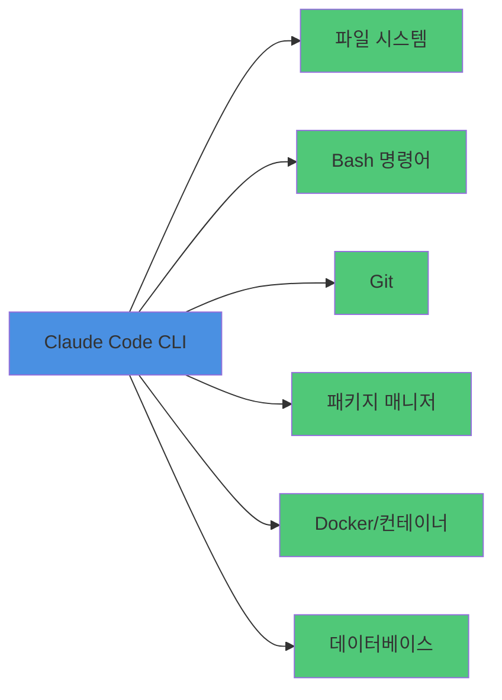
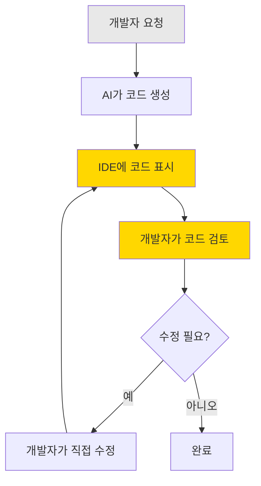
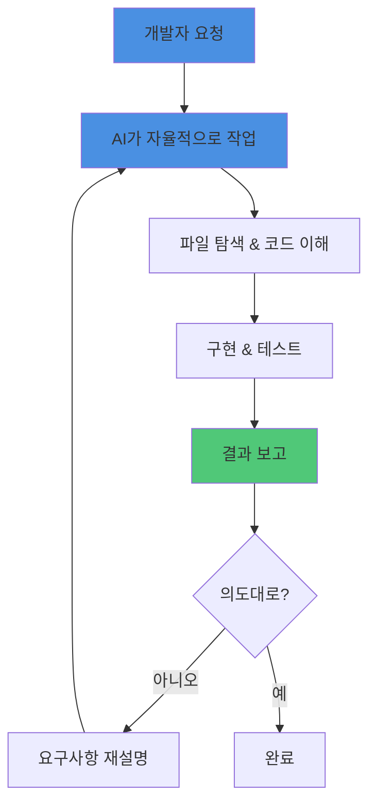

# Clip 2: CLI기반 Claude Code와 Codex로 할 수 있는 것

## 학습 목표
- CLI 기반 AI 개발 도구의 강력함을 이해합니다
- Claude Code와 Codex가 가능하게 하는 개발 패러다임의 변화를 파악합니다
- 파일 시스템과 bash 접근을 통한 무한한 가능성을 탐구합니다

## CLI 기반 AI 도구의 혁신

### 왜 CLI인가?

웹 기반 IDE가 아닌 CLI를 선택한 이유는 명확합니다. CLI는 여러분의 컴퓨터에서 **직접 실행**되며, 다음과 같은 것들에 접근할 수 있습니다:

- **파일 시스템 전체**: 프로젝트의 모든 파일을 읽고 쓸 수 있습니다
- **Bash 명령어**: 터미널에서 할 수 있는 모든 작업을 수행할 수 있습니다
- **로컬 도구들**: git, npm, docker 등 설치된 모든 개발 도구를 활용할 수 있습니다

## 무엇이든 할 수 있다

Claude Code와 Codex로 할 수 있는 일은 정말 무궁무진합니다:

### 1. 코딩 작업
- 새로운 기능 구현
- 버그 수정
- 리팩토링
- 테스트 코드 작성
- API 통합

### 2. 문서 작업
- PRD (Product Requirement Document) 작성
- API 문서 생성
- README 업데이트
- 아키텍처 다이어그램 생성

### 3. 프로젝트 관리
- Git 커밋과 PR 생성
- 이슈 트래킹
- 의존성 업데이트
- 빌드 및 배포

### 4. 데이터 작업
- 로그 분석
- 데이터 마이그레이션
- 스크립트 자동화

## 실제 동작 방식

Claude Code의 공식 설명에 따르면, 이렇게 작동합니다:

> "Claude then started exploring the filesystem and reading files. So, it would read one file, look at the imports, then read the files that were defined in the imports!"

즉, AI가 여러분의 코드베이스를 **이해**합니다. 하나의 파일을 읽고, import 문을 발견하면 관련된 파일들을 차례로 읽어가며 전체 맥락을 파악합니다.

## Context Engineering의 힘
`/context`

더 놀라운 것은 **system prompt를 튜닝**할 수 있다는 점입니다:

- `CLAUDE.md`: system prompt 다음에 오는 프로젝트 가이드라인
- output-style: system prompt 변경

*codex가 claude code보다 부족한 부분이 이러한 커스터마이징(모델을 떠나서)*

이를 통해 Claude를 여러분의 팀과 프로젝트에 완벽하게 맞출 수 있습니다.

### 시스템 프롬프트를 바꿀 수 있기 때문에 코딩 말고 다른 작업도 시킬 수 있어요.
- Deep Research 에이전트
- 업무 자동화 에이전트
  - 관심 있는 분들은 Part1 Chapter3,4를 보세요

## 개발 패러다임의 변화: IDE vs CLI 바이브코딩

### IDE 기반 AI 코딩 도구

Cursor나 Windsurf 같은 IDE 기반 도구를 사용할 때의 개발 흐름:

IDE는 **UX상 코드를 검토하도록 설계**되어 있습니다:
- 생성된 코드가 에디터에 바로 표시됨
- 개발자는 각 파일과 변경사항을 직접 확인
- 코드 레벨의 세부 사항을 계속 보게 됨

### CLI 기반 AI 코딩 도구

반면, Claude Code나 Codex 같은 CLI 도구의 개발 흐름:

CLI 환경에서는 **코드를 일일이 보기 힘듭니다**:
- 터미널 인터페이스의 한계로 긴 코드를 출력하면 가독성 저하
- AI가 여러 파일을 수정할 때 모든 변경사항을 추적하기 어려움
- **의도와 결과에 집중하게 됨**

### 추상화 레벨의 차이

이 차이는 개발 사고방식을 바꿉니다:

| IDE 바이브코딩 | CLI 바이브코딩 |
|--------------|--------------|
| "이 함수를 이렇게 수정해줘" | "회원가입 기능을 구현해줘" |
| 코드 수준의 대화 | 기능 수준의 대화 |
| 구현 세부사항 관여 | 요구사항과 결과에 집중 |
| **낮은 추상화** | **높은 추상화** |

CLI에서는 개발자가:
- **"어떻게(How)"보다 "무엇을(What)" 집중**
- **코드 세부사항보다 아키텍처와 의도에 집중**
- **검증과 테스트 결과로 품질 확인**
- **더 높은 수준의 문제 해결에 몰입**

## 무한한 가능성

Claude Code가 파일 시스템과 bash에 접근할 수 있다는 것은:

- **로그 분석**: "최근 1주일 에러 로그 분석해서 리포트 만들어줘"
- **배포 자동화**: "스테이징 환경에 배포하고 헬스체크 확인해줘"
- **데이터 마이그레이션**: "구 스키마에서 신규 스키마로 데이터 마이그레이션 스크립트 작성해줘"
- **성능 분석**: "API 응답시간 느린 엔드포인트 찾아서 최적화해줘"

모든 것이 가능하다는 의미입니다.

## 핵심 요점

1. **CLI는 강력합니다**: 파일 시스템과 bash 접근으로 무한한 가능성
2. **뭐든지 할 수 있습니다**: 코딩, 문서, 프로젝트 관리, 데이터 작업
3. **커스터마이징 가능**: System prompt 튜닝으로 팀에 최적화
4. **패러다임 변화**: 코드를 덜 보고 의도에 집중
5. **자동화의 끝판왕**: 반복 작업은 모두 자동화 가능
