---
## 강사 정보
- 작성자: 정구봉
- LinkedIn: https://www.linkedin.com/in/gb-jeong/
- 이메일: bong@dio.so

## 강의 자료
- 강의 자료: https://goobong.gitbook.io/fastcampus
- Github: https://github.com/Koomook/fastcampus-ai-agent-vibecoding
- FastCampus 강의 주소: https://fastcampus.co.kr/biz_online_vibeagent

---

# Clip 2: AI Agent architecture 자세히 살펴보기

## 학습 목표

* AI Agent의 핵심 구성 요소 이해하기
* 다양한 Agent 아키텍처 패턴 파악하기
* 실무에 적용 가능한 Agent 설계 원칙 습득하기

## 1. Agent의 정의

### OpenAI 정의

> **Agent는 "지시사항(해야 할 것), 가드레일(하지 말아야 할 것), 도구(할 수 있는 것)를 가지고 사용자를 대신해 행동하는 AI 시스템"**

### 일반적 정의

> **Agent는 "LLM을 사용하여 애플리케이션의 제어 흐름을 결정하는 시스템"**

Agent는 다음과 같은 결정을 내릴 수 있습니다:

* 잠재적인 경로들 사이에서 라우팅
* 어떤 도구를 호출할지 결정
* 더 많은 작업이 필요한지 판단

일반적으로 Agent가 할 수 있는 일은 2025년 10월 7일 발표된 Agent Builder 에서 확인할 수 있음

<figure><figcaption>
<a href="https://platform.openai.com/docs/guides/agents/agent-builder">https://platform.openai.com/docs/guides/agents/agent-builder</a>
</figcaption></figure>

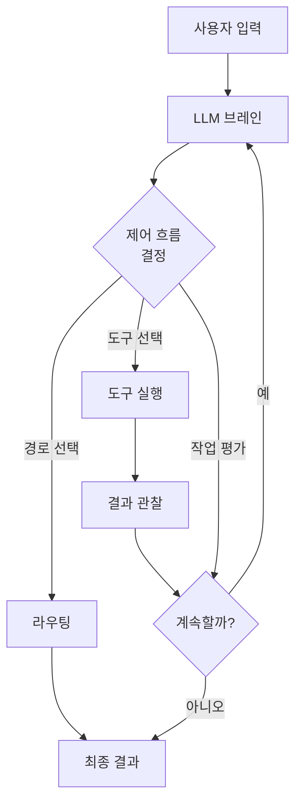

## 2. 핵심 Agent 아키텍처 유형

### 2.1 Router Architecture (라우터 아키텍처)

가장 단순한 형태의 Agent로, **제한된 제어 메커니즘**을 제공합니다.

**특징:**

* LLM이 미리 정의된 옵션 중 **단일 단계를 선택**
* 구조화된 출력 기법 활용:
  * Prompt engineering (프롬프트 엔지니어링)
  * Output parsers (출력 파서)
  * Tool calling (도구 호출)

**사용 예시:**

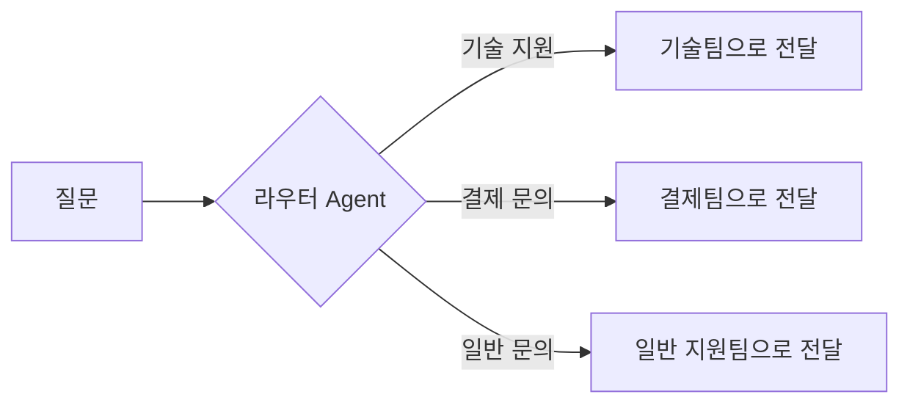

**적용 사례:**

* 고객 문의 분류 시스템
* 문서 카테고리 분류
* 작업 우선순위 결정

### 2.2 Tool-Calling Agent Architecture (도구 호출 Agent 아키텍처)

더 복잡한 Agent로, **다단계 의사결정**을 가능하게 합니다.

**핵심 구성 요소:**

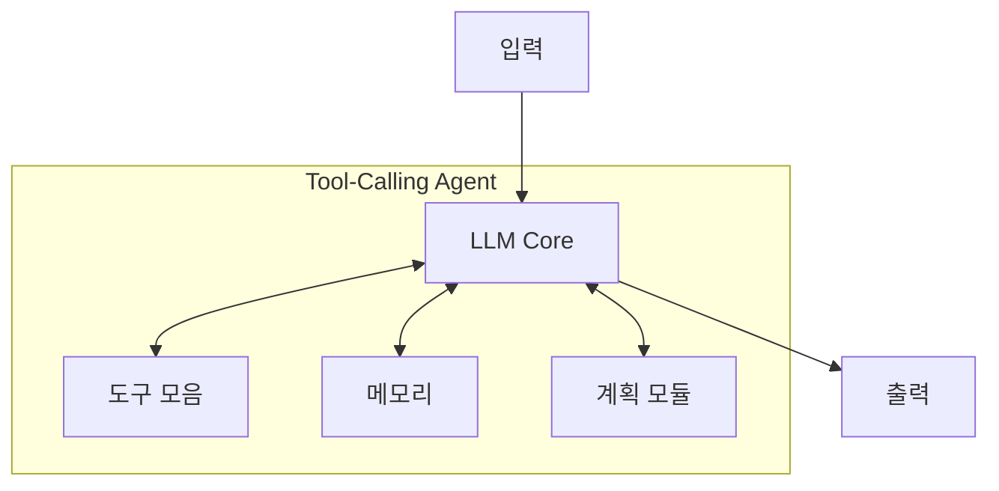

#### 1) Tool Calling (도구 호출)

* LLM이 다양한 도구를 선택하고 사용
* API 호출, 데이터베이스 쿼리, 외부 서비스 연동 등

#### 2) Memory (메모리)

**단기 메모리 (Short-term Memory):**

* 현재 시퀀스 내에서 정보 유지
* 대화 컨텍스트, 중간 결과 저장
* 예시: ChatGPT 한 세션에서 주고 받은 메시지

**장기 메모리 (Long-term Memory):**

* 상호작용 전반에 걸쳐 정보 회상
* 사용자 선호도
* 예시: CLAUDE.md, AGENTS.md

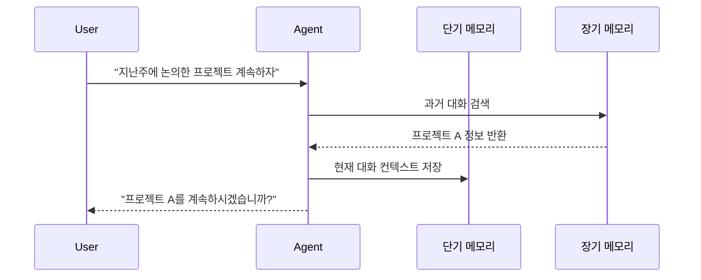

#### 3) Planning (계획 수립)

**재귀적 루프를 통한 계획:**

1. 호출할 도구 결정
2. 도구 실행
3. 결과 평가
4. 충분한 정보가 수집되면 종료

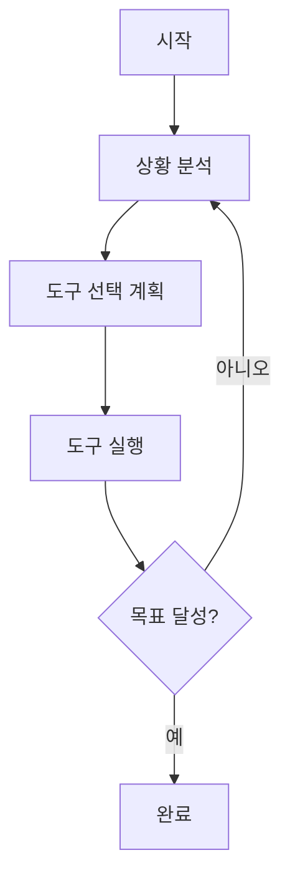

## 3. 고급 Agent 설계 패턴

### 3.1 Core Workflow Patterns (Anthropic)

Anthropic이 제시한 5가지 핵심 워크플로우 패턴:

#### 1) Prompt Chaining (프롬프트 체이닝)

작업을 순차적 단계로 분해

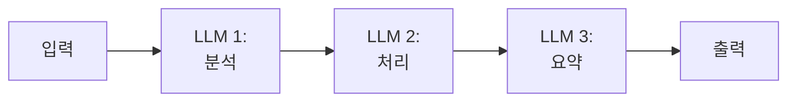

**장점:** 각 단계를 독립적으로 최적화 가능 **예시:** 문서 분석 → 핵심 추출 → 요약 생성

#### 2) Routing (라우팅)

입력을 분류하고 전문화된 작업으로 전달

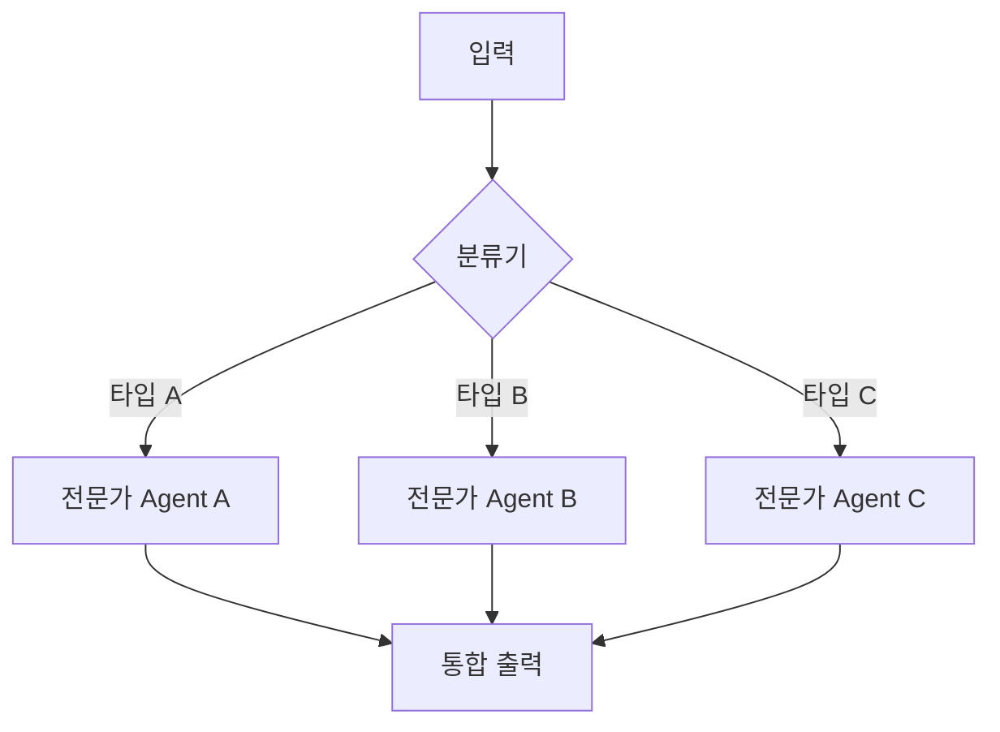

**장점:** 전문화된 처리, 효율성 향상 **예시:** 언어별 번역 Agent, 도메인별 질의응답 시스템

#### 3) Parallelization (병렬화)

하위 작업을 동시에 실행. 예시: Claude Deep Research

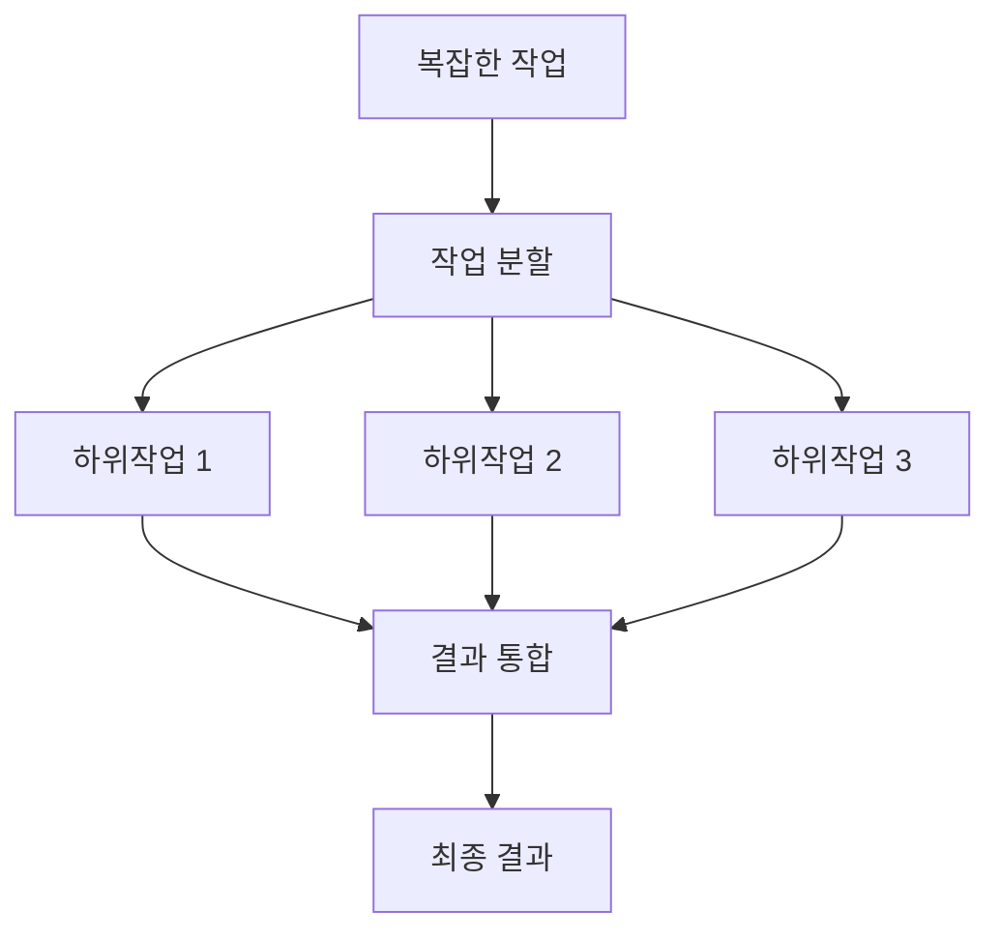

**장점:** 속도 향상, 리소스 효율성 **예시:** 여러 소스에서 동시에 정보 수집

#### 4) Evaluator-Optimizer (평가자-최적화자)

피드백 루프를 통한 반복적 개선

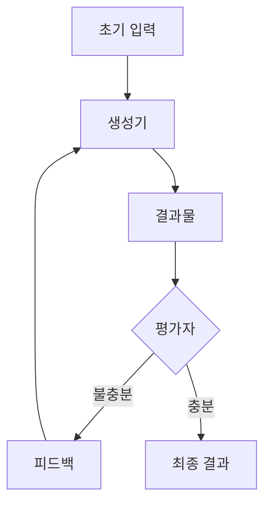

**장점:** 품질 향상, 자가 개선 **예시:** 코드 생성 및 자동 테스트, 콘텐츠 작성 및 품질 검증

### 3.2 고급 기능

#### Human-in-the-Loop (인간 개입)

중요한 결정 시점에 사람의 승인 요청

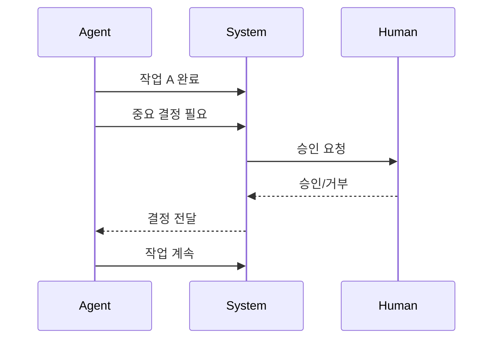

**적용 사례:**

* 금융 거래 승인
* 콘텐츠 발행 전 검토
* 중요 시스템 변경

#### Reflection (반성/성찰)

Agent가 자신의 출력을 평가하고 개선

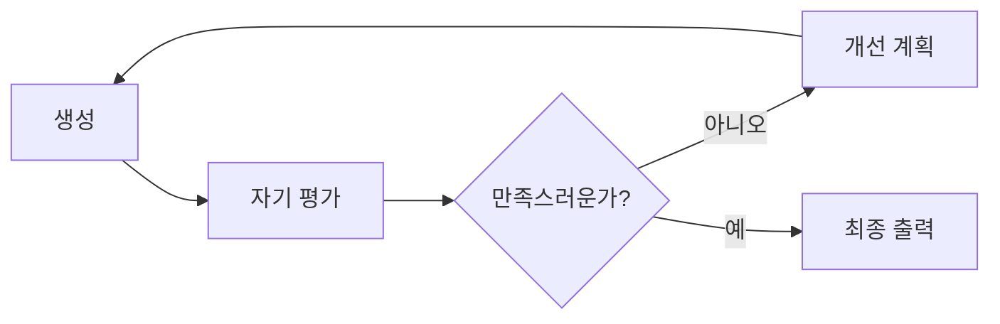

## 4. 멀티 에이전트 vs 싱글 에이전트

#### 멀티 에이전트가 유리한 경우 (Anthropic)

**Orchestrator-Worker 패턴:**

* 리드 Agent가 전문화된 하위 Agent들을 병렬로 조정
* 연구 평가에서 싱글 Agent 대비 90.2% 성능 향상

**적합한 작업:**

* 병렬화가 가능한 독립적 탐색 경로
* 단일 컨텍스트 윈도우를 초과하는 정보량
* 여러 복잡한 도구 동시 사용 필요

**한계:**

* 토큰 사용량 15배 증가
* Agent 간 의존성이 높은 작업엔 비효율적
* 코드 작성 등 병렬화 어려운 작업엔 부적합

#### 싱글 에이전트를 선택해야 하는 경우 (Cognition AI)

**멀티 에이전트의 취약점:**

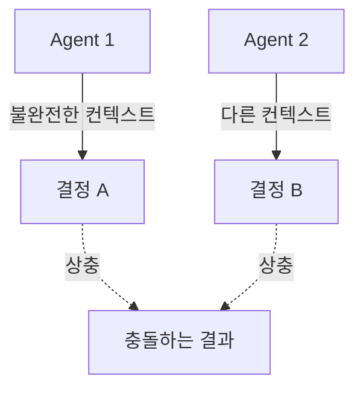

* **컨텍스트 단절**: 하위 Agent간 세밀한 컨텍스트 공유 어려움
* **일관성 문제**: 병렬 작업시 상충되는 결정 발생
* **의사결정 충돌**: "행동은 암묵적 결정을 담고, 충돌하는 결정은 나쁜 결과를 초래"

***

## 참고 자료 및 읽어보면 좋은 자료

* [LangGraph - Agentic Concepts](https://langchain-ai.github.io/langgraph/concepts/agentic_concepts/)
* [Anthropic - Building Effective Agents](https://www.anthropic.com/engineering/building-effective-agents)
* [OpenAI - a-practical-guide-to-building-agents.pdf](https://cdn.openai.com/business-guides-and-resources/a-practical-guide-to-building-agents.pdf)
* [Anthropic - multi-agent-research-system](https://www.anthropic.com/engineering/multi-agent-research-system)
* [Cognition - Dont-build-multi-agents](https://cognition.ai/blog/dont-build-multi-agents#a-theory-of-building-long-running-agents)
* [OpenAI - AgentKit](https://openai.com/index/introducing-agentkit/)

---

## 강사 정보
- 작성자: 정구봉
- LinkedIn: https://www.linkedin.com/in/gb-jeong/
- 이메일: bong@dio.so

## 강의 자료
- 강의 자료: https://goobong.gitbook.io/fastcampus
- Github: https://github.com/Koomook/fastcampus-ai-agent-vibecoding
- FastCampus 강의 주소: https://fastcampus.co.kr/biz_online_vibeagent
