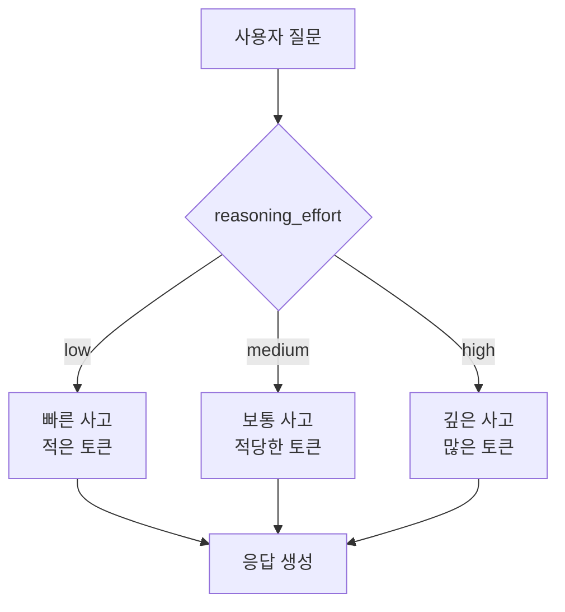

# Clip 2: 세부 파라미터 이해하기 (reasoning_effort, verbosity, max_tokens)

## 학습 목표
- OpenAI API의 고급 파라미터 3가지를 이해합니다
- verbosity와 max_tokens의 차이점을 명확히 구분합니다
- reasoning_effort가 사고 과정에 미치는 영향을 파악합니다
- 실무에서 각 파라미터를 언제 사용해야 하는지 배웁니다

## 참고 자료

- [OpenAI Python API 공식 문서](https://platform.openai.com/docs/api-reference)
- [OpenAI Python 라이브러리 GitHub](https://github.com/openai/openai-python)
- [OpenAI 플랫폼 문서](https://platform.openai.com/docs/overview)

## 1. verbosity: 응답 길이 조절 파라미터

GPT-5 API에 새로 추가된 `verbosity`는 응답의 **길이와 자세함**을 직관적으로 조절하는 스타일 지시자입니다. 모델이 간략히 핵심만 말할지, 상세하고 길게 말할지를 힌트로 제공합니다.

### verbosity 옵션

```python
# verbosity 타입: 'low' | 'medium' | 'high'
```

- **`low`**: 매우 간결. 불필요한 장황함 없이 핵심만 응답합니다
- **`medium`** (기본값): 별도 설정 없으면 medium입니다
- **`high`**: 매우 자세. 추가 설명/예시/맥락을 풍부하게 포함. 복잡한 주제의 심층 해설에 적합합니다

### verbosity 사용 예시

```python
import os
from openai import OpenAI

client = OpenAI(api_key=os.environ.get("OPENAI_API_KEY"))

def demonstrate_verbosity():
    question = "머신러닝이란 무엇인가요?"

    # verbosity=low: 간결한 답변
    low_response = client.chat.completions.create(
        model='gpt-5',
        messages=[{'role': 'user', 'content': question}],
        verbosity='low'
    )

    print('=== verbosity: low ===')
    print(low_response.choices[0].message.content)
    # 예상 출력: "머신러닝은 데이터로부터 패턴을 학습하여 예측하는 AI 기술입니다."

    # verbosity=high: 상세한 답변
    high_response = client.chat.completions.create(
        model='gpt-5',
        messages=[{'role': 'user', 'content': question}],
        verbosity='high'
    )

    print('\n=== verbosity: high ===')
    print(high_response.choices[0].message.content)
    # 예상 출력: "머신러닝은 인공지능의 한 분야로... (긴 설명)
    #           예를 들어... (구체적 예시)
    #           이는 다음과 같은 특징이 있습니다... (추가 설명)"
```

### verbosity 실전 활용 팁

그동안 '조금 더 길거나 짧은 응답'을 바라고 few-shot 프롬프팅을 했다면 verbosity를 실험해보시길 추천드립니다. `low`/`medium`/`high` 한 번씩 해보면서 더 디테일하게 내가 원하는 방향으로 응답을 튜닝할 수 있어요.

**실무 사례**: UI 컴포넌트에 텍스트를 채울 때
```python
# 동일한 크기의 UI 카드에 내용을 채우는 경우
def fill_ui_card(bullet_points: int) -> str:
    verbosity = 'high' if bullet_points == 1 else \
                'medium' if bullet_points == 3 else 'low'

    response = client.chat.completions.create(
        model='gpt-5',
        messages=[{
            'role': 'user',
            'content': f'제품의 {bullet_points}가지 주요 특징을 설명해주세요.'
        }],
        verbosity=verbosity
    )

    # 불렛포인트가 적을 때는 각 포인트를 길게,
    # 많을 때는 각 포인트를 짧게 → UI가 균형있게 보임
    return response.choices[0].message.content
```

## 2. max_tokens vs verbosity: 무엇이 다른가?

LLM API를 사용해보셨다면 `max_tokens`를 알고 계실 겁니다. 두 파라미터는 모두 응답 길이와 관련이 있지만, **작동 방식이 근본적으로 다릅니다**.

### max_tokens: 하드 제한 (Hard Limit)

```python
response = client.chat.completions.create(
    model='gpt-5',
    messages=[{'role': 'user', 'content': '인공지능 역사를 설명해주세요.'}],
    max_completion_tokens=100  # 정확히 100 토큰에서 멈춤
)
# ⚠️ 응답이 100토큰에 도달하면 문장이 끊길 수 있음:
# "인공지능은 1950년대부터 시작되었으며, 앨런 튜링이..."
```

`max_completion_tokens`는 모델이 생성하는 **최대 토큰 수를 지정**하는 파라미터입니다. `max_completion_tokens=100`이면 100토큰에서 즉시 응답이 종료되며 **문장이 끊깁니다**.

**주로 사용하는 경우**:
- Grade/Judge 같은 단순 평가 작업 (응답: "적절함", "부적절함")
- 토큰 비용을 극단적으로 줄여야 할 때
- 응답 형식이 정해져 있고 짧을 때 (JSON, Yes/No 등)

### verbosity: 스타일 가이드 (Style Guide)

```python
response = client.chat.completions.create(
    model='gpt-5',
    messages=[{
        'role': 'user',
        'content': '5문단으로 에세이를 작성해주세요.'
    }],
    verbosity='low'  # 간결한 스타일
)
# ✅ 5개의 단락이 모두 생성되지만, 각 단락이 짧음
```

`verbosity`가 `max_tokens`와 다른 점은 **하드 토큰 제한이 아니라는 점**입니다.

예를 들어, 사용자가 "5문단으로 에세이"를 요구하면:
- `verbosity=low`여도 **5개의 단락을 만듭니다**
- 단, **각 단락의 길이는 짧아집니다**

이렇게 LLM의 응답을 프롬프트보다 프로그래밍적으로 조절하는 확실한 방법이기 때문에 strict한 상황에서 선호되는 편입니다.

### 비교표: max_completion_tokens vs verbosity

| 특징 | max_completion_tokens | verbosity |
|------|-----------|----------|
| **제한 방식** | 절대적 토큰 수 제한 | 스타일 가이드 (유연함) |
| **문장 끊김** | 가능 (토큰 초과 시) | 거의 없음 |
| **형식 보존** | 보장 안 됨 | 보장됨 (5문단 요청 → 5문단 생성) |
| **사용 목적** | 토큰 절약, 짧은 응답 강제 | 응답의 상세도 조절 |
| **적용 범위** | 모든 GPT 모델 | GPT-5 이상 |

### 실무에서 함께 사용하기

```python
def create_product_description(style: str) -> str:
    """style: 'brief' 또는 'detailed'"""
    response = client.chat.completions.create(
        model='gpt-5',
        messages=[{
            'role': 'user',
            'content': '이 제품의 3가지 특징을 설명해주세요.'
        }],
        verbosity='low' if style == 'brief' else 'high',  # 스타일 조절
        max_completion_tokens=1000  # 안전장치: 절대 1000토큰 초과 불가
    )

    return response.choices[0].message.content
```

## 3. reasoning_effort: 사고 깊이 조절

`reasoning_effort`는 GPT-5의 추론 모델에서 사용되는 파라미터로, 답을 내기 전에 모델이 **내부적으로 얼마나 깊게 생각할지**를 조절합니다.

### reasoning_effort 옵션

```python
# reasoning_effort 타입: 'low' | 'medium' | 'high'
```

- **`low`**: 빠른 추론, 적은 thinking tokens
- **`medium`**: 균형잡힌 추론
- **`high`**: 깊은 추론, 많은 thinking tokens (비용 증가)

### reasoning_effort의 작동 원리



**중요**: `reasoning_effort`는 **reasoning tokens**에만 영향을 미칩니다. 사용자에게 보이는 최종 응답의 길이는 거의 동일하지만, 모델이 내부적으로 사용하는 토큰(비용)이 달라집니다.

### reasoning_effort 사용 예시

```python
def solve_complex_problem(problem: str):
    # 복잡한 수학 문제나 논리 퍼즐
    response = client.chat.completions.create(
        model='gpt-5',
        messages=[{
            'role': 'user',
            'content': problem
        }],
        reasoning_effort='high'  # 깊게 생각하도록 설정
    )

    print('응답:', response.choices[0].message.content)

    if response.usage:
        reasoning_tokens = getattr(response.usage.completion_tokens_details, 'reasoning_tokens', 0) \
                          if hasattr(response.usage, 'completion_tokens_details') else 0
        print('Reasoning tokens:', reasoning_tokens)
        print('Completion tokens:', response.usage.completion_tokens)

# 예시: 복잡한 논리 문제
solve_complex_problem("""
  다섯 명의 친구가 서로 다른 나라에 살고 있습니다.
  - Alex는 프랑스나 독일에 살지 않습니다.
  - Bob은 독일 옆 나라에 삽니다.
  - Charlie는 Alex보다 동쪽에 삽니다.
  ...
  각자 어느 나라에 살고 있나요?
""")
```

## 4. 세 파라미터 실무 활용 전략

### 시나리오 1: 제품 설명 생성기

```python
def generate_product_description(product: str, target_length: str) -> str:
    """target_length: 'short', 'medium', 또는 'long'"""
    verbosity_map = {
        'short': 'low',
        'medium': 'medium',
        'long': 'high'
    }

    max_completion_tokens_map = {
        'short': 100,
        'medium': 200,
        'long': 400
    }

    response = client.chat.completions.create(
        model='gpt-5',
        messages=[
            {
                'role': 'system',
                'content': '당신은 마케팅 카피라이터입니다.'
            },
            {
                'role': 'user',
                'content': f'{product}의 특징을 설명해주세요.'
            }
        ],
        verbosity=verbosity_map[target_length],  # 스타일 조절
        max_completion_tokens=max_completion_tokens_map[target_length],  # 안전장치
        reasoning_effort='low'  # 창의성 작업이므로 낮게
    )

    return response.choices[0].message.content
```

### 시나리오 2: 코드 리뷰 자동화

```python
def review_code(code: str, complexity: str) -> str:
    """complexity: 'simple' 또는 'complex'"""
    response = client.chat.completions.create(
        model='gpt-5',
        messages=[
            {
                'role': 'system',
                'content': '당신은 시니어 개발자입니다. 코드를 리뷰해주세요.'
            },
            {
                'role': 'user',
                'content': code
            }
        ],
        verbosity='high',  # 상세한 피드백 필요
        reasoning_effort='high' if complexity == 'complex' else 'medium'
        # 복잡한 코드는 깊게 분석
    )

    return response.choices[0].message.content
```

### 시나리오 3: Yes/No 판단 (Grade/Judge)

```python
def is_content_appropriate(content: str) -> bool:
    response = client.chat.completions.create(
        model='gpt-5',
        messages=[{
            'role': 'user',
            'content': f'다음 콘텐츠가 적절한가요? Yes 또는 No로만 답하세요.\n\n{content}'
        }],
        max_completion_tokens=5,  # "Yes" 또는 "No"만 필요
        reasoning_effort='low'  # 간단한 판단이므로 낮게 설정
    )

    content_text = response.choices[0].message.content
    return 'yes' in content_text.lower() if content_text else False
```

## 5. 비용 최적화 팁

```python
# ❌ 비효율적: 모든 호출에 high 설정
expensive_call = client.chat.completions.create(
    model='gpt-5',
    messages=[...],
    verbosity='high',
    reasoning_effort='high'  # 불필요하게 비용 증가
)

# ✅ 효율적: 필요에 따라 조절
efficient_call = client.chat.completions.create(
    model='gpt-5',
    messages=[...],
    verbosity='medium',  # 대부분의 경우 충분
    reasoning_effort='medium'  # 복잡한 문제가 아니면 medium
)

# ✅ 매우 효율적: 간단한 작업은 max_completion_tokens로 제한
very_efficient_call = client.chat.completions.create(
    model='gpt-5',
    messages=[...],
    max_completion_tokens=50,  # 토큰 비용 최소화
    reasoning_effort='low'  # 간단한 작업은 낮게 설정
)
```

## 핵심 요약

- **verbosity**: 응답의 상세도를 조절하는 스타일 가이드 (형식 유지)
- **max_completion_tokens**: 생성할 최대 토큰 수를 제한 (하드 제한, 문장 끊김 가능)
- **reasoning_effort**: 내부 사고 깊이를 조절 (thinking tokens에 영향)
- **실무 팁**:
  - verbosity는 글의 스타일, max_completion_tokens는 토큰의 절대 개수를 통제
  - grade/judge 작업은 max_completion_tokens로 토큰 절약
  - 복잡한 추론은 reasoning_effort=high, 간단한 작업은 low
- **비용 최적화**: 작업 복잡도에 맞게 파라미터 조절하여 비용 절감

## 다음 단계

다음 Clip에서는 효과적인 프롬프트 작성 기법과 LLM API 호출 코드를 생성하는 실전 예시를 다루겠습니다.
