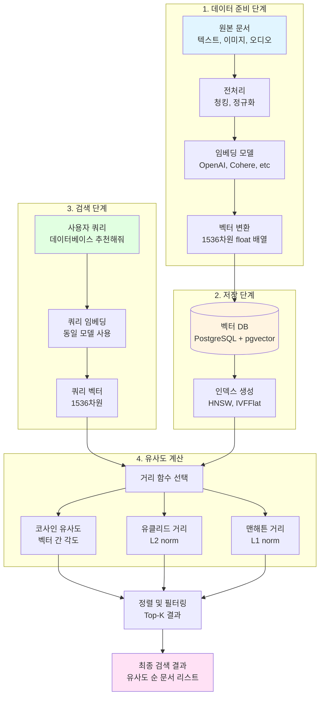

---
## 강사 정보
- 작성자: 정구봉
- LinkedIn: https://www.linkedin.com/in/gb-jeong/
- 이메일: bong@dio.so

## 강의 자료
- 강의 자료: https://goobong.gitbook.io/fastcampus
- Github: https://github.com/Koomook/fastcampus-ai-agent-vibecoding
- FastCampus 강의 주소: https://fastcampus.co.kr/biz_online_vibeagent

---

# Clip 1: Vector Search 이해하기

## 학습 목표
- Vector Search의 개념과 작동 원리를 이해한다
- 임베딩(Embedding)의 역할과 중요성을 파악한다
- pgvector를 통한 PostgreSQL 벡터 검색 구현 방법을 학습한다

## 1. Vector Search란?

### 1.1 기본 개념

**Vector Search(벡터 검색)** 는 데이터를 고차원 벡터 공간에 표현하고, 벡터 간의 거리를 기반으로 유사도를 측정하여 검색하는 기술입니다.



### 1.2 기존 검색과의 차이점

| 구분 | 키워드 검색 | Vector Search |
|------|------------|---------------|
| 검색 방식 | 정확한 키워드 매칭 | 의미적 유사도 |
| 데이터 표현 | 텍스트 그대로 | 고차원 벡터 |
| 활용 | 단어 빈도, 어휘 유사성 | 임베딩 공간의 거리 |
| 장점 | 빠르고 정확한 일치 | 컨텍스트 이해 가능 |

## 2. 임베딩(Embedding) 이해하기

### 2.1 임베딩이란?

**임베딩**은 텍스트, 이미지, 오디오 같은 비정형 데이터를 고차원 공간의 숫자 벡터로 변환하는 과정입니다. 이를 통해 데이터의 의미적 관계를 수학적으로 표현할 수 있습니다.

```python
from openai import OpenAI

client = OpenAI()

# 텍스트를 벡터로 변환
response = client.embeddings.create(
    model="text-embedding-3-small",
    input="Vector Search는 의미 기반 검색을 가능하게 합니다."
)

embedding_vector = response.data[0].embedding
print(f"벡터 차원: {len(embedding_vector)}")  # 1536차원
print(f"벡터 일부: {embedding_vector[:5]}")
```

### 2.2 벡터 유사도 측정

벡터 간 유사도를 측정하는 주요 거리 함수:

**1) 코사인 유사도 (Cosine Similarity)**
```python
import numpy as np

def cosine_similarity(vec1, vec2):
    """두 벡터 간 코사인 유사도 계산"""
    dot_product = np.dot(vec1, vec2)
    norm_vec1 = np.linalg.norm(vec1)
    norm_vec2 = np.linalg.norm(vec2)
    return dot_product / (norm_vec1 * norm_vec2)
```

**2) 유클리드 거리 (L2 Distance)**
```python
def euclidean_distance(vec1, vec2):
    """두 벡터 간 유클리드 거리 계산"""
    return np.linalg.norm(vec1 - vec2)
```

**3) 맨해튼 거리 (L1 Distance)**
```python
def manhattan_distance(vec1, vec2):
    """두 벡터 간 맨해튼 거리 계산"""
    return np.sum(np.abs(vec1 - vec2))
```

## 3. pgvector 소개

### 3.1 pgvector란?

**pgvector**는 PostgreSQL에서 벡터 유사도 검색을 가능하게 하는 오픈소스 확장(extension)입니다. 기존 관계형 데이터베이스에 벡터 검색 기능을 추가하여 별도의 벡터 DB 없이 AI 애플리케이션을 구축할 수 있습니다.

### 3.2 pgvector 주요 기능

**지원 벡터 타입:**
- `vector`: 기본 벡터 타입
- `halfvec`: 2바이트 float (최대 4,000 차원)
- `sparsevec`: 희소 벡터 (최대 1,000 비제로 차원)
- `bit`: 이진 벡터 (최대 64,000 차원)

**지원 거리 함수:**
- `<->`: 유클리드 거리 (L2)
- `<#>`: 네거티브 내적
- `<=>`: 코사인 거리
- `<+>`: 맨해튼 거리 (L1)
- `hamming_distance()`: 해밍 거리
- `jaccard_distance()`: 자카드 거리


### 3.3 pgvector 설치 및 기본 사용

```sql
-- 1. pgvector 확장 설치
CREATE EXTENSION vector;

-- 2. 벡터 컬럼을 가진 테이블 생성
CREATE TABLE documents (
    id SERIAL PRIMARY KEY,
    content TEXT,
    embedding vector(1536)  -- 1536차원 벡터
);

-- 3. 벡터 데이터 삽입
INSERT INTO documents (content, embedding)
VALUES (
    'PostgreSQL은 강력한 관계형 데이터베이스입니다.',
    '[0.1, 0.2, 0.3, ...]'::vector  -- 실제로는 1536개 값
);

-- 4. 유사도 기반 검색 (코사인 거리)
SELECT content, embedding <=> '[query_vector]' AS distance
FROM documents
ORDER BY distance
LIMIT 5;
```

### 3.4 인덱스로 검색 성능 최적화

```sql
-- HNSW 인덱스 생성 (근사 최근접 이웃 검색)
CREATE INDEX ON documents
USING hnsw (embedding vector_cosine_ops);

-- IVFFlat 인덱스 생성 (클러스터 기반)
CREATE INDEX ON documents
USING ivfflat (embedding vector_l2_ops)
WITH (lists = 100);
```

## 4. 실전 예제: 문서 검색 시스템

```python
import psycopg2
from openai import OpenAI

# OpenAI 클라이언트 초기화
openai_client = OpenAI()

# PostgreSQL 연결
conn = psycopg2.connect(
    host="localhost",
    database="vector_db",
    user="postgres",
    password="your_password"
)

def get_embedding(text):
    """텍스트를 벡터로 변환"""
    response = openai_client.embeddings.create(
        model="text-embedding-3-small",
        input=text
    )
    return response.data[0].embedding

def insert_document(content):
    """문서와 임베딩을 DB에 저장"""
    embedding = get_embedding(content)

    with conn.cursor() as cur:
        cur.execute(
            "INSERT INTO documents (content, embedding) VALUES (%s, %s)",
            (content, embedding)
        )
    conn.commit()

def search_similar_documents(query, limit=5):
    """유사한 문서 검색"""
    query_embedding = get_embedding(query)

    with conn.cursor() as cur:
        cur.execute(
            """
            SELECT content, embedding <=> %s AS distance
            FROM documents
            ORDER BY distance
            LIMIT %s
            """,
            (query_embedding, limit)
        )
        return cur.fetchall()

# 사용 예시
insert_document("PostgreSQL은 강력한 오픈소스 데이터베이스입니다.")
results = search_similar_documents("데이터베이스 추천")

for content, distance in results:
    print(f"유사도: {1-distance:.4f} | 내용: {content}")
```

## 5. Vector Search의 한계와 고려사항

### 5.1 성능 최적화의 어려움

- vector search 는 chunking, embedding 모델 선택 등 많은 리서치가 필요
- semantic 의 한계 때문에 keyword search 를 동시에 사용하는 것이 필요

### 5.2 성능 최적화 전략

1. **적절한 인덱스 선택**: HNSW vs IVFFlat
2. **벡터 차원 최적화**: 작업에 맞는 임베딩 모델 선택
3. **데이터 규모 고려**: 대규모 데이터는 전용 벡터 DB 검토

## 핵심 요약

1. **Vector Search**는 의미 기반 유사도 검색을 가능하게 하는 혁신적인 기술입니다
2. **임베딩**을 통해 비정형 데이터를 벡터로 변환하고 수학적으로 비교할 수 있습니다
3. **pgvector**는 PostgreSQL에서 벡터 검색을 구현할 수 있는 강력한 확장입니다
4. 적절한 인덱스와 거리 함수 선택이 성능에 중요한 영향을 미칩니다

## 다음 단계

다음 클립에서는 Keyword Search(전통적 검색)와 Vector Search를 결합한 **Hybrid Search** 구현 방법을 학습합니다.

---

**참고 자료**
- [Elastic - 벡터 검색 가이드](https://www.elastic.co/kr/what-is/vector-search)
- [pgvector GitHub Repository](https://github.com/pgvector/pgvector)
- [Microsoft Learn - Azure AI Search 벡터 검색](https://learn.microsoft.com/ko-kr/azure/search/vector-search-overview)
- [PostgreSQL pgvector 최신 릴리즈](https://www.postgresql.org/about/news/pgvector-070-released-2852/)
- [Supabase Docs - pgvector](https://supabase.com/docs/guides/database/extensions/pgvector)

---

## 강사 정보
- 작성자: 정구봉
- LinkedIn: https://www.linkedin.com/in/gb-jeong/
- 이메일: bong@dio.so

## 강의 자료
- 강의 자료: https://goobong.gitbook.io/fastcampus
- Github: https://github.com/Koomook/fastcampus-ai-agent-vibecoding
- FastCampus 강의 주소: https://fastcampus.co.kr/biz_online_vibeagent
