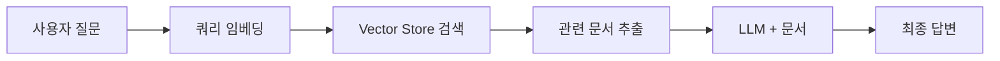
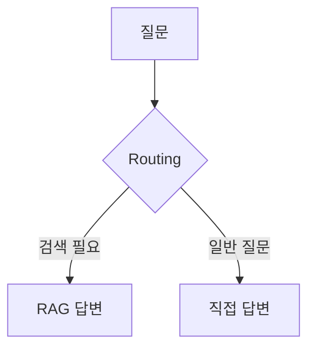
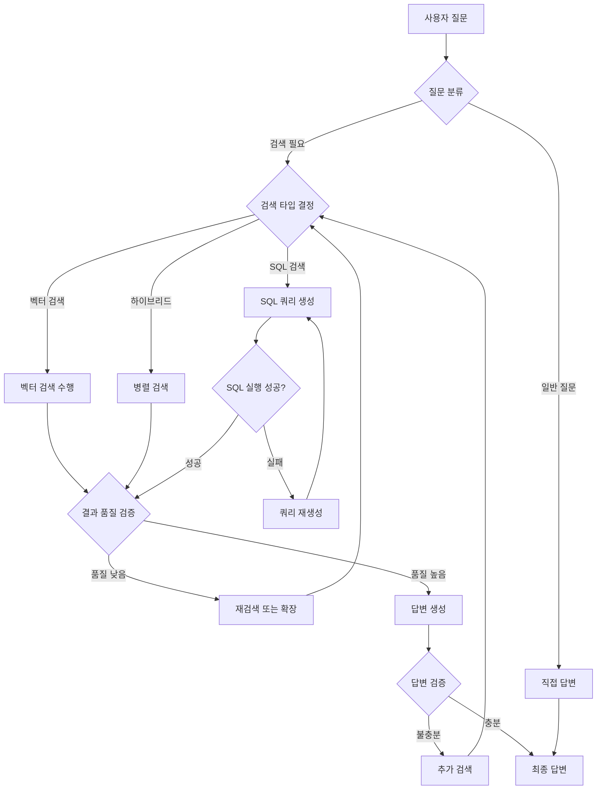
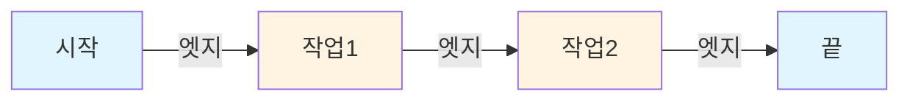
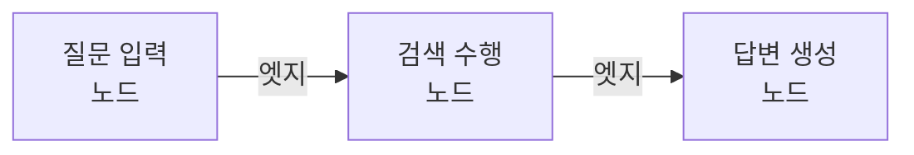

# Clip 1: RAG 개념 이해하기

## 학습 목표
- RAG의 본질을 현대적 관점에서 이해하기
- 벡터 검색뿐만 아니라 다양한 검색 시스템을 활용한 RAG 이해하기
- RAG와 MCP의 차이점과 적절한 활용 시나리오 파악하기
- 컨텍스트 엔지니어링으로서의 RAG 접근법 익히기

## RAG란 무엇인가?

### RAG의 본질적 정의

**RAG(Retrieval Augmented Generation)**는 **검색 시스템이 붙어 있는 Generation**을 의미합니다.

더 근본적으로 표현하면:
> LLM이 정확하게 알지 못하는 정보를 제공하여 내가 원하는 대로 동작하게 시키는 것

이것이 RAG의 본질입니다.

### RAG에 대한 오해와 진실

**흔한 오해:**
- ❌ RAG = 벡터 검색을 반드시 해야 한다
- ❌ RAG는 항상 임베딩과 벡터 DB가 필요하다

**실제 RAG:**
- ✅ 벡터 검색 이외의 검색 시스템도 RAG입니다
- ✅ SQL 쿼리를 통한 검색 + Generation도 RAG입니다
- ✅ 검색 시스템만 붙어있다면 모두 RAG라고 볼 수 있습니다

### RAG의 다양한 형태

**1. 벡터 검색 기반 RAG**
```
질문 → 벡터 임베딩 → 유사도 검색 → 관련 문서 → LLM + 문서 → 답변
```

**2. SQL 검색 기반 RAG**
```
질문 → SQL 쿼리 생성 → DB 검색 → 데이터 추출 → LLM + 데이터 → 답변
```

**3. 하이브리드 RAG**
```
질문 → 벡터 검색 + SQL 검색 → 결과 통합 → LLM + 정보 → 답변
```

## RAG의 현대적 변화: 컨텍스트 엔지니어링

### RAG의 진화

**과거 (1-2년 전):**
- 특정 도메인의 지식을 효율적으로 전달하기 위한 기법
- LLM을 단일 목적으로 사용하게 만드는 방법

**현재:**
- RAG는 **컨텍스트 엔지니어링**으로 변화
- 정보를 제공하는 방식의 하나로 진화
- MCP와 함께 사용되는 보완적 기술

### RAG vs Tool(MCP): 언제 무엇을 사용할까?

**MCP(Model Context Protocol)가 더 적합한 경우:**
- 범용적인 시스템 구축
- 다양한 도구와 서비스를 연결
- 실시간으로 다양한 소스에 접근
- 최신 정보를 계속 업데이트해야 하는 경우

**RAG가 더 적합한 경우:**
- 특정 도메인에 특화된 시스템
- 대량의 문서 검색이 필요한 경우
- CS 챗봇, 상품 추천 시스템
- 농협 대출 상품 검색 같은 특수 영역만 담당하면 될 경우

## RAG의 핵심 구성 요소

RAG 시스템은 검색 방식에 따라 다양한 구성 요소를 사용합니다.

### 벡터 검색 기반 RAG 구성요소

**1. Text Splitters (텍스트 분할기)**
- 긴 문서를 검색/임베딩 가능한 작은 청크로 분할
- 예: 500-1000 토큰 단위로 분할

**2. Embedding Models (임베딩 모델)**
- 텍스트를 벡터로 변환하여 의미적 유사도 계산
- 예: OpenAI `text-embedding-3-large`, `text-embedding-3-small`

**3. Vector Stores (벡터 저장소)**
- 임베딩된 문서를 저장하고 효율적으로 검색
- 예: PostgreSQL (pgvector), Chroma, FAISS, Pinecone

**4. Retrievers (리트리버)**
- 쿼리에 가장 관련성 높은 문서를 선택해서 반환
- 유사도 기반 top-k 선택

### SQL 검색 기반 RAG 구성요소

**1. Database Schema (데이터베이스 스키마)**
- 구조화된 데이터 저장
- 테이블, 컬럼, 관계 정의

**2. SQL Query Generator (SQL 쿼리 생성기)**
- 자연어 질문을 SQL로 변환
- LLM이 스키마를 보고 쿼리 생성

**3. Query Executor (쿼리 실행기)**
- 생성된 SQL을 실행하여 데이터 추출

**4. Result Formatter (결과 포맷터)**
- DB 결과를 LLM이 이해할 수 있는 형태로 변환

## RAG 동작 과정

### 벡터 검색 기반 RAG 워크플로우



**단계별 예시:**

**1. 질문 입력**
```
"농협에서 의사를 위한 대출 상품 있어?"
```

**2. 쿼리 임베딩**
```python
query_embedding = embedding_model.embed("농협에서 의사를 위한 대출 상품 있어?")
# → [0.1, 0.5, -0.3, ...] 벡터로 변환
```

**3. 벡터 검색 실행**
```python
documents = vector_store.similarity_search(query_embedding, top_k=3)
# → 가장 유사한 3개 문서 반환
```

**4. 컨텍스트 구성 및 답변 생성**
```python
context = "\n".join([doc.page_content for doc in documents])
prompt = f"다음 문서를 참고해서 질문에 답변하세요:\n\n{context}\n\n질문: {query}"
answer = llm.invoke(prompt)
```

## Advanced RAG: Routing과 Workflow

### Routing이란?

**질문 유형에 따라 다른 처리 경로를 선택하는 기법**



**예시:**
- "의사 전용 대출 상품 알려줘" → search → Hybrid Search → RAG
- "안녕하세요" → direct → LLM 직접 답변

### Langgraph로 Workflow 구현하기

#### 1. Langgraph는 왜 필요한가?

**복잡한 워크플로우를 상태 그래프로 표현할 수 있게 해줍니다.**

이 말의 의미를 이해하기 위해, 실제 RAG 시스템의 복잡성을 살펴보겠습니다.

**실제 RAG 워크플로우의 복잡성 예시:**



**이런 복잡한 흐름을 관리하는 것이 Langgraph의 핵심 가치입니다.**

#### 2. 상태 그래프로 표현한다는 것의 의미

**그래프(Graph), 노드(Node), 엣지(Edge) 기본 개념**

프로그래밍에서 **그래프**는 작업들이 어떤 순서로 실행되는지를 표현하는 방법입니다.



- **노드(Node)**: 박스로 표현되는 "작업" (예: 검색, 답변 생성)
- **엣지(Edge)**: 노드를 연결하는 화살표, 작업의 "흐름" (A 작업 후 → B 작업으로 이동)
- **그래프(Graph)**: 노드와 엣지가 모여서 만든 전체 "작업 흐름도"

**RAG 워크플로우 예시:**


이 3개의 노드와 2개의 엣지가 모여서 하나의 "RAG 그래프"를 만듭니다.

---

**1. 상태(State) 관리**
워크플로우의 각 단계에서 데이터를 추적하고 공유합니다.

```
State = {
    "question": "의사 전용 대출 상품 알려줘",
    "route": "search",
    "search_type": "hybrid",
    "vector_results": [...],
    "sql_results": [...],
    "retry_count": 0,
    "context": "...",
    "answer": "..."
}
```

**각 단계에서 State가 어떻게 변화하는지:**

```
Step 1: {"question": "의사를 위한 저금리 대출", "profession": null}
Step 2: {"question": ..., "profession": null, "route": "ask_profession"}
Step 3: {"question": ..., "profession": "의사", "route": "hybrid_search"}
Step 4: {"question": ..., "vector_results": [...], "sql_results": [...]}
Step 5: {"question": ..., "merged_results": [...], "result_count": 2}
Step 6: {"question": ..., "route": "relax_conditions", "retry_count": 1}
Step 7: {"question": ..., "sql_results": [...], "result_count": 5}
Step 8: {"question": ..., "final_results": [top 3], "context": "..."}
Step 9: {"question": ..., "answer": "...", "quality": "sufficient"}
```

이런 복잡한 흐름을 코드 레벨에서 완벽하게 제어하고 디버깅할 수 있는 것이 Langgraph의 핵심 가치입니다.

각 노드는 이 State를 읽고, 처리하고, 업데이트합니다.

**노드(Node)와 엣지(Edge)의 상세 역할:**

- **노드(Node):** 실제로 실행되는 작업 단위 (예: 질문 분류, 벡터 검색, SQL 쿼리 생성, 답변 생성)
- **엣지(Edge):** 노드 간 이동 경로
  - **일반 엣지**: 항상 같은 다음 노드로 이동
  - **조건부 엣지**: State 값에 따라 다른 노드로 분기

**복잡한 분기와 루프 처리:**
- 검색 실패 시 재시도
- 답변 품질 검증 후 재검색
- 여러 검색 방법 중 선택
- 병렬 처리 후 결과 통합

#### 3. OpenAI Agent Builder vs Langgraph

**OpenAI Agent Builder의 장점:**
- 시각화된 인터페이스
- 드래그 앤 드롭으로 빠른 프로토타입
- 간단한 워크플로우에 적합

**OpenAI Agent Builder의 한계:**
- 높은 복잡도를 다루기 어려움
- 조건부 분기가 많아지면 관리 어려움
- 세밀한 상태 관리 불가능
- 디버깅과 테스트가 제한적

**출처:** [OpenAI Agent Builder Documentation](https://platform.openai.com/docs/guides/agent-builder)

**Langgraph의 강점:**
- 코드 레벨에서 복잡한 상태 관리
- 무한한 분기와 루프 처리
- 세밀한 디버깅과 로깅 가능
- 유연한 확장성
- 프로덕션 환경에 적합

---

**참고 자료:**
- LangChain Concepts: https://python.langchain.com/docs/concepts/
- LangChain Retrievers: https://python.langchain.com/docs/concepts/retrievers/
- Langgraph Documentation: https://langchain-ai.github.io/langgraph/
