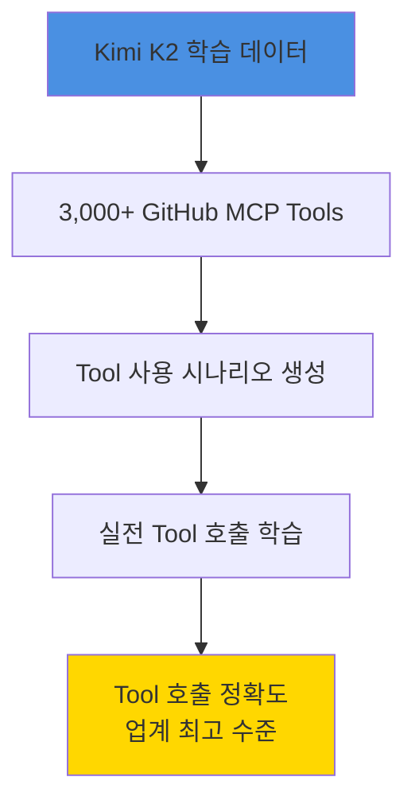
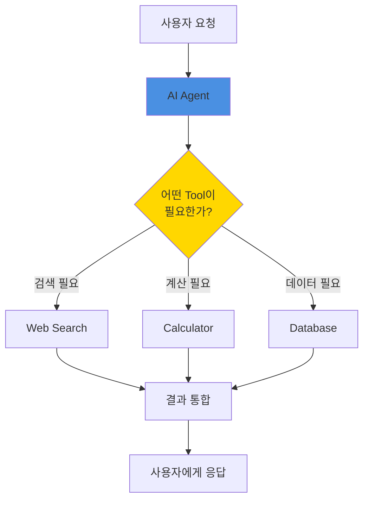
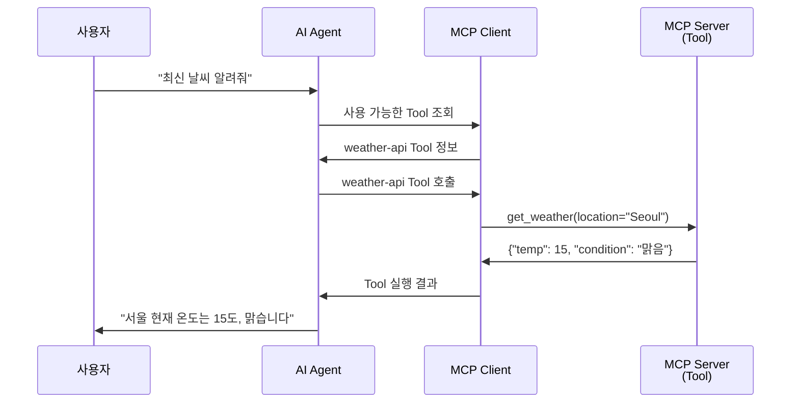

# Clip 3: AI 에이전트 MCP 기술이 주목받는 이유

## 학습 목표

* OpenAI와 주요 AI 기업들이 MCP를 표준으로 채택한 이유 이해하기
* AI Agent의 핵심 개념과 Tool 사용 능력의 중요성 파악하기
* 현재 AI 산업에서 MCP가 차지하는 위치 알아보기
* 최신 LLM 모델들의 Tool 사용 벤치마크 이해하기

## OpenAI가 MCP를 선택한 이유

### OpenAI Dev Day의 중요한 발표

2025년 OpenAI Dev Day에서 발표된 **Apps SDK**는 본질적으로 **ChatGPT라는 AI Agent에 MCP를 연결하는 기술**입니다.

<figure><figcaption>
<a href="https://developers.openai.com/apps-sdk/">https://developers.openai.com/apps-sdk/</a>, <a href="https://openai.com/index/introducing-apps-in-chatgpt/">https://openai.com/index/introducing-apps-in-chatgpt/</a>
</figcaption></figure>

### Apps SDK의 핵심 구조

OpenAI Apps SDK는 다음과 같은 과정으로 작동합니다:

1. **Use Case 연구**: 사용자가 무엇을 하려는지 파악
2. **MCP Server 설정**: Model Context Protocol 서버 구축
3. **App 배포**: ChatGPT에 통합

### 왜 MCP를 선택했는가?

OpenAI가 MCP를 Apps SDK의 핵심으로 선택한 이유:

1. **표준화된 프로토콜**: 일관된 방식으로 Tool 연결
2. **확장성**: 무한히 많은 Tool 추가 가능
3. **보안**: 명확한 권한 관리
4. **개발자 경험**: 쉬운 구현과 배포

## Kimi K2: MCP 전문가로 훈련된 모델

### 혁신적인 학습 방식

Moonshot AI가 개발한 **Kimi K2**는 MCP를 활용하는 능력을 중점적으로 학습한 모델입니다:

### 학습 과정의 특징

**대규모 합성 데이터 생성:**

* GitHub에서 3,000개 이상의 MCP Tool 수집
* 수천 가지 실제 시나리오 시뮬레이션
* Tool 품질 필터링 및 검증

**결과:**

* Tool 호출 정확도 업계 최고 수준
* Claude Sonnet 4 대비 10배 저렴한 비용

## 우리가 쓰는 모든 AI 툴은 AI Agent

### AI Agent의 정의

**AI Agent란?**

* LLM을 활용하는 애플리케이션
* **목표 달성을 위해 자율적으로 작업을 수행**하는 시스템
* 사용자의 의도를 이해하고 필요한 Tool을 선택하여 실행

### 우리가 사용하는 AI Agent 예시

**모두 AI Agent입니다:**

* **ChatGPT**: OpenAI의 대화형 AI Agent
* **Claude**: Anthropic의 다목적 AI Agent
* **Claude Code**: 개발 전문 AI Agent
* **Cursor**: 코드 에디터 통합 AI Agent
* **GitHub Copilot**: 코드 작성 AI Agent

이들의 공통점: **LLM + Tool 사용 능력**

## MCP는 AI Agent가 사용하는 Tool

### Tool이란 무엇인가?

**Tool = AI가 호출할 수 있는 함수**

MCP Tool의 기본 개념:

* 명확한 입력 파라미터 정의
* 구조화된 출력 데이터
* Tool의 목적과 사용법 설명

### MCP의 역할

MCP(Model Context Protocol)는:

1. **Tool을 표준화된 방식으로 정의**
2. **AI Agent가 Tool을 발견하고 이해할 수 있게 함**
3. **안전하게 Tool을 실행하고 결과를 받아옴**

## Tool 사용 능력이 가장 중요한 벤치마크

### 현대 LLM의 핵심 지표

최근 발표되는 모든 주요 LLM 모델은 **Tool 사용 벤치마크**를 강조합니다:

<figure><figcaption>
<a href="https://moonshotai.github.io/Kimi-K2/">https://moonshotai.github.io/Kimi-K2/</a>
</figcaption></figure>

| 모델             | Tool 호출 정확도 | 특징          |
| -------------- | ----------- | ----------- |
| **Kimi K2**    | 매우 높음       | MCP 전문 학습   |
| **GPT-5**      | 높음          | Apps SDK 통합 |
| **Sonnet 4.5** | 매우 높음       | 다목적 Tool 지원 |
| **Opus 4.1**   | 높음          | 복잡한 Tool 체인 |

## 출처

* [OpenAI Apps SDK](https://developers.openai.com/apps-sdk/)
* [OpenAI Apps SDK - Use Cases](https://developers.openai.com/apps-sdk/plan/use-case)
* [OpenAI Apps SDK - MCP Server](https://developers.openai.com/apps-sdk/build/mcp-server)
* [Kimi K2: Open Agentic Intelligence](https://moonshotai.github.io/Kimi-K2/)
