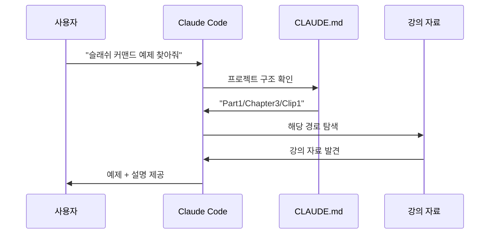
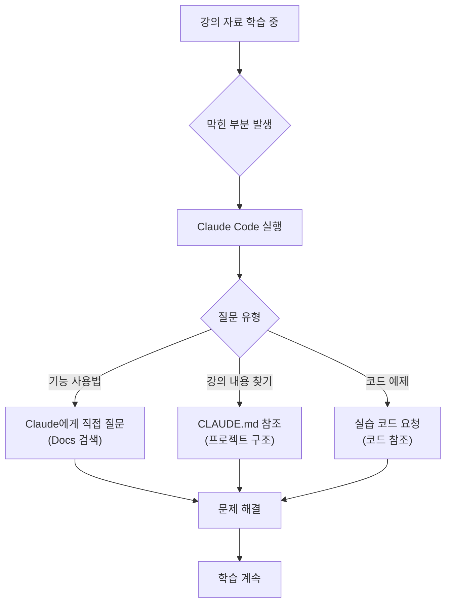
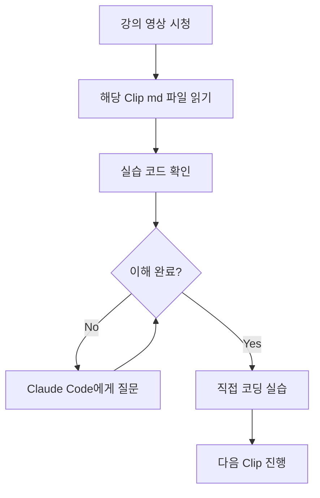

---
## 강사 정보
- 작성자: 정구봉
- LinkedIn: https://www.linkedin.com/in/gb-jeong/
- 이메일: bong@dio.so

## 강의 자료
- 강의 자료: https://goobong.gitbook.io/fastcampus
- Github: https://github.com/Koomook/fastcampus-ai-agent-vibecoding
- FastCampus 강의 주소: https://fastcampus.co.kr/biz_online_vibeagent

---

# Clip 4: Docs와 실습코드 Github

## 학습 목표

* Claude Code Docs를 활용하여 모르는 기능을 효과적으로 학습하기
* CLAUDE.md를 활용한 프로젝트 맞춤형 가이드 작성법 이해하기
* 실습 코드 저장소 구조 파악 및 활용 방법 익히기
* AI를 활용한 학습 전략 수립하기

## Claude Code에게 직접 물어보기

### Claude Code의 강의 자료 검색 능력

Claude Code가 강의 자료를 검색하고 이해할 수 있도록 CLAUDE.md를 준비했습니다. 헷갈리는 내용은 직접 물어보세요!

**예시 질문:**

```
"사용자 정의 슬래쉬 커맨드 실전 예제 찾아줘"
```

Claude Code는 강의 자료에서 관련 내용을 찾아줍니다. 위 질문의 경우 **Part1 Chapter3 Clip1**에서 슬래쉬 커맨드 예제를 찾아 제공합니다.

### Claude Code가 강의 자료를 찾는 과정



### 실전 활용 예시

**1. 특정 기능 검색:**

```
"MCP 서버 설치 방법 알려줘"
"Agents 설정 파일 예제 보여줘"
```

**2. 트러블슈팅:**

```
"MCP 연결이 안 될 때 -> 강의 자료에서 연결 명령어 찾아줘"
```

**3. 고급 기능 탐색:**

```
"Custom hook 작성 예제 찾아줘"
"output-style 예제 찾아줘"
```

## CLAUDE.md로 강의 자료 활용 가이드

### CLAUDE.md란?

**강의 자료를 잘 보기 위한 가이드**

* Claude Code가 강의 자료를 이해하고 효과적으로 탐색할 수 있도록 돕는 파일
* 프로젝트 구조, 학습 주제, 강의 자료 작성 규칙을 설명
* Claude Code 실행 시 자동으로 참조되어 더 정확한 답변 제공

### CLAUDE.md의 구조

```markdown
# CLAUDE.md

## 프로젝트 개요
이 프로젝트가 무엇을 하는지 설명

## 디렉토리 구조
주요 폴더와 파일 설명

## 작업 규칙
- 코딩 스타일
- 명명 규칙
- 언어 (한글/영어)

## 주의사항
- 특별히 지켜야 할 사항
- 하지 말아야 할 것들

## 외부 리소스
- 참고 문서 링크
- API 문서 등
```

### 이 강의 자료의 CLAUDE.md

실제로 이 강의 자료 저장소에도 CLAUDE.md가 있습니다!

**Claude Code가 이해하는 정보:**

```markdown
## 프로젝트 개요
- 패스트캠퍼스 AI 에이전트 강의 시리즈
- 6개 파트, 다수의 챕터와 클립으로 구성
- 한글 교육 콘텐츠

## 강의 자료 구조
- Part -> Chapter -> Clip 순서
- 각 클립은 독립적인 학습 주제
- Python 예제 코드 포함
- Mermaid 다이어그램으로 시각화

## Claude Code가 답변할 때 참고하는 규칙
- 강의 자료는 모두 한글
- 예제는 Python 3.11+ 기반
- 명확한 학습 목표와 핵심 요점 중심
```

## 강의 자료 탐색을 위한 활용법

### CLAUDE.md 활용 시나리오



## 실습 코드 Github 저장소

### 저장소 구조

```
fastcampus-lecture/
├── README.md                    # 전체 커리큘럼
├── CLAUDE.md                    # Claude Code 가이드
├── Part1_AI_에이전트와_Claude_Code_기초/
│   ├── Chapter1_강의_소개/
│   │   ├── Clip1_*.md
│   │   ├── Clip2_*.md
│   │   ├── Clip3_*.md
│   │   └── Clip4_*.md          # 현재 파일
│   ├── Chapter2_Claude_Code_설치와_설정/
...
```

### 실습 코드 활용 방법

* 각 Part의 Chapter별로 순차 학습
* 코드 예제 직접 실행
* Claude Code로 코드 분석 및 수정

### 저장소 활용 팁

**효과적인 학습 방법:**



## 바이브 코딩으로 학습하기

### Claude Code + 강의 자료 시너지

**학습 루프:**

1. **강의 영상 시청**: 개념 이해
2. **강의 자료 읽기**: 구조화된 정보 습득
3. **Claude Code 실행**: 실습 및 질문
4. **강의 자료 기반 대답**: 실습 구현하는 중에 막히는 부분은 강의 자료를 기반으로 대답


---

## 강사 정보
- 작성자: 정구봉
- LinkedIn: https://www.linkedin.com/in/gb-jeong/
- 이메일: bong@dio.so

## 강의 자료
- 강의 자료: https://goobong.gitbook.io/fastcampus
- Github: https://github.com/Koomook/fastcampus-ai-agent-vibecoding
- FastCampus 강의 주소: https://fastcampus.co.kr/biz_online_vibeagent
