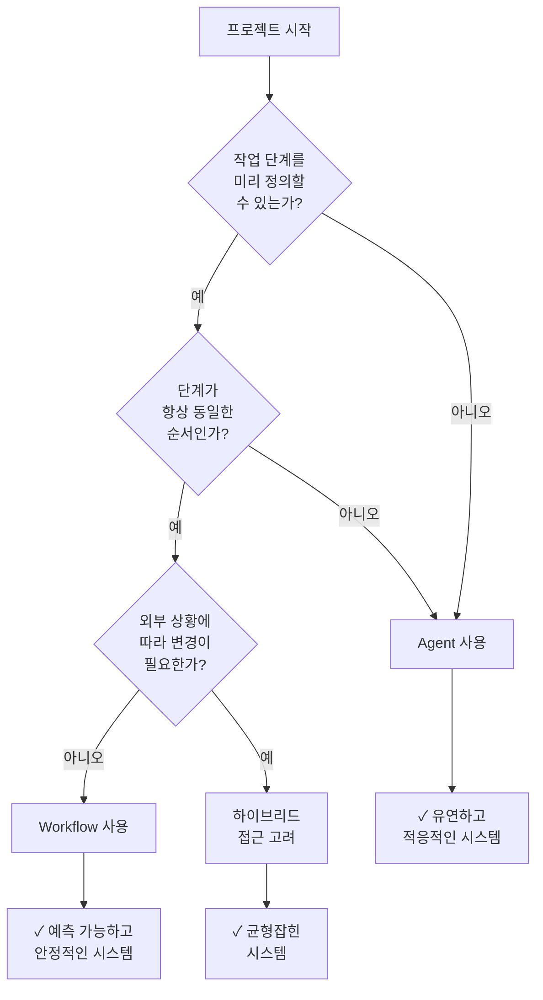
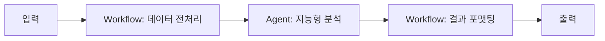

# Clip 1: Agent vs Workflow 개념 이해하기

## 학습 목표

* Agent와 Workflow의 근본적인 차이점 이해하기
* 각 접근 방식의 특징과 적용 시나리오 파악하기
* 프로젝트 요구사항에 따른 올바른 선택 기준 세우기

## 1. Agent와 Workflow의 정의

### Workflow란?

**Workflow**는 LLM과 도구들이 **미리 정의된 코드 경로**를 통해 조율되는 시스템입니다.

**주요 특징:**

* 고정되고 사전에 결정된 단계의 순서를 따름
* 예측 가능한 하위 작업들로 명확하게 분해될 수 있는 작업에 이상적
* 더 많은 제어와 예측 가능성 제공
* 프로세스를 사전에 매핑할 수 있을 때 가장 적합

### Agent란?

**Agent**는 LLM이 **자체 프로세스와 도구 사용을 동적으로 지시**하는 시스템으로, 작업을 수행하는 방법에 대한 제어권을 유지합니다.

**주요 특징:**

* 더 많은 자율성과 유연성을 가짐
* 예측할 수 없는 단계를 가진 개방형 문제를 처리할 수 있음
* 자체 경로와 도구 사용을 동적으로 결정
* 정확한 솔루션 경로를 미리 알 수 없는 복잡하고 진화하는 작업에 가장 적합

## 2. 핵심 차이점

<figure><figcaption>
출처: <a href="https://langchain-ai.github.io/langgraph/tutorials/workflows/">https://langchain-ai.github.io/langgraph/tutorials/workflows/</a>
</figcaption></figure>

### 주요 차이점: 사전 결정 수준

가장 중요한 차이점은 **사전 결정의 수준**입니다:

* **Workflow**: 엄격하고 사전 설계된 경로를 따름
* **Agent**: 환경 피드백을 기반으로 실시간으로 적응하고 결정을 내림

## 3. 언제 무엇을 사용할까?

### Workflow 사용 시기

✅ **다음과 같은 경우에 Workflow를 선택하세요:**

* 구조화되고 잘 이해된 프로세스
* 작업 단계가 명확하게 정의됨
* 높은 예측 가능성과 일관성이 필요함
* 디버깅과 모니터링이 중요함

**예시:**

* 문서 처리 파이프라인 (추출 → 변환 → 저장)
* 정기적인 데이터 분석 리포트 생성
* 승인 프로세스가 있는 워크플로우
* ETL (Extract, Transform, Load) 작업

### Agent 사용 시기

✅ **다음과 같은 경우에 Agent를 선택하세요:**

* 개방형 문제 해결
* 동적인 의사결정이 필요한 복잡한 작업
* 예측할 수 없는 상황에 대한 적응이 필요함
* 창의적이거나 탐색적인 작업

**예시:**

* 고객 지원 챗봇 (다양한 질문 유형 처리)
* 코드 리뷰 및 버그 수정 제안
* 복잡한 리서치 및 정보 수집
* 멀티 스텝 문제 해결 (해결 경로가 미리 알려지지 않음)

## 4. 실전 선택 가이드

### 의사결정 플로우차트

## 5. 핵심 원칙

> **"LLM 분야에서의 성공은 가장 정교한 시스템을 구축하는 것이 아닙니다. 귀하의 요구사항에 맞는 올바른 시스템을 구축하는 것입니다."**
>
> — Anthropic, "Building Effective Agents"

### 설계 원칙

1. **가장 단순한 솔루션으로 시작하기**
   * 불필요한 복잡성 피하기
   * 명확한 이점이 있을 때만 복잡성 추가
2. **결과로 검증하기**
   * 복잡한 Agent가 항상 더 나은 것은 아님
   * 실제 성과 지표로 평가
3. **점진적 개선**
   * Workflow로 시작 → 필요시 Agent 기능 추가
   * 단계별로 복잡성 증가

## 6. 하이브리드 접근 방식

실제로는 **Workflow와 Agent를 결합**하는 것이 효과적인 경우가 많습니다:

**예시:**

* 구조화된 데이터 수집 (Workflow)
* AI 기반 분석 및 의사결정 (Agent)
* 표준 형식으로 결과 출력 (Workflow)

## 요약

| 특성         | Workflow  | Agent    |
| ---------- | --------- | -------- |
| **제어 방식**  | 사전 정의된 경로 | 동적 의사결정  |
| **유연성**    | 낮음        | 높음       |
| **예측 가능성** | 높음        | 낮음       |
| **적용 분야**  | 구조화된 작업   | 개방형 문제   |
| **복잡도**    | 상대적으로 단순  | 상대적으로 복잡 |
| **디버깅**    | 용이함       | 도전적      |

## 다음 단계

다음 Clip에서는 AI Agent의 내부 아키텍처를 자세히 살펴보고, Agent가 어떻게 작동하는지 깊이 있게 이해하겠습니다.

***

## 참고 자료

* [LangGraph - Workflows Tutorial](https://langchain-ai.github.io/langgraph/tutorials/workflows/)
* [Anthropic - Building Effective Agents](https://www.anthropic.com/engineering/building-effective-agents)
