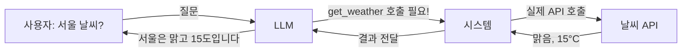
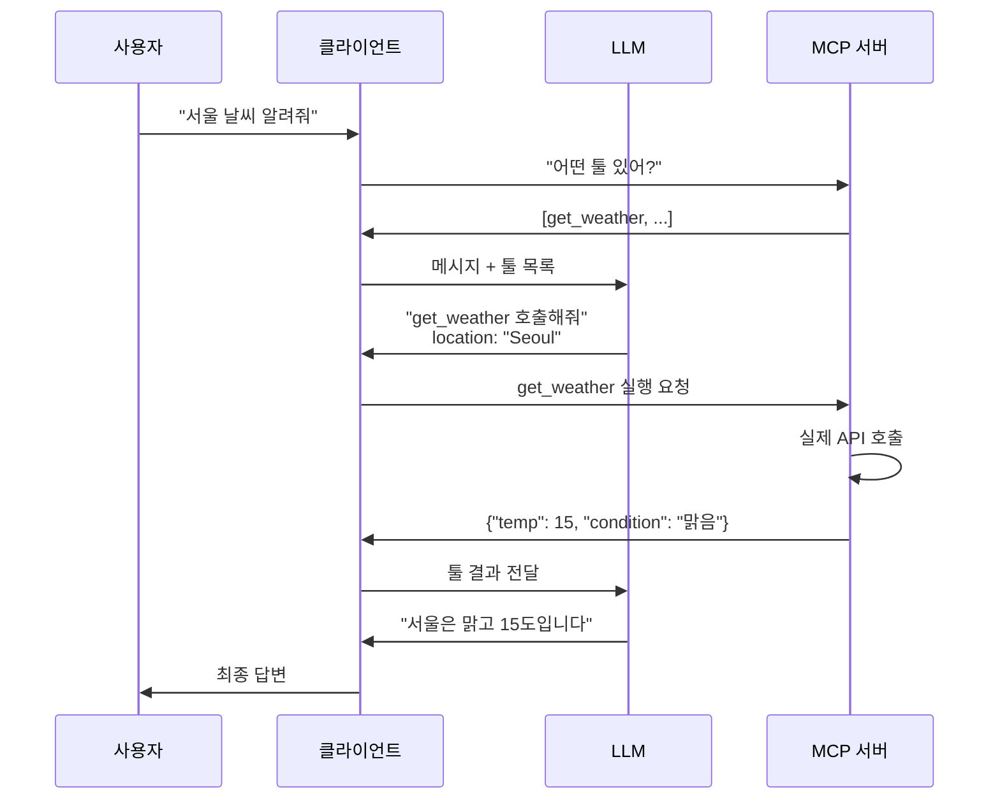

---
## 강사 정보
- 작성자: 정구봉
- LinkedIn: https://www.linkedin.com/in/gb-jeong/
- 이메일: bong@dio.so

## 강의 자료
- 강의 자료: https://goobong.gitbook.io/fastcampus
- Github: https://github.com/Koomook/fastcampus-ai-agent-vibecoding
- FastCampus 강의 주소: https://fastcampus.co.kr/biz_online_vibeagent

---

# Clip 3: Tool 이해하기

## 학습 목표
Tool을 공부하면서 딱 **두 가지 의문**을 해소합니다:
1. 날씨 조회, 일 더하기 일 같은 예시 툴들이 **왜 그렇게 동작하는지** 이해
2. 간단한 코드 형식만 입력했을 뿐인데, **어떻게 그걸 호출하는지** 이해

## Tool이 동작하는 원리

### 첫 번째 의문: 왜 그렇게 동작하는가?

**Tool의 본질**은 LLM이 직접 못 하는 작업(날씨 조회, 계산, 파일 읽기)을 외부 시스템에게 요청하는 메커니즘입니다.

LLM은 텍스트만 생성할 수 있기 때문에:
- "현재 서울 날씨는?"이라는 질문에 답변을 **만들어낼 수만** 있음 (실제 날씨 모름)
- "1 + 1 = ?"도 학습된 패턴으로 답변 (실제 계산 안 함)

Tool은 이런 한계를 극복합니다:



LLM이 하는 일: "이 질문은 get_weather 툴을 써야겠네!" (판단만)
시스템이 하는 일: 실제로 날씨 API 호출하고 결과 가져오기

### 두 번째 의문: 간단한 코드 형식만 입력했는데 어떻게 호출되는가?

**핵심 비밀**: Tool은 **선언**(어떤 툴인지 설명)과 **실행**(실제 코드)이 분리되어 있습니다.

#### 1단계: Tool 선언 (LLM에게 알려주기)

```python
# "이런 툴이 있어!"라고 LLM에게 알려주는 것
tool_definition = {
    "name": "get_weather",
    "description": "특정 도시의 현재 날씨를 조회합니다",
    "parameters": {
        "location": "string",  # 도시 이름
        "unit": "celsius or fahrenheit"  # 온도 단위
    }
}
```

이건 실제 코드가 아니라 **설명서**입니다. "이런 툴을 쓸 수 있어"라고 LLM에게 알려주는 것뿐입니다.

#### 2단계: LLM이 판단

사용자가 "서울 날씨 알려줘"라고 물으면:
- LLM이 tool_definition 목록을 보고 판단: "아, get_weather 써야겠네!"
- LLM이 출력: `{"tool": "get_weather", "arguments": {"location": "Seoul", "unit": "celsius"}}`

**LLM은 코드를 실행하지 않습니다. 단지 "이 툴을 이런 파라미터로 호출해줘"라고 요청만 합니다.**

#### 3단계: 시스템이 실제 코드 실행

```python
# 이게 실제 실행되는 코드
def get_weather(location, unit):
    # 실제 날씨 API 호출
    response = requests.get(f"https://api.weather.com/{location}")
    return response.json()

# 시스템이 LLM의 요청을 받고 실행
result = get_weather("Seoul", "celsius")  # {"temp": 15, "condition": "맑음"}
```

#### 4단계: 결과를 LLM에게 돌려주기

```python
# 시스템이 LLM에게 결과 전달
# LLM이 이제 이 정보로 답변 생성
# "서울은 현재 맑고 15도입니다"
```

## 실전 예제: OpenAI Function Calling

위의 원리를 실제 코드로 보겠습니다.

```python
from openai import OpenAI

client = OpenAI()

# 1단계: Tool 선언 (LLM에게 알려주기)
tools = [
    {
        "type": "function",
        "function": {
            "name": "get_weather",
            "description": "특정 도시의 날씨를 조회합니다",
            "parameters": {
                "type": "object",
                "properties": {
                    "location": {"type": "string", "description": "도시 이름"},
                },
                "required": ["location"]
            }
        }
    }
]

# 2단계: LLM에게 질문 + 사용 가능한 툴 목록 전달
response = client.chat.completions.create(
    model="gpt-5",
    messages=[{"role": "user", "content": "서울 날씨 알려줘"}],
    tools=tools
)

# LLM의 응답 확인
message = response.choices[0].message

# 3단계: LLM이 툴 호출을 요청했는지 확인
if message.tool_calls:
    tool_call = message.tool_calls[0]
    print(f"LLM이 요청한 툴: {tool_call.function.name}")
    print(f"LLM이 요청한 파라미터: {tool_call.function.arguments}")
    # 출력: get_weather, {"location": "Seoul"}

    # 4단계: 실제 함수 실행 (개발자가 직접 구현)
    def get_weather(location):
        # 실제 API 호출 등
        return {"temp": 15, "condition": "맑음"}

    result = get_weather("Seoul")

    # 5단계: 결과를 LLM에게 전달하고 최종 답변 받기
    final_response = client.chat.completions.create(
        model="gpt-5",
        messages=[
            {"role": "user", "content": "서울 날씨 알려줘"},
            message,  # LLM의 툴 호출 요청
            {
                "role": "tool",
                "tool_call_id": tool_call.id,
                "content": str(result)
            }
        ],
        tools=tools
    )

    print(final_response.choices[0].message.content)
    # 출력: "서울은 현재 맑고 15도입니다"
```

## MCP Tool: 같은 원리, 다른 구조

MCP Tool도 원리는 동일하지만, **Tool을 별도 서버에서 관리**한다는 차이가 있습니다.

### OpenAI vs MCP 차이점

```python
# OpenAI 방식: 클라이언트가 툴 정의 + 실행
tools = [{"name": "get_weather", ...}]  # 매번 정의
response = openai.chat.completions.create(tools=tools)
result = get_weather(...)  # 클라이언트가 실행

# MCP 방식: 서버가 툴 정의 + 실행
# 1. MCP 서버에 툴이 미리 등록되어 있음
# 2. 클라이언트는 서버에 "어떤 툴 있어?"라고 물어봄
# 3. LLM이 툴 호출 요청하면, 서버에 "실행해줘" 요청
```

### MCP Tool 간단 예제

```python
# MCP 서버 코드
from mcp.server import Server

server = Server("weather-server")

# 1. 툴 목록 제공 (클라이언트가 "어떤 툴 있어?" 물으면)
@server.list_tools()
async def list_tools():
    return [
        {
            "name": "get_weather",
            "description": "도시의 날씨를 조회합니다",
            "inputSchema": {
                "type": "object",
                "properties": {
                    "location": {"type": "string"}
                },
                "required": ["location"]
            }
        }
    ]

# 2. 툴 실행 (클라이언트가 "실행해줘" 요청하면)
@server.call_tool()
async def call_tool(name, arguments):
    if name == "get_weather":
        location = arguments["location"]
        # 실제 날씨 API 호출
        return {"temp": 15, "condition": "맑음"}
```

**핵심 차이**: OpenAI는 클라이언트가 툴을 실행하지만, MCP는 서버가 실행합니다.

## 전체 흐름 다이어그램



## 핵심 요약

### 두 가지 의문 해소

**1. 왜 그렇게 동작하는가?**
- LLM은 텍스트 생성만 가능 → 실제 행동(날씨 조회, 계산)은 못 함
- Tool은 LLM의 "요청"을 시스템의 "실행"으로 연결하는 다리
- LLM: 판단만 / 시스템: 실행

**2. 어떻게 호출되는가?**
- Tool 정의 = 설명서 (실제 코드 아님)
- LLM이 설명서 보고 "이 툴 써야겠다" 판단
- 시스템이 실제 코드 실행하고 결과 전달
- 선언(정의)과 실행(코드)이 분리됨

### OpenAI vs MCP 차이

| 특징 | OpenAI | MCP |
|------|--------|-----|
| 툴 정의 위치 | 클라이언트 | 서버 |
| 툴 실행 위치 | 클라이언트 | 서버 |
| 재사용성 | 매번 정의 | 서버에 등록 |

## 참고 자료
- [OpenAI Function Calling 공식 문서](https://platform.openai.com/docs/guides/function-calling)
- [MCP 공식 문서](https://modelcontextprotocol.io/docs/getting-started/intro)

---

## 강사 정보
- 작성자: 정구봉
- LinkedIn: https://www.linkedin.com/in/gb-jeong/
- 이메일: bong@dio.so

## 강의 자료
- 강의 자료: https://goobong.gitbook.io/fastcampus
- Github: https://github.com/Koomook/fastcampus-ai-agent-vibecoding
- FastCampus 강의 주소: https://fastcampus.co.kr/biz_online_vibeagent
