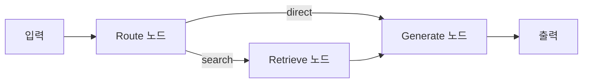
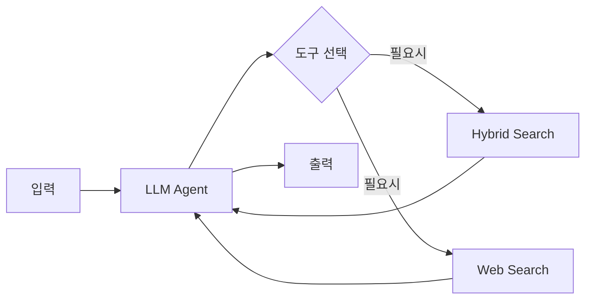
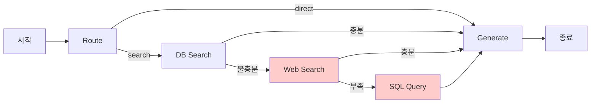

# Clip 1: Workflow에서 Agentic 개념 복기하기

## 학습 목표

* Workflow와 Agent의 차이점을 실제 구현을 통해 이해하기
* 구현한 Langgraph Routing RAG Workflow의 장단점 분석하기
* Agent 기반 RAG로 전환해야 하는 이유 파악하기

## 1. Workflow vs Agent 개념 복기

### Workflow의 특징

**Workflow**는 미리 정의된 경로를 따라 실행되는 시스템입니다.

**핵심 특징:**
- **사전 정의된 경로**: 노드와 엣지가 코드로 명확하게 정의됨
- **예측 가능성**: 어떤 입력이 들어와도 동일한 경로를 따름
- **제어 가능성**: 각 단계를 명확하게 제어하고 디버깅 가능
- **구조화**: 복잡한 프로세스를 명확한 단계로 분해

### Agent의 특징

**Agent**는 LLM이 자율적으로 도구를 선택하고 실행하는 시스템입니다.

**핵심 특징:**
- **동적 의사결정**: LLM이 상황에 따라 어떤 도구를 사용할지 결정
- **유연성**: 예상치 못한 질문에도 적절히 대응
- **자율성**: 도구 선택과 실행 순서를 LLM이 제어
- **적응성**: 새로운 도구 추가 시 코드 수정 최소화

### 주요 차이점

**Workflow 방식 (고정된 경로):**


**Agent 방식 (동적 도구 선택):**


## 2. 구현한 Langgraph Routing RAG Workflow 분석

### 현재 구현 구조

앞서 구현한 `langgraph_rag.py`는 다음과 같은 Workflow 구조를 가집니다:

```
┌─────────┐
│  START  │
└────┬────┘
     │
     ▼
┌──────────────┐
│  Route Node  │ ◄── 질문 분석: search or direct?
└──────┬───────┘
       │
       ├─────────────────┐
       │                 │
       ▼                 ▼
  [search]          [direct]
       │                 │
       ▼                 │
┌────────────────┐       │
│ Retrieve Node  │       │
│ (Hybrid Search)│       │
└────────┬───────┘       │
         │               │
         └───────┬───────┘
                 │
                 ▼
         ┌───────────────┐
         │ Generate Node │ ◄── 답변 생성
         └───────┬───────┘
                 │
                 ▼
             ┌─────┐
             │ END │
             └─────┘
```

**실행 흐름:**
1. **Route Node**: 질문 분석하여 검색 필요 여부 판단 (`search` or `direct`)
2. **Retrieve Node** (조건부): `search` 판단 시 Hybrid Search 실행
3. **Generate Node**: 검색 결과(또는 없이) 답변 생성

### 실제 코드 구조 (langgraph_rag.py:268-300)

```python
def build_graph() -> StateGraph:
    """Langgraph 워크플로우 구성"""
    workflow = StateGraph(State)

    # 노드 추가
    workflow.add_node("route", route_node)
    workflow.add_node("retrieve", retrieve_node)
    workflow.add_node("generate", generate_node)

    # 엣지 정의
    workflow.add_edge(START, "route")

    # 조건부 엣지: route → retrieve or generate
    workflow.add_conditional_edges(
        "route",
        should_retrieve,
        {
            "retrieve": "retrieve",
            "generate": "generate"
        }
    )

    # retrieve → generate
    workflow.add_edge("retrieve", "generate")
    workflow.add_edge("generate", END)

    return workflow.compile()
```

## 3. Workflow 구현의 장단점

### 장점 ✅

#### 1. 높은 예측 가능성
- 모든 경로가 명확하게 정의되어 있어 디버깅이 쉬움
- 어떤 입력이 들어와도 동일한 흐름을 따름

#### 2. 제어 가능성
- 각 노드에서 정확히 무엇을 할지 코드로 명시
- Route 단계에서 검색 필요 여부를 확실히 제어

#### 3. 성능 최적화
- 불필요한 검색을 방지하여 비용 절감
- 일반적인 질문은 바로 답변 생성

#### 4. 명확한 구조
```python
# search_app/langgraph_rag.py:93-133
def route_node(state: State) -> State:
    """Route 노드: 질문을 분석하여 검색 필요 여부 판단"""
    question = state["question"]

    messages = [
        SystemMessage(content="""당신은 질문을 분석하는 전문가입니다.
사용자의 질문이 농협 대출 상품에 대한 구체적인 정보를 요구하는지 판단하세요.

- 대출 상품 검색이 필요한 경우: "search"
- 일반적인 질문이나 인사말: "direct"
..."""),
        HumanMessage(content=question)
    ]

    response = llm.invoke(messages)
    route_decision = response.content.strip().lower()

    if "search" in route_decision:
        route_decision = "search"
    else:
        route_decision = "direct"

    return {**state, "route_decision": route_decision}
```

### 단점 ❌

#### 1. 유연성 부족

**문제:** 새로운 상황에 대응하려면 노드와 엣지를 계속 추가해야 함

**예시:**
- 현재: `route → retrieve → generate`
- 추가 요구사항 1: "검색 결과가 불충분하면 웹 검색 추가"
  → 새로운 노드와 조건부 엣지 추가 필요
- 추가 요구사항 2: "여러 번 검색해야 하는 복잡한 질문"
  → 루프 로직 추가 필요
- 추가 요구사항 3: "데이터베이스에서 직접 통계 조회"
  → 또 다른 노드와 분기 추가 필요

#### 2. 복잡도 증가

새로운 기능을 추가할 때마다:
- 새로운 노드 함수 작성
- 조건부 엣지 로직 수정
- State 타입 확장
- 테스트 케이스 추가

```python
# 기능 추가 시 필요한 수정 예시
class State(TypedDict):
    question: str
    route_decision: str
    documents: list
    answer: str
    debug: bool
    # 새 기능마다 필드 추가 필요
    web_search_results: list  # 추가 1
    database_query_result: dict  # 추가 2
    multi_search_count: int  # 추가 3
```

#### 3. LLM의 능력을 완전히 활용하지 못함

**현재 방식의 한계:**
- Route 단계에서만 LLM이 판단
- 이후는 고정된 경로를 따름
- LLM이 "더 많은 정보가 필요하다"고 판단해도 추가 검색 불가

**예시 시나리오:**
```
사용자: "30대 의사에게 가장 적합한 대출 상품은?"

[현재 Workflow]
1. Route: "search" 판단
2. Retrieve: "의사 대출" 검색 → 3개 결과
3. Generate: 답변 생성
   → 만약 결과가 불충분해도 추가 검색 불가

[이상적인 Agent]
1. LLM: "의사 대출" 검색 실행
2. LLM: 결과 검토 후 "30대에 특화된 정보가 부족함"
3. LLM: "청년 우대 대출" 추가 검색
4. LLM: 두 결과를 종합하여 답변
```

#### 4. 확장성 문제

새로운 검색 소스를 추가할 때마다 노드와 조건부 엣지가 계속 증가합니다:



> **문제점**: 빨간색으로 표시된 노드들은 새로 추가해야 하는 검색 소스입니다. 각각의 추가마다 코드 수정이 필요합니다.

## 4. Agent로 전환해야 하는 이유

### Agent 방식의 작동 원리

```python
# Agent 방식 (개념)
agent = Agent(
    tools=[
        hybrid_search_tool,
        web_search_tool
    ]
)

# LLM이 자율적으로 도구를 선택하고 실행
result = agent.run("30대 의사에게 가장 적합한 대출 상품은?")

# 내부 실행 흐름 (LLM이 자동으로 결정)
# 1. hybrid_search_tool("의사 대출")
# 2. [결과 확인] "더 많은 정보 필요"
# 3. web_search_tool("30대 의사 대출 추천")
# 4. [결과 확인] "충분함"
# 5. 답변 생성
```

### Agent의 핵심 장점

#### 1. 동적 도구 선택
```
Workflow: 코드에 정의된 순서대로 실행
Agent: LLM이 상황에 따라 필요한 도구만 선택
```

#### 2. 유연한 대응
```
Workflow: 예상하지 못한 질문 → 에러 또는 부적절한 답변
Agent: 예상하지 못한 질문 → 도구를 조합하여 해결
```

#### 3. 확장 용이성
```python
# 새로운 도구 추가
tools.append(new_calculator_tool)  # Agent는 자동으로 활용
```

#### 4. 자연스러운 대화
```
Workflow: "이 질문은 검색이 필요합니다" (기계적)
Agent: "잠시만요, 관련 정보를 찾아보겠습니다" (자연스러움)
```

## 5. 실전 비교: Workflow vs Agent

### 시나리오: "의사 전용 대출의 금리와 한도를 비교해줘"

#### Workflow 방식
```python
# 1단계: Route (고정)
route_decision = route_node(question)  # "search" 반환

# 2단계: Retrieve (고정)
documents = hybrid_search(question, limit=3)  # 항상 3개

# 3단계: Generate (고정)
answer = generate_with_documents(documents)  # 무조건 답변 생성

# 문제: 3개 결과가 불충분해도 추가 검색 불가
```

#### Agent 방식
```python
# LLM이 자율적으로 판단하고 실행
agent_execution = [
    {"thought": "금리와 한도 정보가 필요하니 검색해야겠다"},
    {"action": "hybrid_search_tool", "input": "의사 전용 대출"},
    {"observation": "3개 상품 발견, 하지만 금리 정보가 부족함"},
    {"thought": "더 구체적인 금리 정보를 찾아야겠다"},
    {"action": "hybrid_search_tool", "input": "의사 전용 대출 금리"},
    {"observation": "상세 금리 정보 획득"},
    {"thought": "이제 충분한 정보를 수집했다"},
    {"final_answer": "의사 전용 대출 상품 비교..."}
]
```

**핵심 메시지:**
> Workflow는 명확한 경로를 제공하지만, Agent는 복잡한 상황에 유연하게 대응합니다.
> 대출 상담과 같이 다양한 질문과 맥락이 존재하는 도메인에서는 Agent가 더 효과적입니다.

## 6. 다음 단계: Agent 구현 방법

다음 Clip에서는 실제로 Agent를 구현합니다. 구현 방법은 다음과 같습니다:

### 웹 검색이 필요한 이유

대출 상담 Agent에 웹 검색을 추가하는 이유는 **최신 금융 정보 검색**이 필요하기 때문입니다.

**실제 시나리오:**
```
사용자: "2025년 기준금리가 어떻게 되나요? 현재 대출 받기 좋은 시기인가요?"

[문제점]
- 내부 DB: 농협 대출 상품 정보만 있음 (기준금리 정보 없음)
- 기준금리는 한국은행이 정기적으로 변경
- 금융 시장 동향은 실시간으로 변함

[해결책: Web Search 추가]
1. Hybrid Search: 농협 대출 상품 검색 (내부 DB)
2. Tavily Search: "2025년 한국은행 기준금리" 검색 (웹)
3. Agent: 두 정보를 종합하여 답변 생성
```

**Agent가 유연하게 대응하는 예시:**
- 일반 대출 질문 → Hybrid Search만 사용
- 기준금리, 시장 동향 질문 → Tavily Search만 사용
- 복합 질문 → 두 도구를 모두 사용

### Tavily Search API 사용

Web Search는 **Tavily Search API**를 사용합니다.

**Tavily 선택 이유:**
- **무료 사용량**: 한 달에 1,000건까지 무료 제공
- **비용 효율**: 추가 금액 없이 즉시 사용 가능
- **간단한 API**: REST API로 직접 호출 가능
- **고품질 결과**: 웹 검색 결과를 AI 친화적 형태로 제공

> **참고**: OpenAI 내장 Search Tool은 추가 비용이 발생하므로 Tavily를 사용합니다.

### Agent 도구 구성

```python
# Agent에 제공할 도구
tools = [hybrid_search_tool, tavily_search_tool]
```

### 프론트엔드 구조

Vercel AI SDK Python 샘플을 클론하여 사용:

```bash
# 1. 프론트엔드 클론
git clone https://github.com/vercel-labs/ai-sdk-preview-python-streaming
cd ai-sdk-preview-python-streaming

# 2. 백엔드만 수정
# 프론트엔드는 그대로 사용
```


## 요약

| 구분 | Workflow RAG | Agent RAG (다음 Clip) |
|------|-------------|---------------------|
| **경로** | 고정된 노드와 엣지 | LLM이 동적으로 결정 |
| **도구** | 코드로 명시 | Function Calling 사용 |
| **Web Search** | 별도 구현 필요 | Tavily API (무료 1000건) |
| **비용** | OpenAI API만 | OpenAI + Tavily 무료 |
| **프론트엔드** | 직접 구현 | Vercel 샘플 활용 |

## 참고 자료

* [Part2 Chapter1: Agent vs Workflow 개념 이해하기](../../Part2_Agent_개념과_아키텍처/Chapter1_Agent_개념_이해하기/Clip1_Agent_vs_Workflow_개념_이해하기.md)
* [LangGraph - Workflows vs Agents](https://langchain-ai.github.io/langgraph/tutorials/workflows/)
* [Anthropic - Building Effective Agents](https://www.anthropic.com/engineering/building-effective-agents)
* [Tavily Search API Documentation](https://docs.tavily.com/documentation/api-reference/endpoint/search)
* [OpenAI Function Calling Guide](https://platform.openai.com/docs/guides/function-calling)
* [Vercel AI SDK Python Streaming](https://github.com/vercel-labs/ai-sdk-preview-python-streaming)
