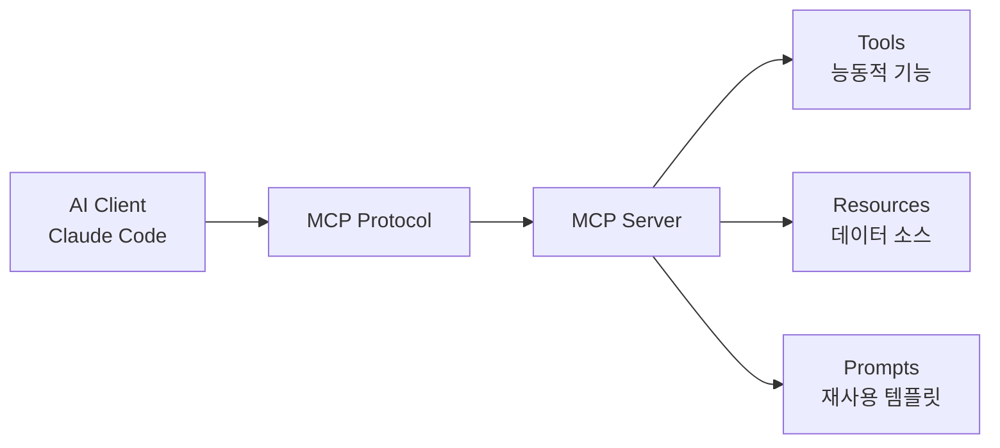

---
## 강사 정보
- 작성자: 정구봉
- LinkedIn: https://www.linkedin.com/in/gb-jeong/
- 이메일: bong@dio.so

## 강의 자료
- 강의 자료: https://goobong.gitbook.io/fastcampus
- Github: https://github.com/Koomook/fastcampus-ai-agent-vibecoding
- FastCampus 강의 주소: https://fastcampus.co.kr/biz_online_vibeagent

---

# Clip 1: MCP server의 개념과 구조 이해하기

## 학습 목표
- MCP server의 개념과 역할을 이해한다
- Tool, Resource, Prompt의 차이점과 활용법을 파악한다
- MCP server의 연결 방식과 설치 방법을 이해한다

## MCP Server란?

MCP (Model Context Protocol) server는 **AI 애플리케이션이 외부 기능과 데이터에 접근할 수 있도록 표준화된 인터페이스를 제공하는 서버**입니다.

### 왜 "표준화"가 중요한가?

MCP는 마치 **USB-C 포트**와 같습니다. USB-C 케이블을 내 컴퓨터에도 꽂을 수 있고, 맥북에도 꽂을 수 있고, 다른 사무실의 서버에도 꽂을 수 있듯이, MCP는 **호환성이 높은 Tool 인터페이스**입니다.

이전에는 각 AI 애플리케이션마다 Tool(Function)을 다르게 구현해야 했습니다. 하지만 MCP는 **약속된 규격**으로 Tool을 정의하여, 한 번 만든 MCP server를 여러 AI 애플리케이션에서 재사용할 수 있게 만들었습니다.

### 핵심 개념



MCP server는 세 가지 핵심 구성 요소를 통해 AI와 외부 세계를 연결합니다:

## 1. Tool: AI가 실행하는 능동적 기능

Tool은 **AI가 직접 호출하여 특정 작업을 수행하는 함수**입니다.

### Tool의 특징

- **AI 주도**: 모델이 필요에 따라 능동적으로 선택하고 호출
- **명확한 입출력**: JSON Schema로 정의된 파라미터 검증
- **실행 기능**: 데이터 조회부터 API 호출, 파일 조작까지 다양한 작업 수행

### Tool의 구성 요소

```python
# Tool 정의 예시
{
    "name": "search_web",
    "description": "인터넷에서 정보를 검색합니다",
    "inputSchema": {
        "type": "object",
        "properties": {
            "query": {
                "type": "string",
                "description": "검색할 키워드"
            },
            "max_results": {
                "type": "integer",
                "description": "최대 결과 수"
            }
        },
        "required": ["query"]
    }
}
```

**구성 요소:**
- `name`: Tool의 고유 식별자
- `description`: AI가 언제 이 Tool을 사용해야 하는지 판단하는 설명 (매우 중요!)
- `inputSchema`: JSON Schema 형식의 입력 파라미터 정의

### Tool이 실제로 작동하는 방식

AI는 `name`과 `description`을 보고 어떤 Tool을 선택할지 결정합니다.

예를 들어, 사용자가 "2025년 손흥민이 어떤 팀에 있는지 알려줘"라고 요청하면:

1. AI가 `search_web` Tool의 description을 확인
2. `inputSchema`를 바탕으로 입력값 생성:
   ```python
   {
       "query": "2025년 손흥민 축구팀",
       "max_results": 5
   }
   ```
3. Tool을 실행하고 검색 결과 반환
4. AI가 결과를 분석해 답변 생성

### Tool 동작 프로토콜

1. **`tools/list`**: 사용 가능한 Tool 목록 조회
2. **`tools/call`**: 특정 Tool을 실행하고 결과 반환

## 2. Resource: 읽기 전용 데이터 소스

Resource는 **AI가 참조할 수 있는 수동적인 데이터 제공자**입니다.

### Resource의 특징

- **수동적 접근**: Tool과 달리 데이터를 제공만 함
- **읽기 전용**: 데이터를 변경하지 않고 조회만 가능
- **URI 기반**: 고유한 URI로 각 리소스를 식별

### Resource 활용 예시

```python
# Resource URI 예시
"file:///project/docs/README.md"
"database://users/table/customers"
"api://github/repo/fastcampus-lecture"
```

### Resource 프로토콜

1. **`resources/list`**: 사용 가능한 Resource 목록
2. **`resources/templates/list`**: 동적 Resource를 위한 URI 템플릿
3. **`resources/read`**: 특정 Resource의 내용 읽기
4. **`resources/subscribe`**: Resource 변경 감지 (옵션)

### Tool vs Resource 비교

| 구분 | Tool | Resource |
|------|------|----------|
| **성격** | 능동적 (Active) | 수동적 (Passive) |
| **주도권** | AI가 호출 | 사용자/시스템이 제공 |
| **역할** | 작업 실행 | 데이터 제공 |
| **예시** | 파일 작성, API 호출, 계산 | 문서 내용, 데이터베이스 조회 |

## 3. Prompt: 재사용 가능한 지시 템플릿

Prompt는 **사용자가 반복적으로 사용할 수 있는 구조화된 지시사항 템플릿**입니다.

### Prompt의 특징

- **사용자 주도**: 사용자가 선택하여 사용
- **재사용성**: 자주 사용하는 워크플로우를 템플릿화
- **구조화**: 일관된 형식으로 AI에게 작업 지시

### Prompt 예시

```python
# 코드 리뷰 Prompt 템플릿
{
    "name": "code-review",
    "description": "코드 리뷰를 수행합니다",
    "arguments": [
        {
            "name": "file_path",
            "description": "리뷰할 파일 경로",
            "required": true
        }
    ]
}
```

### Prompt 프로토콜

1. **`prompts/list`**: 사용 가능한 Prompt 템플릿 목록
2. **`prompts/get`**: 특정 Prompt의 전체 내용 가져오기

## MCP Server 연결 방식

MCP server는 두 가지 방식으로 AI 클라이언트와 연결됩니다.

### 1. stdio (Standard Input/Output)

**로컬 프로세스로 실행되는 방식**

```json
{
  "mcpServers": {
    "filesystem": {
      "command": "npx",
      "args": ["-y", "@modelcontextprotocol/server-filesystem", "/path/to/allowed/files"]
    }
  }
}
```

**특징:**
- 가장 간단하고 일반적인 방식
- Claude Code에서 주로 사용
- 프로세스 간 stdin/stdout으로 통신
- 로컬 실행으로 빠른 응답 속도
- 로컬 파일을 직접 파일 경로로 접근

### 2. HTTP (Server-Sent Events)

**원격 서버로 실행되는 방식**

```json
{
  "mcpServers": {
    "notion": {
      "type": "http",
      "url": "https://mcp.notion.com/mcp"
    }
  }
}
```

**특징:**
- 원격 서버와 통신 가능
- 여러 클라이언트가 하나의 서버 공유
- 네트워크를 통한 확장성
- 주로 인증이 필요한 서비스에 사용 (예: Notion, Linear, Figma)

### stdio vs HTTP 비교

| 방식 | stdio | HTTP |
|------|-------|------|
| **실행 위치** | 로컬 프로세스 | 원격 서버 |
| **속도** | 빠름 | 네트워크 지연 존재 |
| **보안** | 로컬 실행으로 안전 | 인증/암호화 필요 |
| **확장성** | 클라이언트당 1 프로세스 | 다중 클라이언트 지원 |
| **사용 사례** | 파일 시스템, 로컬 DB | API 서비스, 공유 리소스 |

## MCP Server 설치 방법

MCP server는 일반적으로 **패키지 매니저를 통해 설치하고 실행**합니다.

### MCP Server 식별하기

MCP server를 설치할 때, 어떤 방식으로 설치해야 하는지는 패키지 이름으로 구분할 수 있습니다:

- **`npx`로 되어 있는 MCP server** → Node.js 기반으로 설치
- **`uvx`로 되어 있는 MCP server** → Python 기반으로 설치


**의미:**
- `npx`: npm 패키지를 설치 없이 직접 실행
- `-y`: 자동으로 설치 확인
- `@modelcontextprotocol/server-filesystem`: npm 패키지 이름
- `/path/to/directory`: 서버 실행 시 전달할 인자

**장점:**
- 별도 설치 불필요
- 항상 최신 버전 사용
- 간편한 설정

### uvx로 설치 (Python 기반)

**의미:**
- `uvx`: uv 도구를 통한 Python 패키지 실행
- `mcp-server-sqlite`: PyPI 패키지 이름
- `--db-path`: 서버 실행 옵션

**장점:**
- Python 가상환경 자동 관리
- 의존성 충돌 방지
- 빠른 실행 속도


## MCP Server의 사용자 제어와 보안

MCP는 **사용자의 명시적 제어와 감독**을 강조합니다.

### MCP 아키텍처의 보안 원칙

MCP 프로토콜 자체는 보안을 강제할 수 없지만, 다음과 같은 핵심 원칙을 제시합니다:

#### 1. 사용자 동의와 제어 (User Consent and Control)
- **데이터 접근 전 동의**: 호스트는 사용자 데이터를 MCP server에 노출하기 전에 반드시 사용자 동의를 받아야 합니다
- **명시적 승인**: 중요한 작업은 사용자의 명시적 승인이 필요합니다

#### 2. 데이터 프라이버시 (Data Privacy)
- **최소 권한**: 필요한 최소한의 데이터만 접근 허용
- **데이터 보호**: 사용자 데이터는 승인 없이 서버로 전달되지 않습니다

#### 3. LLM 샘플링 제어
- **샘플링 요청 제어**: LLM 샘플링 요청이 있을 때만 서버가 데이터를 볼 수 있습니다
- **투명성**: AI가 어떤 Tool을 사용하는지 사용자가 확인 가능

#### 4. Tool 안전성 (Tool Safety)
- **안전한 실행**: 모든 데이터 접근 및 작업은 안전하게 실행됩니다
- **활동 로그**: 모든 Tool 실행 기록을 남깁니다

### 구현 가이드라인

MCP 프로토콜 수준에서는 보안을 강제할 수 없지만, 구현자는 다음을 **반드시** 고려해야 합니다:

1. **강력한 동의 및 권한 플로우 구축**: 사용자가 명확히 이해하고 승인할 수 있는 UI 제공
2. **보안 영향에 대한 명확한 문서화**: 각 Tool이 어떤 권한을 요구하는지 명시
3. **적절한 접근 제어 및 데이터 보호**: 파일 시스템 접근 범위 제한 등
4. **통합 시 보안 모범 사례 준수**: 인증, 암호화, 로깅 등
5. **기능 설계 시 프라이버시 고려**: 개인정보 최소 수집 원칙


## 핵심 정리

- **MCP Server**: AI가 외부 기능과 데이터에 접근하는 표준화된 인터페이스
- **Tool**: AI가 호출하는 능동적 기능 (예: 파일 작성, API 호출)
- **Resource**: AI가 참조하는 수동적 데이터 (예: 문서, 데이터베이스)
- **Prompt**: 재사용 가능한 지시 템플릿 (예: 코드 리뷰, 문서 생성)
- **연결 방식**: stdio (로컬) 또는 HTTP (원격)
- **설치 방법**: npx (Node.js) 또는 uvx (Python)로 간편하게 실행

## 참고 자료

- [MCP Server Concepts - 공식 문서](https://modelcontextprotocol.io/docs/learn/server-concepts)


---

## 강사 정보
- 작성자: 정구봉
- LinkedIn: https://www.linkedin.com/in/gb-jeong/
- 이메일: bong@dio.so

## 강의 자료
- 강의 자료: https://goobong.gitbook.io/fastcampus
- Github: https://github.com/Koomook/fastcampus-ai-agent-vibecoding
- FastCampus 강의 주소: https://fastcampus.co.kr/biz_online_vibeagent
