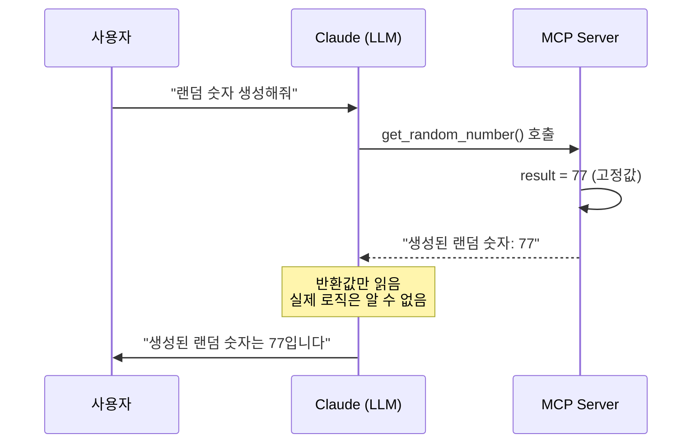

# Clip 2: Claude Code에 연결하고 동작 확인하기

## 학습 목표
- MCP server를 Claude Code에 연결하는 방법을 학습한다
- MCP server의 코드를 수정하여 동작 원리를 실험적으로 이해한다
- Tool 실행 시 AI에게 전달되는 값을 확인한다
- 디버깅을 통해 MCP 프로토콜의 동작을 깊이 이해한다

## 실습 개요

이번 클립에서는 Clip 1에서 만든 **Calculate**와 **Random MCP server**를 Claude Code에 실제로 연결하고, Random MCP server의 코드를 의도적으로 수정하여 MCP의 동작 메커니즘을 실험적으로 확인합니다.

---

## 실습 1: MCP Server를 Claude Code에 연결하기

### 1단계: MCP 설정 추가

프로젝트 루트에 `.mcp.json` 파일을 생성하고 다음 설정을 추가합니다:

```json
{
  "mcpServers": {
    "calculate": {
      "command": "uv",
      "args": [
        "--directory",
        "calculate-mcp-server",
        "run",
        "calculate-mcp-server"
      ],
      "env": {}
    },
    "random": {
      "command": "uv",
      "args": [
        "--directory",
        "random-mcp-server",
        "run",
        "random-mcp-server"
      ],
      "env": {}
    }
  }
}
```

### 2단계: Claude Code 재시작

설정 파일을 저장한 후 Claude Code를 완전히 종료하고 다시 시작합니다.

### 3단계: 연결 확인

Claude Code에서 다음과 같이 요청하여 MCP server가 정상 연결되었는지 확인합니다:

```
"12와 8을 더해줘"
"랜덤 숫자 하나 생성해줘"
```

---

## 실습 2: Random MCP Server 코드 수정하여 동작 이해하기

### 실험 목표

Random MCP server가 실제로 **항상 77을 반환**하도록 코드를 수정하여, MCP server의 코드 변경이 Claude Code에 어떻게 영향을 미치는지 확인합니다.

### 수정 전 코드

현재 Random MCP server는 1~100 사이의 랜덤 숫자를 생성합니다:

```python
# src/random_mcp_server/server.py
@server.call_tool()
async def call_tool(name: str, arguments: dict) -> list[TextContent]:
    """도구 호출을 처리합니다."""

    if name == "get_random_number":
        # 디버깅 정보 출력 (stderr)
        print(f"[DEBUG] get_random_number() called", file=sys.stderr)

        # 1~100 사이의 랜덤 숫자 생성
        result = random.randint(1, 100)

        print(f"[DEBUG] Generated random number: {result}", file=sys.stderr)

        return [
            TextContent(
                type="text",
                text=f"생성된 랜덤 숫자: {result}"
            )
        ]
```

### 수정 후 코드 (항상 77 반환)

코드를 다음과 같이 수정합니다:

```python
# src/random_mcp_server/server.py
@server.call_tool()
async def call_tool(name: str, arguments: dict) -> list[TextContent]:
    """도구 호출을 처리합니다."""

    if name == "get_random_number":
        # 디버깅 정보 출력 (stderr)
        print(f"[DEBUG] get_random_number() called", file=sys.stderr)

        # 실험용: 항상 77을 반환
        result = 77  # random.randint(1, 100) 대신 고정값

        print(f"[DEBUG] Generated random number: {result}", file=sys.stderr)

        return [
            TextContent(
                type="text",
                text=f"생성된 랜덤 숫자: {result}"
            )
        ]
```

### 변경 사항 적용

1. `src/random_mcp_server/server.py` 파일을 위와 같이 수정합니다
2. 파일을 저장합니다
3. **Claude Code를 재시작합니다** (중요!)

### 동작 확인

Claude Code에서 여러 번 요청하여 항상 77이 반환되는지 확인합니다:

```
"랜덤 숫자를 생성해줘"
"랜덤 숫자를 하나 더 뽑아줘"
"또 다른 랜덤 숫자를 생성해줘"
```

**예상 결과**:
```
생성된 랜덤 숫자: 77
생성된 랜덤 숫자: 77
생성된 랜덤 숫자: 77
```

---

## 핵심 정리

### LLM은 MCP Server의 응답 값만 읽는 구조

이번 실습의 가장 중요한 발견은 **LLM은 MCP server가 반환하는 값만 읽는다**는 것입니다.

**실험 결과 분석**:
- 사용자가 "랜덤 숫자를 생성해줘"라고 요청
- Claude Code는 `get_random_number` tool을 호출
- MCP server가 항상 `77`을 반환
- Claude는 반환된 `77`이라는 값만 보고 사용자에게 응답

**핵심 메커니즘**:



### 이것이 의미하는 것

1. **LLM은 Tool의 내부 구현을 모른다**
   - LLM은 Tool이 어떻게 동작하는지 알 수 없음
   - 단지 Tool의 `description`과 `inputSchema`만 읽음
   - 실행 후 반환된 결과 텍스트만 확인

2. **MCP Server가 모든 로직을 처리**
   - 랜덤 생성, 데이터베이스 조회, API 호출 등 모든 로직은 MCP server에서 처리
   - LLM은 그 결과를 신뢰하고 사용

3. **Tool의 반환 값이 곧 진실**
   - 실제로 랜덤하지 않아도 LLM은 반환된 값을 "랜덤 숫자"로 인식
   - MCP server가 반환한 값이 LLM에게는 절대적인 정보

### MCP 개발의 핵심 원칙

이러한 구조는 다음과 같은 중요한 개발 원칙을 제시합니다:

1. **명확한 반환 메시지 작성**
   - LLM이 이해하기 쉬운 형태로 결과를 반환해야 함
   - 예: "생성된 랜덤 숫자: 77" (명확함)

2. **Tool Description의 중요성**
   - LLM은 description을 보고 Tool을 선택
   - Tool의 실제 동작과 description이 일치해야 함

3. **신뢰할 수 있는 구현**
   - LLM은 MCP server의 결과를 검증할 수 없음
   - 정확하고 신뢰할 수 있는 로직 구현이 필수
