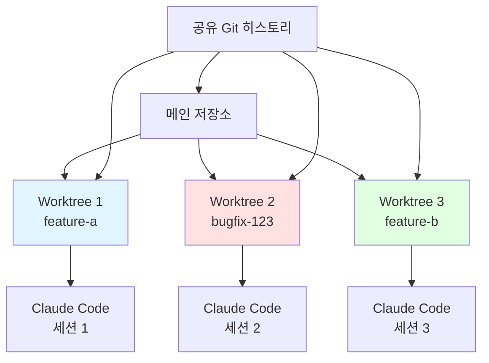

# Clip 1: git worktree 이해

## 🎯 학습 목표

* Git worktree의 개념과 동작 원리를 이해합니다
* 여러 브랜치를 동시에 작업할 수 있는 환경 구성 방법을 학습합니다
* Claude Code를 병렬로 실행하여 생산성을 극대화하는 방법을 익힙니다

<figure><figcaption></figcaption></figure>

## 🏗️ 시스템 아키텍처



## 🗂️ STEP 1: Git Worktree 기본 개념

### Worktree란?

**정의:** 동일한 Git 저장소의 여러 브랜치를 **별도의 디렉토리**에서 동시에 작업할 수 있게 해주는 Git 기능

### Branch vs Worktree 비교

| 구분                 | Branch (브랜치 전환)            | Worktree            |
| ------------------ | -------------------------- | ------------------- |
| **작업 디렉토리**        | 하나의 디렉토리 공유                | 브랜치마다 독립적인 디렉토리     |
| **동시 작업**          | ❌ 불가능 (한 번에 하나만)           | ✅ 가능 (여러 브랜치 동시 작업) |
| **브랜치 전환**         | `git checkout` 필요          | 디렉토리 이동만으로 전환       |
| **파일 상태**          | 전환 시 파일이 변경됨               | 각 디렉토리가 독립적 상태 유지   |
| **작업 임시 저장**       | `git stash` 필요             | 불필요 (각자 독립적)        |
| **컨텍스트 스위칭**       | 높음 (파일 재구성 필요)             | 낮음 (그냥 디렉토리 이동)     |
| **병렬 Claude Code** | ❌ 불가능                      | ✅ 가능 (각 디렉토리에서 실행)  |
| **환경 설정**          | 공유 (node\_modules, venv 등) | 독립적 (각자 설치 가능)      |
| **디스크 사용량**        | 적음 (하나의 워킹 디렉토리)           | 많음 (여러 워킹 디렉토리)     |
| **Git 히스토리**       | 공유                         | 공유 (같은 .git 사용)     |
| **사용 사례**          | 순차적 작업, 단일 기능 개발           | 병렬 작업, 긴급 수정, 멀티태스킹 |

**핵심 차이점:**

* **Branch**: 같은 작업 공간에서 코드 버전을 전환
* **Worktree**: 여러 작업 공간을 만들어 동시에 다른 버전 작업

#### 전통적인 방식의 문제점

```bash
# 전통적인 브랜치 전환
git checkout feature-a
# feature-a 작업 중...

# 갑자기 긴급 버그 수정 필요
git stash                    # 현재 작업 임시 저장
git checkout main
git checkout -b bugfix-123
# 버그 수정...
git checkout feature-a
git stash pop               # 작업 복원

# 문제점:
# 1. 컨텍스트 스위칭 오버헤드
# 2. stash 관리의 복잡성
# 3. 동시 작업 불가능
# 4. Claude Code 세션 중단
```

#### Worktree 방식의 장점

```bash
# Worktree 방식
cd ~/project                 # 메인 워킹 디렉토리
# feature-a 작업 중...

# 긴급 버그 수정 필요
git worktree add ../project-bugfix-123 -b bugfix-123
cd ../project-bugfix-123
# 버그 수정 (독립적인 환경)

# 동시에 다른 터미널에서
cd ~/project
# feature-a 작업 계속 가능!

# 장점:
# ✅ 완전한 파일 격리
# ✅ 동시 작업 가능
# ✅ 컨텍스트 유지
# ✅ 병렬 Claude Code 실행
```

## 📱 STEP 2: Worktree 기본 사용법

### Worktree 생성

#### 1. 새 브랜치로 Worktree 생성

```bash
# 기본 문법
git worktree add <경로> -b <브랜치명>

# 예시: feature-a 브랜치를 위한 worktree
git worktree add ../project-feature-a -b feature-a

# 결과
# Creating worktree '../project-feature-a'
# Preparing ../project-feature-a (identifier project-feature-a)
# HEAD is now at 1234567 Initial commit
```

**설명:**

* `../project-feature-a`: 새 워킹 디렉토리 경로
* `-b feature-a`: 새 브랜치 생성
* HEAD는 새 브랜치를 가리킴

#### 2. 기존 브랜치로 Worktree 생성

```bash
# 이미 존재하는 브랜치 체크아웃
git worktree add ../project-bugfix bugfix-123

# 특정 커밋에서 시작
git worktree add ../project-hotfix -b hotfix-urgent main

# 설명:
# - bugfix-123: 기존 브랜치
# - hotfix-urgent: 새 브랜치 (main에서 시작)
```

#### 3. 임시 Worktree (실험용)

```bash
# detached HEAD로 생성
git worktree add ../project-experiment --detach

# 설명:
# - 브랜치에 속하지 않음
# - 실험적 변경에 유용
# - 커밋은 가능하지만 브랜치 없음
```

### Worktree 관리

#### Worktree 목록 확인

```bash
# 모든 worktree 나열
git worktree list

# 출력 예시:
# /Users/dev/project           1234567 [main]
# /Users/dev/project-feature-a 8901234 [feature-a]
# /Users/dev/project-bugfix    5678901 [bugfix-123]

# 상세 정보
git worktree list --porcelain

# 출력 예시:
# worktree /Users/dev/project
# HEAD 1234567abcdef
# branch refs/heads/main
#
# worktree /Users/dev/project-feature-a
# HEAD 8901234abcdef
# branch refs/heads/feature-a
```

#### Worktree 제거

```bash
# 방법 1: worktree 제거 명령
git worktree remove ../project-feature-a

# 방법 2: 디렉토리 삭제 후 정리
rm -rf ../project-feature-a
git worktree prune

# prune: 이미 삭제된 worktree 정보 제거
```

## 🔍 STEP 3: Claude Code와 Worktree 활용

### 병렬 Claude Code 세션

#### 시나리오: 동시 개발

```bash
# 터미널 1: API 개발
cd ~/project
git worktree add ../project-api -b feature/api
cd ../project-api
claude

# Claude Code 세션 1
# "User API를 구현해줘"

# 터미널 2: 프론트엔드 개발
cd ~/project
git worktree add ../project-frontend -b feature/frontend
cd ../project-frontend
claude

# Claude Code 세션 2
# "User 관리 UI를 구현해줘"

# 터미널 3: 버그 수정
cd ~/project
git worktree add ../project-bugfix -b bugfix/login
cd ../project-bugfix
claude

# Claude Code 세션 3
# "로그인 버그를 수정해줘"
```

**장점:**

```python
benefits = {
    "코드 격리": "각 세션이 독립적인 파일 상태 유지",
    "동시 작업": "여러 기능을 병렬로 개발",
    "컨텍스트 보존": "각 Claude가 자신의 작업에만 집중",
    "충돌 방지": "파일 변경이 서로 간섭하지 않음"
}
```

#### 각 Worktree에서 환경 설정

```bash
# Python 프로젝트 예시
cd ../project-api
python -m venv .venv
source .venv/bin/activate
pip install -r requirements.txt

cd ../project-frontend
npm install

# 각 worktree는 독립적인 환경 가능
# - 다른 Python 가상환경
# - 다른 node_modules
# - 다른 .env 파일
```

## 📖 참고 자료

* Git Worktree 공식 문서: https://git-scm.com/docs/git-worktree
* Claude Code 병렬 작업 가이드: https://docs.claude.com/en/docs/claude-code/common-workflows#run-parallel-claude-code-sessions-with-git-worktrees
