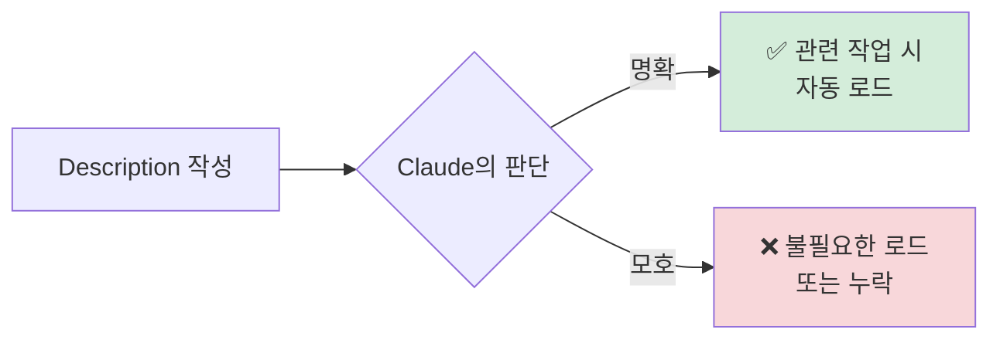
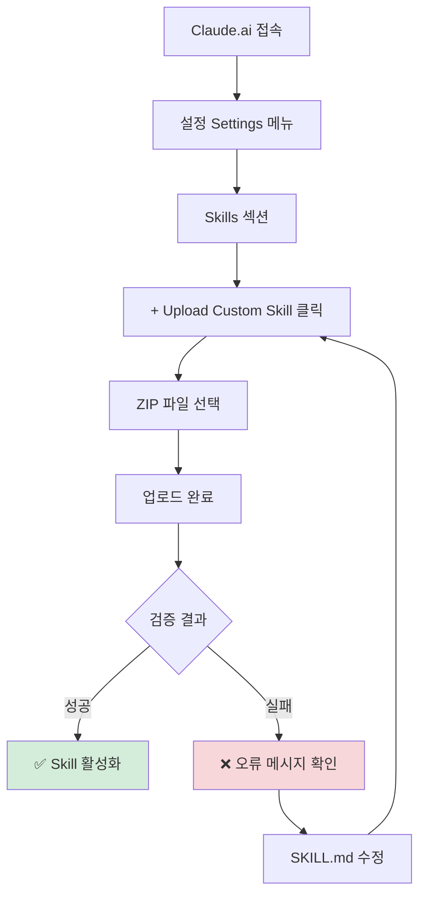

# Clip 2: Skill 만들고 Claude.ai에 추가하기

## 📋 학습 목표

* 커스텀 Skill의 기본 구조를 이해하고 작성할 수 있다
* YAML 프론트매터와 마크다운 본문을 올바르게 구성할 수 있다
* Skill을 패키징하고 Claude.ai에 업로드할 수 있다
* 실전 예제로 업무 자동화 Skill을 직접 만들어볼 수 있다

***

## 1. Skill의 기본 구조

### 1.1 최소 구조

모든 Skill은 최소한 **`SKILL.md`** 파일을 포함한 디렉토리로 구성됩니다.

```
my-custom-skill/
└── SKILL.md      # 필수 파일
```

### 1.2 확장 구조

실제 프로젝트에서는 추가 리소스를 포함합니다.

```
company-report-skill/
├── SKILL.md                    # 메인 지침
├── REFERENCE.md                # 참고 자료
├── templates/
│   ├── report_template.md      # 보고서 템플릿
│   └── chart_config.json       # 차트 설정
└── scripts/
    ├── generate_chart.py       # 차트 생성 스크립트
    └── export_pdf.py           # PDF 변환 스크립트
```

***

## 2. SKILL.md 파일 작성하기

### 2.1 YAML 프론트매터 (필수)

```yaml
---
name: company-report-skill
description: 회사 분기 실적 보고서를 자동으로 생성하는 Skill.
             매출 데이터 분석, 차트 생성, PDF 변환 작업에 사용.
version: 1.0.0
dependencies:
  - python >= 3.10
  - matplotlib
---
```

#### 필수 필드

| 필드            | 설명                             | 제약 조건              |
| ------------- | ------------------------------ | ------------------ |
| `name`        | Skill의 고유 이름                   | 최대 64자, 소문자+하이픈 권장 |
| `description` | Claude가 Skill을 언제 사용할지 판단하는 설명 | 최대 1024자, 구체적으로 작성 |

#### 선택 필드

| 필드             | 설명            | 예시                             |
| -------------- | ------------- | ------------------------------ |
| `version`      | 버전 번호         | `1.0.0`, `2.1.3`               |
| `dependencies` | 필요한 소프트웨어/패키지 | `python >= 3.10`, `node >= 18` |

***

### 2.2 Description 작성 전략

**❌ 나쁜 예:**

```yaml
description: 보고서를 만드는 Skill
```

* 너무 모호함
* 언제 사용할지 불명확

**✅ 좋은 예:**

```yaml
description: 회사 분기 실적 보고서를 자동으로 생성하는 Skill.
             매출 데이터 분석, 차트 생성, PDF 변환 작업에 사용.
             CSV 파일을 입력받아 시각화된 보고서를 출력함.
```

* 구체적인 용도 명시
* 입력/출력 형식 언급
* 주요 기능 나열



***

### 2.3 마크다운 본문 작성

프론트매터 이후에는 상세 지침을 마크다운으로 작성합니다.

```markdown
# Company Report Skill

## 사용 시기
- 분기별 실적 보고서 생성 요청 시
- CSV 형식의 매출 데이터가 있을 때
- 경영진 대상 시각화 보고서 필요 시

## 입력 데이터 형식

CSV 파일은 다음 컬럼을 포함해야 합니다:
- `date`: YYYY-MM-DD 형식의 날짜
- `revenue`: 매출액 (숫자)
- `cost`: 비용 (숫자)
- `category`: 제품 카테고리

## 작업 프로세스

### 1단계: 데이터 검증
- CSV 파일 로드
- 필수 컬럼 존재 여부 확인
- 날짜 형식 검증

### 2단계: 데이터 분석
- 매출 증가율 계산
- 카테고리별 비중 분석
- 전분기 대비 변화량 산출

### 3단계: 차트 생성
- `scripts/generate_chart.py` 실행
- 매출 추이 선 그래프
- 카테고리별 원형 차트

### 4단계: 보고서 작성
- `templates/report_template.md` 기반
- 분석 결과 삽입
- 인사이트 요약

### 5단계: PDF 변환
- `scripts/export_pdf.py` 실행
- 회사 브랜드 템플릿 적용

## 예제 사용법

**프롬프트:**
```

Q4 실적 보고서를 만들어줘. 데이터는 sales\_Q4.csv 파일이야.

```

**예상 출력:**
- `Q4_Performance_Report.pdf`
- 주요 지표 요약
- 시각화 차트 3개
```

***

## 3. 코드 및 리소스 추가하기

### 3.1 Python 스크립트 예제

**`scripts/generate_chart.py`:**

```python
"""
차트 생성 스크립트
CSV 데이터를 읽어 matplotlib으로 시각화
"""
import pandas as pd
import matplotlib.pyplot as plt
import matplotlib.font_manager as fm
from pathlib import Path

def load_data(csv_path: str) -> pd.DataFrame:
    """CSV 파일 로드 및 검증"""
    df = pd.read_csv(csv_path)
    required_columns = ['date', 'revenue', 'cost', 'category']

    missing = [col for col in required_columns if col not in df.columns]
    if missing:
        raise ValueError(f"필수 컬럼 누락: {missing}")

    df['date'] = pd.to_datetime(df['date'])
    return df

def create_revenue_trend(df: pd.DataFrame, output_path: str):
    """매출 추이 선 그래프 생성"""
    plt.figure(figsize=(12, 6))

    # 한글 폰트 설정 (선택)
    # plt.rcParams['font.family'] = 'AppleGothic'

    # 월별 매출 집계
    monthly = df.groupby(df['date'].dt.to_period('M'))['revenue'].sum()

    plt.plot(monthly.index.astype(str), monthly.values,
             marker='o', linewidth=2, color='#1E3A8A')
    plt.title('월별 매출 추이', fontsize=16, fontweight='bold')
    plt.xlabel('월', fontsize=12)
    plt.ylabel('매출 (원)', fontsize=12)
    plt.grid(True, alpha=0.3)
    plt.xticks(rotation=45)
    plt.tight_layout()
    plt.savefig(output_path, dpi=300)
    plt.close()

def create_category_pie(df: pd.DataFrame, output_path: str):
    """카테고리별 매출 비중 원형 차트"""
    plt.figure(figsize=(10, 8))

    category_revenue = df.groupby('category')['revenue'].sum()

    colors = ['#1E3A8A', '#F59E0B', '#10B981', '#EF4444', '#8B5CF6']
    plt.pie(category_revenue.values, labels=category_revenue.index,
            autopct='%1.1f%%', colors=colors, startangle=90)
    plt.title('카테고리별 매출 비중', fontsize=16, fontweight='bold')
    plt.axis('equal')
    plt.tight_layout()
    plt.savefig(output_path, dpi=300)
    plt.close()

if __name__ == '__main__':
    import sys

    if len(sys.argv) < 2:
        print("사용법: python generate_chart.py <csv_파일>")
        sys.exit(1)

    csv_file = sys.argv[1]
    df = load_data(csv_file)

    # 차트 생성
    create_revenue_trend(df, 'revenue_trend.png')
    create_category_pie(df, 'category_pie.png')

    print("✅ 차트 생성 완료: revenue_trend.png, category_pie.png")
```

### 3.2 템플릿 파일 예제

**`templates/report_template.md`:**

```markdown
# {{QUARTER}} 분기 실적 보고서

**작성일**: {{DATE}}
**작성자**: 자동 생성 (Claude Skills)

---

## 📊 주요 지표

| 지표 | 값 | 전분기 대비 |
|------|----|-----------|
| 총 매출 | {{TOTAL_REVENUE}} 원 | {{REVENUE_CHANGE}}% |
| 총 비용 | {{TOTAL_COST}} 원 | {{COST_CHANGE}}% |
| 순이익 | {{NET_PROFIT}} 원 | {{PROFIT_CHANGE}}% |

---

## 📈 매출 추이


### 인사이트
{{REVENUE_INSIGHT}}

---

## 🍰 카테고리별 분석


### 주요 발견
{{CATEGORY_INSIGHT}}

---

## 💡 결론 및 제언

{{CONCLUSION}}
```

***

## 4. Skill 패키징하기

### 4.1 폴더 구조 검증

패키징 전에 구조를 확인합니다.

```bash
# 터미널에서 실행
tree company-report-skill/
```

**예상 출력:**

```
company-report-skill/
├── SKILL.md
├── REFERENCE.md
├── templates/
│   ├── report_template.md
│   └── chart_config.json
└── scripts/
    ├── generate_chart.py
    └── export_pdf.py

2 directories, 6 files
```

### 4.2 ZIP 파일 생성

**중요**: ZIP 파일이 Skill 폴더를 루트로 포함해야 합니다.

**❌ 잘못된 구조:**

```
company-report-skill.zip
├── SKILL.md          # 폴더 없이 바로 파일들
├── scripts/
└── templates/
```

**✅ 올바른 구조:**

```
company-report-skill.zip
└── company-report-skill/    # 폴더가 루트
    ├── SKILL.md
    ├── scripts/
    └── templates/
```

**macOS/Linux:**

```bash
# 부모 디렉토리에서 실행
zip -r company-report-skill.zip company-report-skill/

# 구조 확인
unzip -l company-report-skill.zip
```

**Windows:**

```powershell
Compress-Archive -Path company-report-skill -DestinationPath company-report-skill.zip
```

***

## 5. Claude.ai에 업로드하기

### 5.1 사전 요구사항

* ✅ Claude.ai Pro, Max, Team, 또는 Enterprise 플랜
* ✅ 올바른 구조의 ZIP 파일
* ✅ SKILL.md에 필수 메타데이터 포함

### 5.2 업로드 단계



**1단계: 설정 접속**

* Claude.ai 우측 상단 프로필 아이콘 클릭
* "Settings" 선택

**2단계: Skills 메뉴**

* 좌측 메뉴에서 "Skills" 클릭
* "Custom Skills" 섹션으로 이동

**3단계: 업로드**

* "+ Upload Custom Skill" 버튼 클릭
* ZIP 파일 선택
* "Upload" 확인

**4단계: 검증**

* 자동 검증 프로세스 시작
* YAML 문법 확인
* 파일 구조 검증

**5단계: 활성화**

* 검증 통과 시 Skill 목록에 표시
* 토글 스위치로 활성화/비활성화 가능

***

## 6. 실습: 간단한 Skill 만들기

### 🗂️ STEP 1: 폴더 및 파일 생성

```bash
# 터미널에서 실행
mkdir -p meeting-notes-skill
cd meeting-notes-skill
touch SKILL.md
```

### 📝 STEP 2: SKILL.md 작성

```yaml
---
name: meeting-notes-skill
description: 회의록을 구조화된 형식으로 자동 정리하는 Skill.
             회의 내용을 입력받아 참석자, 안건, 결정 사항, 액션 아이템으로 분류.
version: 1.0.0
---

# Meeting Notes Skill

## 사용 시기
- 회의록 정리가 필요할 때
- 녹취록이나 메모를 구조화하고 싶을 때
- 액션 아이템을 명확히 추출하고 싶을 때

## 출력 형식

회의록은 다음 섹션으로 구성됩니다:

### 1. 회의 정보
- 날짜 및 시간
- 참석자 목록
- 장소 (또는 화상회의 링크)

### 2. 안건 (Agenda)
- 논의된 주제들을 번호로 나열

### 3. 주요 논의 내용
- 안건별 상세 내용
- 의견 및 질문 사항

### 4. 결정 사항 (Decisions)
- 합의된 내용
- 승인된 안건

### 5. 액션 아이템 (Action Items)
- 담당자, 작업 내용, 마감일로 구성된 표

## 예제

**입력:**
```

오늘 마케팅 팀 회의에서 신제품 출시 캠페인을 논의했어요. 김대리, 박과장, 이부장이 참석했고, SNS 광고 예산은 500만원으로 결정했습니다. 김대리는 다음주까지 인스타그램 콘텐츠 초안을 만들기로 했어요.

````

**출력:**
```markdown
# 마케팅 팀 회의록

**날짜**: 2025-10-18
**참석자**: 김대리, 박과장, 이부장

## 안건
1. 신제품 출시 캠페인 기획

## 주요 논의 내용
### 1. 신제품 출시 캠페인 기획
- SNS 채널 활용 방안 검토
- 예산 및 일정 논의

## 결정 사항
- SNS 광고 예산: 500만원

## 액션 아이템
| 담당자 | 작업 내용 | 마감일 |
|--------|----------|--------|
| 김대리 | 인스타그램 콘텐츠 초안 작성 | 2025-10-25 |
````

## 사용 팁

* 회의 녹취록을 복사-붙여넣기 하면 자동으로 구조화됩니다
* 액션 아이템에 명확한 담당자와 마감일이 포함되도록 합니다
* 결정 사항과 논의 사항을 명확히 구분합니다

````

### 📦 STEP 3: ZIP 파일 생성

```bash
# 부모 디렉토리로 이동
cd ..

# ZIP 파일 생성
zip -r meeting-notes-skill.zip meeting-notes-skill/

# 구조 확인
unzip -l meeting-notes-skill.zip
````

### ⬆️ STEP 4: Claude.ai에 업로드

1. Claude.ai > Settings > Skills
2. "+ Upload Custom Skill"
3. `meeting-notes-skill.zip` 선택
4. 업로드 완료 후 활성화

### ✅ STEP 5: 테스트

**Claude.ai에서 테스트:**

```
오늘 제품 개발 회의를 했어요.
강팀장, 송개발자, 정디자이너가 참석했고,
새로운 기능 추가를 결정했습니다.
강팀장은 다음주 월요일까지 기획서를 작성하기로 했어요.
```

**예상 결과:** Claude가 자동으로 `meeting-notes-skill`을 로드하여 구조화된 회의록을 생성합니다.

***

## 7. 고급 팁

### 7.1 Skill Creator 활용하기

Claude.ai에는 `skill-creator`라는 기본 Skill이 포함되어 있습니다.

**사용 방법:**

```
💬 사용자: "회사 재무 보고서를 자동으로 만드는 Skill을 만들어줘"

🤖 Claude의 동작:
[Step 1] skill-creator Skill 자동 로드
[Step 2] 대화형으로 요구사항 질문
  - "어떤 데이터를 입력받나요?"
  - "출력 형식은 어떻게 되나요?"
  - "어떤 차트가 필요한가요?"
[Step 3] SKILL.md 초안 자동 생성
[Step 4] 필요한 스크립트 템플릿 제공
```

### 7.2 버전 관리

**API에서 버전 지정:**

```python
import anthropic

client = anthropic.Anthropic()

# 특정 버전 사용
response = client.messages.create(
    model="claude-sonnet-4-5-20250929",
    messages=[{"role": "user", "content": "보고서 만들어줘"}],
    skills=[
        {"id": "company-report-skill", "version": "1.2.0"}
    ]
)
```

### 7.3 여러 Skills 조합

**시나리오: 브랜드 가이드에 맞는 회의록 생성**

```
💬 사용자: "오늘 회의록을 정리해줘"

🤖 Claude의 동작:
[로드된 Skills]
1. meeting-notes-skill → 회의록 구조화
2. brand-guidelines → 회사 브랜드 폰트/컬러 적용
3. export-pdf → PDF 변환

[결과]
→ 구조화된 회의록 (meeting-notes-skill)
→ 브랜드 스타일 적용 (brand-guidelines)
→ PDF 파일 생성 (export-pdf)
```

## 참고 자료

### 공식 문서

* [커스텀 Skills 만들기 가이드](https://support.claude.com/en/articles/12512198-how-to-create-custom-skills)
