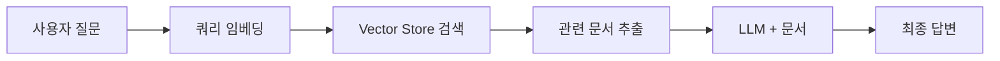
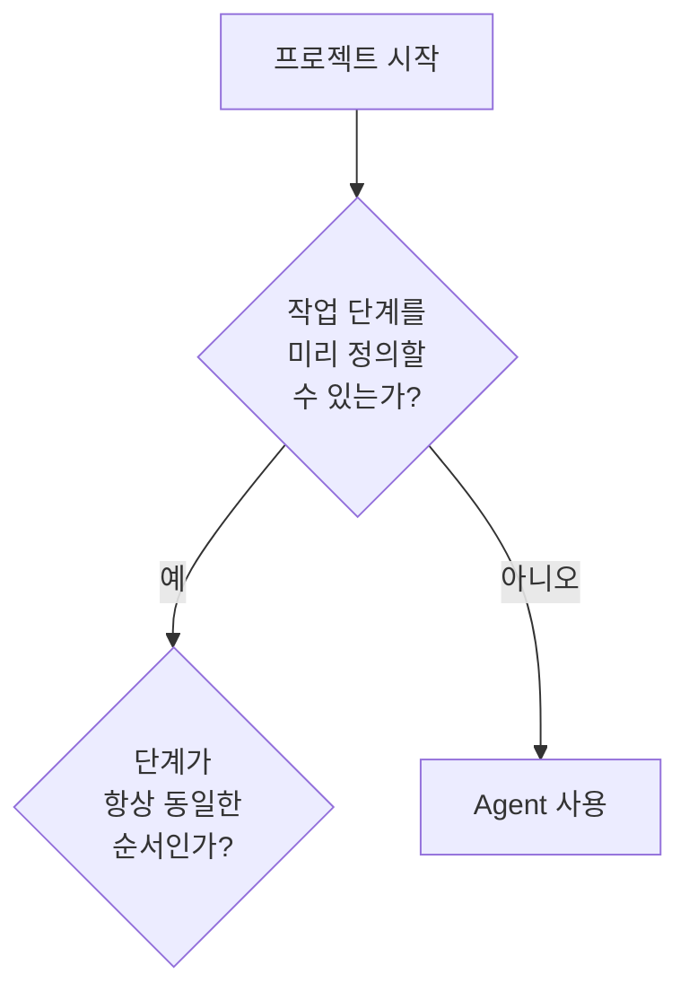

# 강의 자료 생성 가이드라인

이 문서는 패스트캠퍼스 AI 에이전트 강의 시리즈의 강의 자료(Markdown 파일)를 작성할 때 따라야 할 표준 가이드라인입니다.

> **목적**: Part1~3의 기존 강의 자료를 분석하여 도출한 공통 패턴과 구조를 체계화하여, 일관되고 고품질의 교육 콘텐츠를 생성할 수 있도록 합니다.

---

## 📁 파일 구조 및 명명 규칙

### 디렉토리 구조
```
PartN_주제명/
├── ChapterN_세부주제/
│   ├── README.md (선택)
│   ├── Clip1_제목.md
│   ├── Clip2_제목.md
│   └── ...
```

### 파일명 규칙
- **형식**: `ClipN_제목.md`
  - N: 1부터 시작하는 순차 번호
  - 제목: 한글로 작성, 언더스코어(_)로 구분
- **예시**:
  - ✅ `Clip1_Vector_Search_이해하기.md`
  - ✅ `Clip3_PRD_프롬프트_만들기.md`
  - ❌ `clip-1-vector-search.md` (소문자, 하이픈 사용 X)

---

## 📄 문서 구조 템플릿

### 기본 구조
```markdown
# Clip N: 제목

## 학습 목표
- 목표 1 (동사형으로 작성)
- 목표 2
- 목표 3

## 1. 개념/주제 섹션
내용...

## 2. 실습/예제 섹션
내용...

## 핵심 요약 (선택)
요약...

## 참고 자료
- 링크 1
- 링크 2
```

---

## ✍️ 작성 스타일 가이드

### 1. 제목 구조

#### 문서 최상위 제목 (H1)
```markdown
# Clip N: 제목
```
- 항상 `Clip N:`으로 시작
- 콜론(:) 뒤에 공백 한 칸
- 숫자는 아라비아 숫자 사용

#### 주요 섹션 제목 (H2)
```markdown
## 학습 목표
## 1. Vector Search란?
## 2. 핵심 구성 요소
```
- 이모지 사용 가능: `## 📋 학습 개요`, `## 🗂️ STEP 1:`
- 숫자 섹션: `## 1.`, `## 2.` 형식 (점 포함)

#### 하위 섹션 제목 (H3)
```markdown
### 1.1 기본 개념
### 설치 방법 선택
```

---

### 2. 학습 목표 섹션 (필수)

**형식 1: 기본 형식**
```markdown
## 학습 목표
- 개념을 이해할 수 있다
- 방법을 습득할 수 있다
- 차이점을 파악할 수 있다
```

**형식 2: 이모지 활용**
```markdown
## 📋 학습 개요

### 🎯 학습 목표
- 목표 1
- 목표 2
```

**작성 원칙:**
- 2~5개의 명확한 학습 목표 제시
- "~이해하기", "~습득하기", "~파악하기" 등 동사형 종결
- 불릿 포인트(-)로 나열
- 구체적이고 측정 가능하게 작성

---

### 3. 본문 작성 원칙

#### A. 개념 설명

**명확한 정의 제공:**
```markdown
### RAG란 무엇인가?

**RAG(Retrieval Augmented Generation)**는 검색 시스템이 붙어 있는 Generation을 의미합니다.

더 근본적으로 표현하면:
> LLM이 정확하게 알지 못하는 정보를 제공하여 내가 원하는 대로 동작하게 시키는 것
```

**작성 포인트:**
- 첫 문장에서 정의를 명확히
- 굵은 글씨(**text**)로 핵심 용어 강조
- 인용구(>)로 중요 개념 강조

#### B. 비교 및 대조

**표(Table) 활용:**
```markdown
| 구분 | 키워드 검색 | Vector Search |
|------|------------|---------------|
| 검색 방식 | 정확한 키워드 매칭 | 의미적 유사도 |
| 데이터 표현 | 텍스트 그대로 | 고차원 벡터 |
```

**좋은 예/나쁜 예 구분:**
```markdown
**흔한 오해:**
- ❌ RAG = 벡터 검색을 반드시 해야 한다
- ❌ RAG는 항상 임베딩과 벡터 DB가 필요하다

**실제 RAG:**
- ✅ 벡터 검색 이외의 검색 시스템도 RAG입니다
- ✅ SQL 쿼리를 통한 검색 + Generation도 RAG입니다
```

---

### 4. 시각적 요소 활용

#### A. Mermaid 다이어그램 (적극 권장)

**플로우차트:**
```markdown

```

**의사결정 플로우:**
```markdown

```

**다이어그램 작성 원칙:**
- 복잡한 개념이나 프로세스는 반드시 시각화
- 한글 레이블 사용
- 스타일링으로 가독성 향상 (`style A fill:#e1f5ff`)

#### B. 이모지 활용

**섹션 제목:**
- 📋 학습 개요
- 🎯 학습 목표
- 🗂️ STEP
- 📱 단계
- 💡 팁

**강조 표시:**
- ✅ 올바른 방법
- ❌ 잘못된 방법
- ⚠️ 주의사항
- 🚨 위험/중요
- 💬 대화/메시지
- 🔧 도구/툴 사용

---

### 5. 코드 예제 작성

#### Python 코드 블록
```markdown
```python
from openai import OpenAI

client = OpenAI()

def call_openai():
    """OpenAI API 호출 예시"""
    try:
        response = client.chat.completions.create(
            model="gpt-5-mini",
            messages=[
                {"role": "system", "content": "당신은 친절한 AI입니다."},
                {"role": "user", "content": "안녕하세요"}
            ]
        )
        return response.choices[0].message.content
    except Exception as error:
        print(f"오류: {error}")
```
```

**코드 작성 원칙:**
- 실행 가능한 완전한 코드 제공
- 주석으로 설명 추가
- 에러 핸들링 포함
- 변수명은 의미 있게 작성

#### 터미널 명령어
```markdown
```bash
# 설치
npm install -g @anthropic-ai/claude-code

# 실행
claude

# 설정 확인
claude --version
```
```

---

### 6. 실습 및 예제

#### 단계별 실습 구조
```markdown
## 실습: 여러 MCP를 동시에 활용해보기

### 1. 준비: 사용 가능한 MCP 확인

Claude Code를 실행하면...

### 2. 실제 동작 예시: YouTube + Linear + Slack

다음은 실제로...

```bash
User: "최대한 많은 MCP를 사용해봐"

Claude Code의 동작:
🔍 Step 1: 사용 가능한 MCP Tool 확인
✅ Result: ...
```
```

**실습 작성 원칙:**
- 명확한 단계 번호 부여
- 각 단계마다 예상 결과 표시
- 실제 터미널 출력 예시 제공
- 트러블슈팅 팁 포함 (선택)

---

### 7. 바이브코딩 프롬프트 섹션

**PRD 프롬프트 예시:**
```markdown
## PRD 작성 전략

### 2. PRD 프롬프트
```
스펙:
- Python, uv 패키지 매니저
- Neon PostgreSQL (pgvector, pg_search 확장)
- OpenAI text-embedding-3-small

데이터베이스:
- Neon MCP 사용
- 프로젝트: nonghyup-loan
- 테이블: loan_products

핵심 기능:
- hybrid_search(): RRF로 vector, bm25 search 결합
  - https://docs.paradedb.com/documentation/guides/hybrid 참고

CLI 동작:
uv run python ... "의사 전용 대출"
```
```

**작성 원칙:**
- 실제 사용할 프롬프트를 코드 블록으로 제공
- 간결하지만 필요한 모든 정보 포함
- 참고 링크 명시
- 사용 방법과 예상 결과 함께 제시

---

### 8. 출처 및 참고 자료

**문서 마지막에 배치:**
```markdown
## 참고 자료

### 공식 문서
- [Claude Code 개요](https://docs.claude.com/ko/docs/claude-code/overview)
- [LangGraph Documentation](https://langchain-ai.github.io/langgraph/)

### 관련 기술
- pgvector GitHub: https://github.com/pgvector/pgvector
- OpenAI Embeddings: https://platform.openai.com/docs/guides/embeddings

### 추가 학습
- [Elastic - 벡터 검색 가이드](https://www.elastic.co/kr/what-is/vector-search)
```

**작성 원칙:**
- 모든 외부 자료는 출처 명확히 표기
- 링크는 반드시 검증된 URL 사용
- 카테고리별로 분류 (공식 문서, 관련 기술, 추가 학습)
- 본문에서 참조한 자료는 반드시 포함

---

## 🎨 스타일 가이드

### 강조 및 서식

**굵은 글씨 (Bold):**
- 핵심 용어 첫 등장 시: `**RAG(Retrieval Augmented Generation)**`
- 중요 개념: `**주의**: 이 작업은...`

**인용구 (Blockquote):**
```markdown
> "LLM 분야에서의 성공은 가장 정교한 시스템을 구축하는 것이 아닙니다."
> — Anthropic
```

**코드 인라인:**
- 명령어, 파일명, 함수명: `` `claude` ``, `` `pgvector` ``, `` `hybrid_search()` ``

**리스트:**
- 불릿 포인트: `-` 사용 (일관성)
- 순서 리스트: `1.`, `2.` (점 포함)
- 중첩 시 2칸 들여쓰기

---

## 📝 작성 프로세스

### 1. 사전 준비
- [ ] 강의 커리큘럼(lecture_prompt.md) 확인
- [ ] 해당 Clip의 학습 목표 파악
- [ ] 필요한 참고 자료 수집
- [ ] 코드 예제 테스트

### 2. 초안 작성
- [ ] 제목 및 학습 목표 작성
- [ ] 본문 개념 설명 (이론)
- [ ] 실습/예제 작성 (실전)
- [ ] 다이어그램 추가
- [ ] 코드 예제 검증

### 3. 검토 및 수정
- [ ] 학습 목표와 내용 일치 여부 확인
- [ ] 코드 예제 실행 가능 여부 테스트
- [ ] 링크 유효성 검증
- [ ] 한글 인코딩 확인 (깨짐 방지)
- [ ] 마크다운 문법 검증

### 4. 최종 확인
- [ ] 200줄 이하 권장 (필요시 초과 가능)
- [ ] 시각적 요소 충분히 활용했는지
- [ ] 바이브코딩 프롬프트 포함 여부
- [ ] 참고 자료 출처 명시 확인

---

## ⚠️ 주의사항

### 필수 준수 사항
1. **한글 인코딩**: UTF-8 인코딩 사용, 파일 저장 후 깨짐 확인
2. **코드는 요청 시에만**: 강의 자료 작성 요청에 실제 코드 작성은 포함되지 않음
3. **출처 명시**: 웹에서 가져온 내용은 반드시 링크 포함
4. **다음 클립 예고 금지**: "다음 클립에서는..." 형태 문구 사용하지 않기
5. **바이브코딩 프롬프트**: 사람이 실제로 입력할 정도로 간결하게 작성

### 지양할 패턴
- ❌ 지나치게 긴 문서 (500줄 이상)
- ❌ 이론만 나열하고 예제 없음
- ❌ 검증되지 않은 코드 예제
- ❌ 깨진 링크 또는 출처 없는 인용
- ❌ 모호하거나 추상적인 설명

### 권장 패턴
- ✅ 개념 → 예제 → 실습 흐름
- ✅ 다이어그램으로 복잡한 개념 시각화
- ✅ 실행 가능한 완전한 코드 제공
- ✅ 바이브코딩 실습 포함
- ✅ 명확한 학습 목표와 요약

---

## 🔍 품질 체크리스트

작성 완료 후 다음 항목을 확인하세요:

### 구조
- [ ] 제목 형식: `# Clip N: 제목`
- [ ] 학습 목표 섹션 존재
- [ ] 명확한 섹션 구분 (H2, H3)
- [ ] 참고 자료 섹션 포함

### 내용
- [ ] 핵심 개념 정의 명확
- [ ] 실습/예제 포함
- [ ] 바이브코딩 프롬프트 제공
- [ ] 코드 예제 실행 가능

### 시각화
- [ ] Mermaid 다이어그램 (복잡한 개념)
- [ ] 표(Table) 활용 (비교/대조)
- [ ] 이모지 적절히 사용
- [ ] 코드 블록 문법 강조

### 품질
- [ ] 한글 인코딩 정상
- [ ] 링크 유효성 검증
- [ ] 출처 명시 확인
- [ ] 오타 및 문법 검토

---

## 📚 참고: 우수 사례

### 이론 설명 우수 사례
**Part2/Chapter1/Clip1 - Agent vs Workflow:**
- 명확한 정의와 비교표
- 의사결정 플로우차트
- 하이브리드 접근 방식 설명

### 실습 우수 사례
**Part3/Chapter1/Clip3 - PRD 프롬프트 만들기:**
- 실제 사용 가능한 PRD 프롬프트
- 명확한 스펙 정의
- 체크리스트 제공

### 시각화 우수 사례
**Part3/Chapter2/Clip1 - RAG 개념 이해하기:**
- 복잡한 워크플로우 다이어그램
- 상태 변화 시각화
- 단계별 State 예시

---

## 📞 문의 및 개선

이 가이드라인은 강의 자료의 품질과 일관성을 유지하기 위한 기준입니다.
- 새로운 패턴 발견 시: 가이드라인 업데이트 제안
- 불명확한 부분: `.claude/lecture_prompt.md` 참조
- 기술적 문의: Claude Code에게 질문

---

**마지막 업데이트**: 2025-10-16
**버전**: 1.0
**기반 분석**: Part1~3 총 9개 대표 클립 분석
