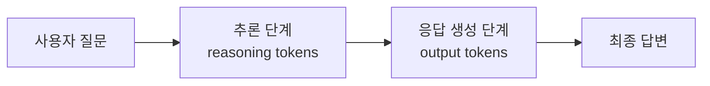

# Clip 1: LLM API 이해하고 호출해보기

## 학습 목표

* LLM API의 기본 개념과 작동 원리를 이해합니다
* OpenAI API를 사용하여 실제로 LLM을 호출하는 방법을 배웁니다
* LangChain을 활용한 LLM 호출 방법을 익힙니다

## LLM API란?

LLM(Large Language Model) API는 거대 언어 모델의 기능을 프로그래밍적으로 사용할 수 있게 해주는 인터페이스입니다. 우리가 ChatGPT 웹사이트에서 채팅하듯이, 코드를 통해 프로그래밍적으로 AI와 대화하고 응답을 받을 수 있습니다.

### LLM API의 핵심 구성 요소


LLM API 호출의 기본 흐름:

1. **요청(Request)**: 사용자의 질문이나 명령을 API에 전송
2. **처리(Processing)**: LLM이 요청을 분석하고 응답 생성
3. **응답(Response)**: 생성된 텍스트를 JSON 형태로 반환

## OpenAI API 직접 호출하기

OpenAI API는 가장 널리 사용되는 LLM API 중 하나입니다. GPT 모델을 프로그래밍적으로 사용할 수 있게 해줍니다.

### 1. 기본 설정

먼저 OpenAI 라이브러리를 설치합니다:

```bash
pip install openai
```

### 2. Python으로 OpenAI API 호출하기

```python
from openai import OpenAI
import os

# OpenAI 클라이언트 초기화
client = OpenAI(
    api_key=os.environ.get("OPENAI_API_KEY")
)

def call_openai():
    try:
        # API 호출
        # 참고: GPT-5 시리즈는 추론 모델로 temperature, top_p 등의 파라미터를 지원하지 않습니다
        # reasoning_effort를 "minimal"로 설정하여 빠른 응답을 받습니다
        response = client.chat.completions.create(
            model="gpt-5-mini",  # GPT-5 mini 모델
            messages=[
                {
                    "role": "system",
                    "content": "당신은 친절한 AI 어시스턴트입니다."
                },
                {
                    "role": "user",
                    "content": "인공지능이란 무엇인가요?"
                }
            ],
            reasoning_effort="minimal",  # 추론 토큰 사용 최소화
            max_completion_tokens=2000
        )

        # 응답 추출 및 출력
        ai_message = response.choices[0].message.content
        print("AI 응답:", ai_message)

        # 사용된 토큰 정보
        if response.usage:
            print(f"사용 토큰 - Prompt: {response.usage.prompt_tokens}, "
                  f"Completion: {response.usage.completion_tokens}, "
                  f"Total: {response.usage.total_tokens}")

    except Exception as error:
        print(f"API 호출 오류: {error}")

if __name__ == "__main__":
    call_openai()
```

### 주요 파라미터 설명

* **model**: 사용할 LLM 모델 (`gpt-5`, `gpt-5-mini` 등)
* **messages**: 대화 히스토리 배열
  * `system`: AI의 역할과 행동 방식 정의
  * `user`: 사용자의 질문이나 요청
  * `assistant`: AI의 이전 응답 (대화 컨텍스트 유지 시 사용)
* **reasoning_effort**: 추론 깊이 조절 (`"minimal"`, `"low"`, `"medium"`, `"high"`)
  * GPT-5 전용 파라미터로, 내부 사고 과정의 깊이를 조절합니다
  * `"minimal"`: 빠른 응답, 간단한 질문에 적합
  * `"low"`: 일반적인 질의응답
  * `"medium"`: 적당한 추론이 필요한 작업
  * `"high"`: 복잡한 논리, 수학 문제, 코딩 등
* **max\_completion\_tokens**: 생성할 최대 토큰 수
  * GPT-5 모델은 추론 토큰 + 응답 토큰을 모두 포함하므로 충분히 큰 값 권장

> **중요**: GPT-5 시리즈는 추론 모델(reasoning model)이므로 `temperature`, `top_p`, `presence_penalty`, `frequency_penalty` 등의 샘플링 파라미터를 지원하지 않습니다. 대신 `verbosity`(응답 길이 조절)와 `reasoning_effort`(사고 깊이 조절) 같은 새로운 파라미터를 제공합니다.

### GPT-5의 추론 토큰 이해하기

GPT-5 모델은 내부적으로 "생각하는" 과정을 거칩니다:



- **reasoning_tokens**: 내부적으로 문제를 분석하고 추론하는데 사용되는 토큰 (사용자에게 보이지 않음)
- **output_tokens**: 실제로 사용자에게 전달되는 응답 텍스트
- **max_completion_tokens**: 이 두 가지를 합친 전체 토큰 수의 상한선

예를 들어, `max_completion_tokens=500`으로 설정하면:
- reasoning에 500개를 모두 사용하면 → 응답이 비어있게 됨
- reasoning에 100개, 응답에 400개 사용 → 정상적인 답변

따라서 **충분한 토큰을 할당**하거나 **reasoning_effort를 적절히 조절**하는 것이 중요합니다.

## LangChain으로 LLM 호출하기

LangChain은 LLM 애플리케이션 개발을 쉽게 만들어주는 프레임워크입니다. 다양한 LLM 제공자를 통일된 인터페이스로 사용할 수 있게 해줍니다.

### 1. LangChain 설치

```bash
pip install langchain langchain-openai
```

### 2. Python으로 LangChain 사용하기

```python
from langchain_openai import ChatOpenAI
from langchain_core.messages import HumanMessage, SystemMessage
from langchain_core.prompts import ChatPromptTemplate
from langchain_core.output_parsers import StrOutputParser
import os

def call_with_langchain():
    """LangChain으로 OpenAI 모델 호출 기본 예시"""
    # ChatOpenAI 모델 초기화
    # 참고: GPT-5 시리즈는 temperature 파라미터를 지원하지 않습니다
    model = ChatOpenAI(
        model="gpt-5",  # 모델명 지정
        max_completion_tokens=500,
        api_key=os.environ.get("OPENAI_API_KEY")
    )

    try:
        # 메시지 배열로 호출
        messages = [
            SystemMessage(content="당신은 친절한 AI 어시스턴트입니다."),
            HumanMessage(content="인공지능이란 무엇인가요?")
        ]

        response = model.invoke(messages)
        print("AI 응답:", response.content)

    except Exception as error:
        print(f"LangChain 호출 오류: {error}")

def use_prompt_template():
    """프롬프트 템플릿을 사용한 고급 예시"""
    # 모델 초기화
    model = ChatOpenAI(
        model="gpt-5"
    )

    # 프롬프트 템플릿 정의
    prompt_template = ChatPromptTemplate.from_messages([
        ("system", "당신은 {role}입니다."),
        ("human", "{topic}에 대해 {style} 스타일로 설명해주세요.")
    ])

    # 출력 파서 정의 (문자열로 변환)
    output_parser = StrOutputParser()

    # 체인 구성: 프롬프트 -> 모델 -> 파서
    chain = prompt_template | model | output_parser

    # 체인 실행
    response = chain.invoke({
        "role": "전문 강사",
        "topic": "머신러닝",
        "style": "초보자도 이해하기 쉬운"
    })

    print("AI 응답:", response)

if __name__ == "__main__":
    call_with_langchain()
    print("\n" + "="*50 + "\n")
    use_prompt_template()
```

## OpenAI API vs LangChain 비교

| 특징          | OpenAI API 직접 호출 | LangChain         |
| ----------- | ---------------- | ----------------- |
| **유연성**     | OpenAI 모델만 가능    | 여러 LLM 제공자 지원     |
| **고급 기능**   | 직접 구현 필요         | 템플릿, 체인, 메모리 등 내장 |
| **사용 사례**   | 간단한 LLM 호출       | 복잡한 AI 애플리케이션     |
| **코드 재사용성** | 낮음               | 높음 (템플릿, 체인)      |
