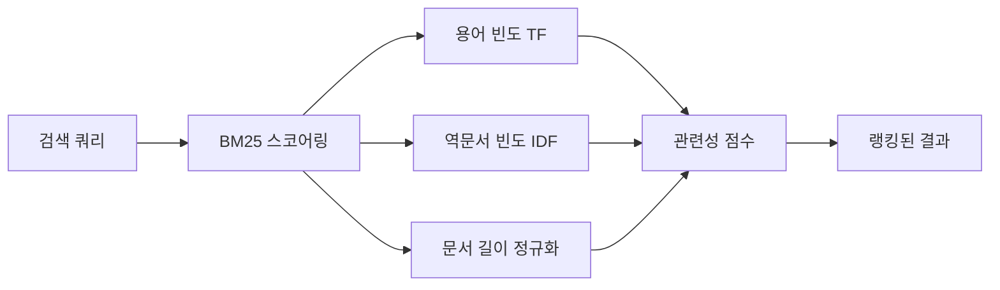
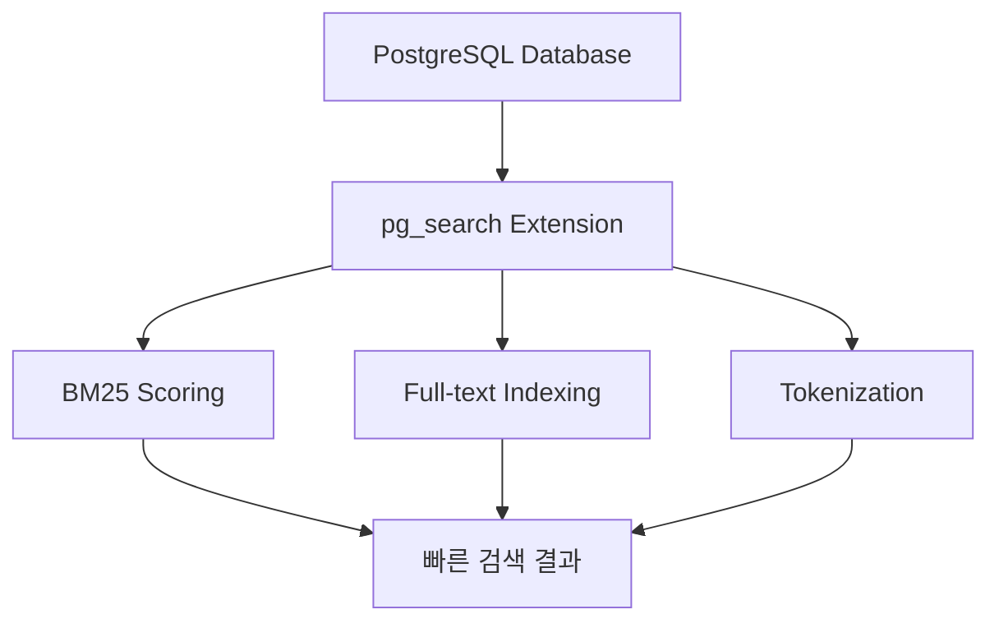

---
## 강사 정보
- 작성자: 정구봉
- LinkedIn: https://www.linkedin.com/in/gb-jeong/
- 이메일: bong@dio.so

## 강의 자료
- 강의 자료: https://goobong.gitbook.io/fastcampus
- Github: https://github.com/Koomook/fastcampus-ai-agent-vibecoding
- FastCampus 강의 주소: https://fastcampus.co.kr/biz_online_vibeagent

---

# Part 3. 바이브코딩으로 Hybrid Search RAG 구현하기

## Clip 2: BM25 이해하기

### 학습 목표
- BM25 알고리즘의 핵심 개념과 동작 원리 이해
- Full-text Search와 BM25의 차이점 파악
- ParadeDB의 pg_search를 활용한 BM25 구현 방법 학습

---

## 1. BM25란 무엇인가?

**BM25(Best Matching 25)**는 정보 검색(Information Retrieval)에서 가장 널리 사용되는 랭킹 함수입니다. 문서와 쿼리 간의 관련성을 수치화하여, 검색 결과의 우선순위를 결정합니다.

### 핵심 특징



BM25는 다음 세 가지 요소를 고려합니다:

1. **TF (Term Frequency)**: 검색어가 문서에 얼마나 자주 등장하는가?
2. **IDF (Inverse Document Frequency)**: 검색어가 전체 문서 집합에서 얼마나 희귀한가?
3. **문서 길이 정규화**: 긴 문서가 자동으로 높은 점수를 받지 않도록 조정

---

## 2. Full-text Search vs BM25

### Full-text Search
기본적인 전문 검색은 **단순 매칭**에 중점을 둡니다:
- 검색어가 문서에 포함되어 있는가? (Boolean 검색)
- 몇 번 등장하는가? (단순 빈도)

### BM25의 차별점

| 특성 | Full-text Search | BM25 |
|------|------------------|------|
| **랭킹 방식** | 단순 빈도 기반 | 확률론적 모델 |
| **문서 길이 고려** | X | O (정규화 적용) |
| **희귀 단어 가중치** | 동일 | 높게 평가 (IDF) |
| **포화 효과** | X | O (빈도 증가의 한계 효과 감소) |

```python
# Full-text Search 예시 (단순 빈도)
def simple_search_score(term, document):
    return document.count(term)  # 단순 카운트

# BM25는 포화 효과 적용
# 용어가 5번 나오나 10번 나오나 점수 차이가 크지 않음
```

---

## 3. ParadeDB의 pg_search

**ParadeDB**는 PostgreSQL에 고성능 검색 기능을 추가하는 확장입니다. Elasticsearch와 같은 검색 엔진의 성능을 PostgreSQL 내에서 구현합니다.

### pg_search의 핵심 기능



### 주요 특징

1. **네이티브 BM25 지원**: 별도 서버 없이 PostgreSQL 내에서 BM25 랭킹
2. **하이브리드 쿼리**: SQL과 검색 쿼리를 하나의 쿼리로 결합
3. [장점] **실시간 인덱싱**: 데이터 변경 시 자동으로 검색 인덱스 업데이트

### 기본 사용 예시

```python
import psycopg2

# ParadeDB 연결
conn = psycopg2.connect(
    host="localhost",
    database="mydb",
    user="postgres"
)

# BM25 인덱스 생성
cursor = conn.cursor()
cursor.execute("""
    CALL paradedb.create_bm25(
        index_name => 'search_idx',
        table_name => 'documents',
        key_field => 'id',
        text_fields => '{title: {}, content: {}}'
    );
""")

# BM25 검색 수행
cursor.execute("""
    SELECT id, title, paradedb.score(id) as score
    FROM search_idx.search('content:AI AND title:agent')
    ORDER BY score DESC
    LIMIT 10;
""")

results = cursor.fetchall()
for doc_id, title, score in results:
    print(f"[{score:.2f}] {title}")
```

---

## 4. RAG에서 BM25의 역할

Hybrid Search RAG 시스템에서 BM25는 **키워드 기반 검색**을 담당합니다:

```python
def hybrid_search(query: str, k: int = 5):
    """BM25와 벡터 검색을 결합한 하이브리드 검색"""

    # 1. BM25로 키워드 매칭 (정확한 용어 검색)
    bm25_results = pg_search_bm25(query, k=k)

    # 2. 벡터 검색으로 의미적 유사도 검색
    vector_results = vector_search(query, k=k)

    # 3. 두 결과를 결합하여 최종 문서 반환
    return combine_results(bm25_results, vector_results)
```

---

## 핵심 요점 정리

**주요 개념**
1. **BM25는 단순 빈도를 넘어선 확률론적 랭킹**: IDF로 희귀 단어에 가중치를 부여하고, 문서 길이를 정규화하여 공정한 비교를 가능하게 합니다.

2. **ParadeDB는 PostgreSQL을 검색 엔진으로**: 별도의 Elasticsearch 없이도 PostgreSQL 내에서 고성능 BM25 검색을 구현할 수 있습니다.

3. **Hybrid Search의 핵심 구성 요소**: BM25(키워드 정확도) + 벡터 검색(의미적 유사도)를 결합하면 각각의 약점을 보완하여 더 강력한 검색 시스템을 만들 수 있습니다.

---


## 출처
[ParadeDB Documentation](https://docs.paradedb.com/search/bm25)


---

## 강사 정보
- 작성자: 정구봉
- LinkedIn: https://www.linkedin.com/in/gb-jeong/
- 이메일: bong@dio.so

## 강의 자료
- 강의 자료: https://goobong.gitbook.io/fastcampus
- Github: https://github.com/Koomook/fastcampus-ai-agent-vibecoding
- FastCampus 강의 주소: https://fastcampus.co.kr/biz_online_vibeagent
