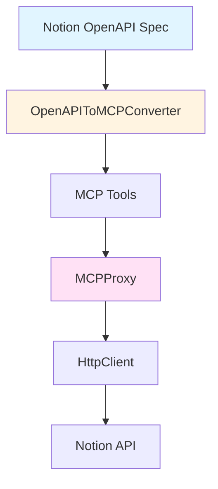

---
## 강사 정보
- 작성자: 정구봉
- LinkedIn: https://www.linkedin.com/in/gb-jeong/
- 이메일: bong@dio.so

## 강의 자료
- 강의 자료: https://goobong.gitbook.io/fastcampus
- Github: https://github.com/Koomook/fastcampus-ai-agent-vibecoding
- FastCampus 강의 주소: https://fastcampus.co.kr/biz_online_vibeagent

---

# Clip 2: MCP server 코드 까보기

## 학습 목표
- 실제 MCP server의 코드 구조를 분석하고 이해한다
- Tool 기반, OpenAPI 기반, Playwright 통합 방식의 구현 차이를 파악한다
- MCP SDK를 활용한 서버 구현 패턴을 익힌다

## 실제 MCP Server 분석하기

Clip 1에서 MCP server의 개념을 배웠다면, 이번 클립에서는 **실제 코드가 어떻게 작동하는지** 살펴보겠습니다.

공개된 MCP server들을 분석해보면, 크게 세 가지 구현 패턴이 있습니다:

1. **Tool 기반 서버**: Sequential Thinking처럼 특정 기능을 Tool로 제공
2. **OpenAPI 기반 서버**: Notion처럼 REST API를 MCP Tool로 변환
3. **라이브러리 통합 서버**: Playwright처럼 기존 라이브러리를 래핑

각각의 구현 방식을 코드와 함께 살펴보겠습니다.

## 1. Tool 기반 MCP Server: Sequential Thinking

**출처**: https://github.com/modelcontextprotocol/servers/tree/main/src/sequentialthinking

Sequential Thinking은 **사고 과정을 단계별로 추적하는 도구**를 제공하는 MCP server입니다.

### 핵심 구조

```typescript
// MCP SDK 임포트
import { Server } from "@modelcontextprotocol/sdk/server/index.js";
import { StdioServerTransport } from "@modelcontextprotocol/sdk/server/stdio.js";
import {
  CallToolRequestSchema,
  ListToolsRequestSchema,
  Tool,
} from "@modelcontextprotocol/sdk/types.js";

// 서버 인스턴스 생성
const server = new Server(
  {
    name: "sequential-thinking-server",
    version: "0.2.0",
  },
  {
    capabilities: {
      tools: {},  // Tool 기능 활성화
    },
  }
);
```

이 코드는 MCP server의 **기본 뼈대**를 만듭니다:
- `Server` 클래스로 서버 인스턴스 생성
- `capabilities`에 `tools`를 선언하여 Tool 제공을 명시
- `StdioServerTransport`로 stdio 통신 사용

### Tool 정의하기

```typescript
const SEQUENTIAL_THINKING_TOOL: Tool = {
  name: "sequentialthinking",
  description: `동적이고 반성적인 문제 해결을 위한 상세 도구입니다.
이 도구는 적응하고 진화할 수 있는 유연한 사고 과정을 통해 문제를 분석합니다.

사용 시기:
- 복잡한 문제를 단계별로 분해할 때
- 계획과 설계에 수정이 필요할 때
- 여러 단계에 걸쳐 맥락을 유지해야 할 때`,

  inputSchema: {
    type: "object",
    properties: {
      thought: {
        type: "string",
        description: "현재 사고 단계"
      },
      thoughtNumber: {
        type: "integer",
        description: "현재 사고 번호 (예: 1, 2, 3)",
        minimum: 1
      },
      totalThoughts: {
        type: "integer",
        description: "예상되는 총 사고 수 (예: 5, 10)",
        minimum: 1
      },
      nextThoughtNeeded: {
        type: "boolean",
        description: "다음 사고 단계가 필요한지 여부"
      }
    },
    required: ["thought", "nextThoughtNeeded", "thoughtNumber", "totalThoughts"]
  }
};
```

**중요 포인트:**
- `description`은 AI가 이 Tool을 **언제 사용할지 판단하는 핵심 정보**
- `inputSchema`는 JSON Schema 형식으로 파라미터 타입과 검증 규칙 정의
- `required` 필드로 필수 파라미터 지정

### 요청 핸들러 등록

```typescript
// Tool 목록 요청 처리
server.setRequestHandler(ListToolsRequestSchema, async () => ({
  tools: [SEQUENTIAL_THINKING_TOOL],
}));

// Tool 실행 요청 처리
server.setRequestHandler(CallToolRequestSchema, async (request) => {
  if (request.params.name === "sequentialthinking") {
    return thinkingServer.processThought(request.params.arguments);
  }

  return {
    content: [{
      type: "text",
      text: `Unknown tool: ${request.params.name}`
    }],
    isError: true
  };
});
```

**핸들러의 역할:**
1. `ListToolsRequestSchema`: Claude가 사용 가능한 Tool 목록 조회
2. `CallToolRequestSchema`: Claude가 선택한 Tool을 실행하고 결과 반환

### 서버 실행

```typescript
async function runServer() {
  const transport = new StdioServerTransport();
  await server.connect(transport);
  console.error("Sequential Thinking MCP Server running on stdio");
}

runServer().catch((error) => {
  console.error("Fatal error running server:", error);
  process.exit(1);
});
```

**통신 방식:**
- `StdioServerTransport`: 표준 입출력(stdin/stdout)으로 통신
- Claude Code는 서버를 **자식 프로세스**로 실행하고 stdin/stdout으로 메시지 주고받음

### 상태 관리

```typescript
class SequentialThinkingServer {
  private thoughtHistory: ThoughtData[] = [];  // 사고 이력 저장
  private branches: Record<string, ThoughtData[]> = {};  // 분기 추적

  public processThought(input: unknown): { content: Array<{ type: string; text: string }> } {
    const validatedInput = this.validateThoughtData(input);

    // 이력에 추가
    this.thoughtHistory.push(validatedInput);

    // 분기 저장
    if (validatedInput.branchFromThought && validatedInput.branchId) {
      if (!this.branches[validatedInput.branchId]) {
        this.branches[validatedInput.branchId] = [];
      }
      this.branches[validatedInput.branchId].push(validatedInput);
    }

    return {
      content: [{
        type: "text",
        text: JSON.stringify({
          thoughtNumber: validatedInput.thoughtNumber,
          totalThoughts: validatedInput.totalThoughts,
          nextThoughtNeeded: validatedInput.nextThoughtNeeded
        }, null, 2)
      }]
    };
  }
}
```

**상태 관리의 중요성:**
- MCP server는 **세션 동안 상태를 유지**할 수 있음
- Sequential Thinking은 사고 이력과 분기를 추적하여 맥락 제공

## 2. OpenAPI 기반 MCP Server: Notion

**출처**: https://github.com/makenotion/notion-mcp-server

Notion MCP server는 **OpenAPI 스펙을 MCP Tool로 자동 변환**하는 범용적인 접근 방식을 사용합니다.

### 아키텍처 구조



Notion MCP는 다음 계층으로 구성됩니다:
1. **OpenAPI Spec**: Notion API 정의
2. **Converter**: OpenAPI → MCP Tool 변환
3. **Proxy**: MCP 요청 라우팅
4. **HttpClient**: 실제 API 호출

### OpenAPI를 MCP Tool로 변환

```typescript
class OpenAPIToMCPConverter {
  constructor(private openApiSpec: OpenAPIV3.Document) {}

  convertToMCPTools(): {
    tools: Record<string, { methods: NewToolMethod[] }>,
    openApiLookup: Record<string, OpenAPIV3.OperationObject>
  } {
    const tools = { "API": { methods: [] } };
    const openApiLookup = {};

    // OpenAPI 경로를 순회
    for (const [path, pathItem] of Object.entries(this.openApiSpec.paths || {})) {
      for (const [method, operation] of Object.entries(pathItem)) {
        if (!this.isOperation(method, operation)) continue;

        // 각 API 엔드포인트를 MCP Tool로 변환
        const mcpMethod = this.convertOperationToMCPMethod(operation, method, path);
        if (mcpMethod) {
          tools["API"].methods.push(mcpMethod);
          openApiLookup[`API-${mcpMethod.name}`] = { ...operation, method, path };
        }
      }
    }

    return { tools, openApiLookup };
  }
}
```

**자동 변환의 장점:**
- OpenAPI 스펙만 있으면 **자동으로 MCP Tool 생성**
- API 엔드포인트 추가 시 **코드 수정 없이** Tool이 추가됨
- 일관된 Tool 인터페이스 제공

### MCPProxy: 요청 라우팅

```typescript
export class MCPProxy {
  private server: Server;
  private httpClient: HttpClient;
  private tools: Record<string, NewToolDefinition>;
  private openApiLookup: Record<string, OpenAPIV3.OperationObject>;

  constructor(name: string, openApiSpec: OpenAPIV3.Document) {
    // MCP Server 초기화
    this.server = new Server(
      { name, version: '1.0.0' },
      { capabilities: { tools: {} } }
    );

    // HTTP 클라이언트 설정
    const baseUrl = openApiSpec.servers?.[0].url;
    this.httpClient = new HttpClient({
      baseUrl,
      headers: this.parseHeadersFromEnv(),  // 환경변수에서 인증 토큰 읽기
    }, openApiSpec);

    // OpenAPI → MCP Tool 변환
    const converter = new OpenAPIToMCPConverter(openApiSpec);
    const { tools, openApiLookup } = converter.convertToMCPTools();
    this.tools = tools;
    this.openApiLookup = openApiLookup;

    this.setupHandlers();
  }
}
```

**Proxy 패턴의 역할:**
- MCP 프로토콜과 HTTP API 사이의 **브리지 역할**
- Tool 호출을 실제 API 요청으로 변환
- 인증 토큰 관리 및 에러 핸들링

### 요청 처리 흐름

```typescript
// Tool 호출 핸들러
this.server.setRequestHandler(CallToolRequestSchema, async (request) => {
  const { name, arguments: params } = request.params;

  // OpenAPI 엔드포인트 찾기
  const operation = this.findOperation(name);
  if (!operation) {
    throw new Error(`Method ${name} not found`);
  }

  try {
    // HTTP API 호출
    const response = await this.httpClient.executeOperation(operation, params);

    // MCP 형식으로 변환하여 반환
    return {
      content: [{
        type: 'text',
        text: JSON.stringify(response.data)
      }]
    };
  } catch (error) {
    // 에러 처리
    console.error('Error in tool call', error);
    return {
      content: [{
        type: 'text',
        text: JSON.stringify({ status: 'error', ...error })
      }]
    };
  }
});
```

**처리 흐름:**
1. Claude가 Tool 이름과 파라미터 전달
2. Tool 이름으로 OpenAPI operation 검색
3. HttpClient가 실제 API 호출
4. 응답을 MCP 형식으로 변환하여 반환

### 환경 변수로 인증 관리

```typescript
private parseHeadersFromEnv(): Record<string, string> {
  // NOTION_TOKEN 환경변수 확인
  const notionToken = process.env.NOTION_TOKEN;
  if (notionToken) {
    return {
      'Authorization': `Bearer ${notionToken}`,
      'Notion-Version': '2022-06-28'
    };
  }

  // OPENAPI_MCP_HEADERS로 커스텀 헤더 지원
  const headersJson = process.env.OPENAPI_MCP_HEADERS;
  if (headersJson) {
    return JSON.parse(headersJson);
  }

  return {};
}
```

**인증 처리:**
- 환경변수로 민감한 토큰을 안전하게 관리
- `NOTION_TOKEN` 또는 `OPENAPI_MCP_HEADERS` 사용

## 3. 라이브러리 통합 MCP Server: Playwright

**출처**: https://github.com/microsoft/playwright-mcp

Playwright MCP는 **기존 라이브러리의 기능을 MCP Tool로 래핑**하는 방식입니다.

### 래퍼 구조

```typescript
// cli.js - MCP 서버 엔트리포인트
const { program } = require('playwright-core/lib/utilsBundle');
const { decorateCommand } = require('playwright/lib/mcp/program');

const packageJSON = require('./package.json');
const p = program.version('Version ' + packageJSON.version).name('Playwright MCP');
decorateCommand(p, packageJSON.version);
void program.parseAsync(process.argv);
```

```typescript
// index.js - 라이브러리 노출
const { createConnection } = require('playwright/lib/mcp/index');
module.exports = { createConnection };
```

**구조 특징:**
- 실제 MCP 구현은 **Playwright 라이브러리 내부**에 있음
- 이 패키지는 **얇은 래퍼**로 CLI와 진입점만 제공
- Playwright의 브라우저 자동화 기능을 MCP Tool로 노출

### 제공하는 Tool 예시

Playwright MCP는 브라우저 자동화를 위한 다양한 Tool을 제공합니다:

```typescript
// 웹 페이지 스냅샷 Tool
{
  name: "browser_snapshot",
  description: "현재 페이지의 접근성 스냅샷을 캡처합니다",
  inputSchema: {
    type: "object",
    properties: {}
  }
}

// 클릭 Tool
{
  name: "browser_click",
  description: "웹 페이지에서 클릭을 수행합니다",
  inputSchema: {
    type: "object",
    properties: {
      element: {
        type: "string",
        description: "사람이 읽을 수 있는 요소 설명"
      },
      ref: {
        type: "string",
        description: "페이지 스냅샷의 정확한 요소 참조"
      }
    },
    required: ["element", "ref"]
  }
}

// 텍스트 입력 Tool
{
  name: "browser_type",
  description: "편집 가능한 요소에 텍스트를 입력합니다",
  inputSchema: {
    type: "object",
    properties: {
      element: { type: "string" },
      ref: { type: "string" },
      text: { type: "string" },
      submit: { type: "boolean" }
    },
    required: ["element", "ref", "text"]
  }
}
```

**Tool 설계 특징:**
- **구조화된 데이터**: 스크린샷 대신 접근성 트리 사용
- **명확한 참조**: `ref`로 정확한 DOM 요소 식별
- **사용자 설명**: `element`로 사용자에게 의도 전달

### 설정 방식

```json
{
  "mcpServers": {
    "playwright": {
      "command": "npx",
      "args": [
        "@playwright/mcp@latest",
        "--browser=chrome",
        "--headless"
      ]
    }
  }
}
```

**설정 옵션:**
- `--browser`: 사용할 브라우저 선택 (chrome, firefox, webkit)
- `--headless`: 헤드리스 모드 실행
- `--user-data-dir`: 사용자 프로필 경로
- `--viewport-size`: 브라우저 창 크기

## MCP Server 구현 패턴 비교

### 1. Tool 기반 (Sequential Thinking)

**특징:**
- 특정 기능을 Tool로 직접 구현
- 상태를 서버 내부에서 관리
- 세밀한 제어 가능

**장점:**
- 구현이 명확하고 단순
- 특정 도메인에 최적화 가능
- 디버깅이 쉬움

**단점:**
- Tool 추가 시 코드 수정 필요
- 확장성이 제한적

**적합한 경우:**
- 특정 기능에 집중된 서버
- 복잡한 상태 관리가 필요한 경우
- 커스텀 로직이 많은 경우

### 2. OpenAPI 기반 (Notion)

**특징:**
- OpenAPI 스펙을 자동으로 Tool로 변환
- HTTP API를 MCP로 브리징
- 범용적이고 확장 가능

**장점:**
- API 추가 시 자동으로 Tool 생성
- 일관된 인터페이스
- 재사용 가능한 변환 로직

**단점:**
- OpenAPI 스펙 필요
- HTTP 오버헤드
- 세밀한 제어가 어려움

**적합한 경우:**
- REST API를 MCP로 노출하고 싶을 때
- 여러 엔드포인트를 Tool로 제공할 때
- API 기반 서비스 통합

### 3. 라이브러리 통합 (Playwright)

**특징:**
- 기존 라이브러리를 래핑
- 라이브러리의 기능을 Tool로 노출
- 최소한의 코드로 통합

**장점:**
- 기존 생태계 활용
- 유지보수가 라이브러리 팀에 위임
- 안정적이고 검증된 기능

**단점:**
- 라이브러리 의존성
- Tool 인터페이스 설계 제약
- 디버깅이 어려울 수 있음

**적합한 경우:**
- 잘 만들어진 라이브러리가 있을 때
- 복잡한 기능을 MCP로 노출하고 싶을 때
- 빠른 프로토타이핑이 필요할 때

## 핵심 정리

**MCP Server 구현의 3가지 패턴:**
1. **Tool 기반**: 특정 기능을 직접 구현 (예: Sequential Thinking)
2. **OpenAPI 기반**: REST API를 자동 변환 (예: Notion)
3. **라이브러리 통합**: 기존 라이브러리 래핑 (예: Playwright)

**공통 구조:**
- MCP SDK의 `Server` 클래스 사용
- `StdioServerTransport` 또는 `SSEServerTransport`로 통신
- `ListToolsRequestSchema`와 `CallToolRequestSchema` 핸들러 구현
- Tool 정의: name, description, inputSchema

**핵심 개념:**
- `description`은 AI가 Tool 선택의 기준이 되므로 명확하게 작성
- `inputSchema`는 JSON Schema로 파라미터 검증
- 환경변수로 민감한 정보 관리
- 에러 처리와 로깅 필수

## 참고 자료

- [Sequential Thinking MCP Server](https://github.com/modelcontextprotocol/servers/tree/main/src/sequentialthinking)
- [Notion MCP Server](https://github.com/makenotion/notion-mcp-server)
- [Playwright MCP Server](https://github.com/microsoft/playwright-mcp)
- [MCP SDK Documentation](https://modelcontextprotocol.io/docs/tools/mcp-sdk)


---

## 강사 정보
- 작성자: 정구봉
- LinkedIn: https://www.linkedin.com/in/gb-jeong/
- 이메일: bong@dio.so

## 강의 자료
- 강의 자료: https://goobong.gitbook.io/fastcampus
- Github: https://github.com/Koomook/fastcampus-ai-agent-vibecoding
- FastCampus 강의 주소: https://fastcampus.co.kr/biz_online_vibeagent
