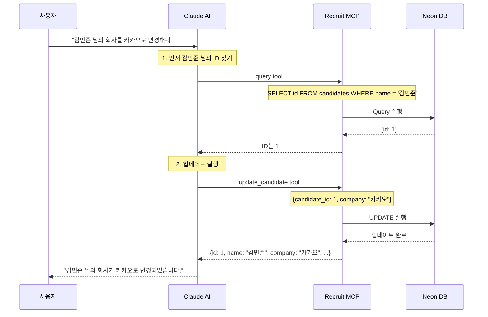

# Clip 3: DB Write Tool 설계하기

## 학습 목표
- 안전한 데이터 수정 tool 설계 원칙 이해하기
- PostgreSQL MCP 서버를 기반으로 custom write tool 구현하기
- 보안과 데이터 무결성을 고려한 API 설계 배우기

## 왜 Write Tool이 필요한가?

PostgreSQL MCP 서버는 기본적으로 읽기 전용입니다. 하지만 실제 업무에서는 데이터를 수정해야 하는 경우가 많습니다:

- 후보자의 이직으로 회사 정보 업데이트
- 새로운 스킬 습득 반영
- 직군 변경 (예: Designer → PM)

하지만 **모든 것을 변경할 수 있는 write tool은 위험합니다!**

## 안전한 Write Tool 설계 원칙

### 1. 최소 권한 원칙 (Principle of Least Privilege)

```python
# ❌ 위험한 설계
def update_all_fields(candidate_id, **fields):
    # 모든 필드를 변경 가능 - 매우 위험!
    pass

# ✅ 안전한 설계
def update_candidate(candidate_id, position=None, skills=None, company=None):
    # position, skills, company만 변경 가능
    # name과 id는 변경 불가
    pass
```

**왜 name과 id를 보호해야 하나?**
- `id`: 데이터베이스의 primary key, 변경 시 참조 무결성 깨짐
- `name`: 고유 식별자, 실수로 변경하면 다른 사람이 될 수 있음

### 2. 명시적 파라미터 (Explicit Parameters)

```python
# ❌ 위험한 설계
{
  "type": "object",
  "properties": {
    "sql": {"type": "string"}  # 임의의 SQL 실행 가능
  }
}

# ✅ 안전한 설계
{
  "type": "object",
  "properties": {
    "candidate_id": {"type": "integer"},
    "position": {"type": "string"},
    "skills": {"type": "array"},
    "company": {"type": "string"}
  }
}
```

### 3. 검증 레이어 (Validation Layer)

```python
# position 값 검증
VALID_POSITIONS = {"Developer", "Designer", "PM", "Marketer"}

if position and position not in VALID_POSITIONS:
    raise ValueError(f"Invalid position: {position}")
```

## 바이브코딩으로 MCP 서버 구현하기

### 🎯 프롬프트: Write Tool이 있는 MCP 서버 만들기

다음 프롬프트를 Claude Code에 입력하여 안전한 Write Tool을 포함한 MCP 서버를 생성할 수 있습니다:

```
Python으로 PostgreSQL MCP 서버를 구현해줘.

기본 요구사항:
1. https://github.com/modelcontextprotocol/servers-archived/tree/main/src/postgres
   참고해서 읽기 전용 query tool 구현
2. 안전한 update_candidate tool 추가 구현

update_candidate tool 설계:
- position, skills, company 필드만 변경 가능
- name과 id는 변경 불가 (보안상 중요)
- SQL Injection 방지를 위한 파라미터화된 쿼리 사용
- 명시적 파라미터만 허용 (임의의 SQL 실행 금지)

프로젝트 구조:
- server.py: 메인 서버 코드
- pyproject.toml: 패키지 설정 (mcp, asyncpg 의존성)
- README.md: 사용 가이드
```

### 📝 프롬프트 설명

**1. 참조 저장소 지정**
- 원본 PostgreSQL MCP 서버를 참고하여 기본 구조 파악
- 읽기 전용 query tool의 안전한 구현 방식 학습

**2. 안전한 업데이트 설계**
- **변경 가능 필드**: position, skills, company
- **변경 불가 필드**: name (고유 식별자), id (primary key)
- 최소 권한 원칙 적용

**3. 보안 요구사항**
- 파라미터화된 쿼리로 SQL Injection 방지
- 화이트리스트 방식으로 허용된 필드만 수정
- 임의의 SQL 실행 차단

### 주요 구현 포인트

#### Tool 설계
- `query`: 읽기 전용, 트랜잭션으로 안전성 보장
- `update_candidate`: 특정 필드만 수정, name/id 보호

#### 보안 원칙
1. **최소 권한**: 필요한 필드만 변경 허용
2. **명시적 파라미터**: 각 필드를 개별 파라미터로 정의
3. **검증 레이어**: 유효한 값만 허용

### 원본 서버와의 차이점

| 구분 | 원본 PostgreSQL MCP | 우리의 구현 |
|------|---------------------|-------------|
| 언어 | TypeScript | Python |
| 기능 | 읽기 전용 | 읽기 + 안전한 쓰기 |
| Tools | query만 제공 | query + update_candidate |
| 보안 | 읽기만 가능 | 필드별 쓰기 제어 |
| 실용성 | 제한적 | 업무에 바로 적용 가능 |

## 실전 시나리오: 후보자 정보 업데이트

### 시나리오: "김민준 님이 카카오로 이직"



### 다양한 업데이트 시나리오

**시나리오 1: 회사 변경**
```
"김민준 님의 회사를 카카오로 변경해줘"
→ update_candidate(candidate_id=1, company="카카오")
```

**시나리오 2: 스킬 추가**
```
"ID 3번 후보자에게 Docker 스킬 추가해줘"
→ 1. query로 현재 스킬 조회
→ 2. 배열에 "Docker" 추가
→ 3. update_candidate(candidate_id=3, skills=[..., "Docker"])
```

**시나리오 3: 직군 변경**
```
"이서윤 님이 PM으로 직군을 변경했어"
→ update_candidate(candidate_id=2, position="PM")
```

**시나리오 4: 여러 필드 동시 업데이트**
```
"박도윤 님이 네이버로 이직하고 TypeScript, Go 스킬을 추가했어"
→ update_candidate(
    candidate_id=3,
    company="네이버",
    skills=["JavaScript", "React", "TypeScript", "Go"]
  )
```

### 보안 설계 요약

| 필드 | 변경 가능 여부 | 이유 |
|------|---------------|------|
| `id` | ❌ 불가 | Primary key, 데이터 무결성 |
| `name` | ❌ 불가 | 고유 식별자, 보안 |
| `position` | ✅ 가능 | 직군 변경 발생 |
| `skills` | ✅ 가능 | 스킬 업데이트 필요 |
| `company` | ✅ 가능 | 이직 발생 |

## 실습 체크리스트

- [ ] 프롬프트 작성 원칙 이해
- [ ] 화이트리스트 방식의 보안 장점 파악
- [ ] update_candidate tool의 설계 의도 학습
- [ ] 변경 가능/불가능 필드 구분 기준 이해
