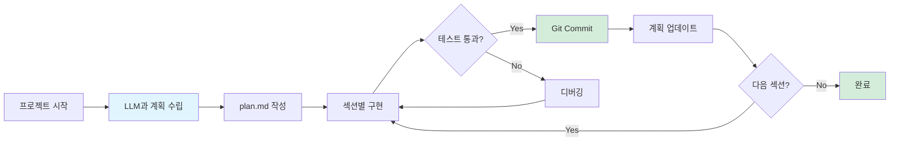
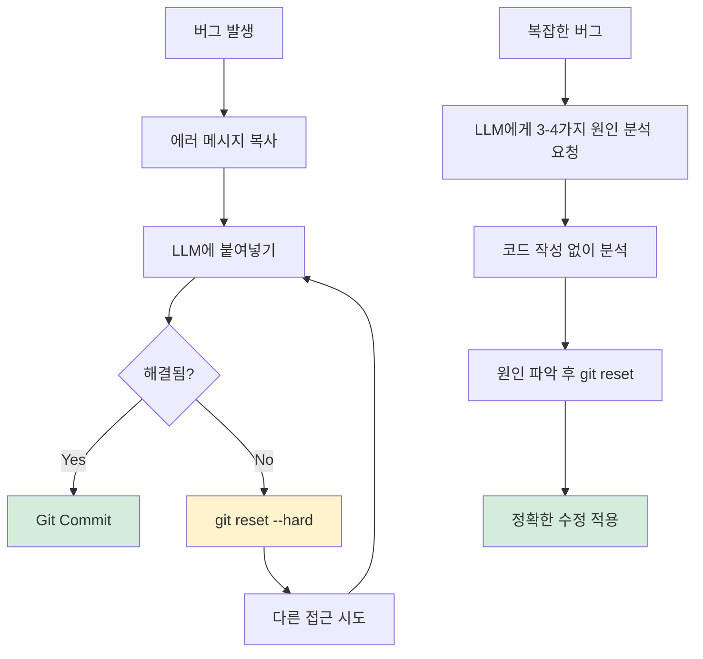
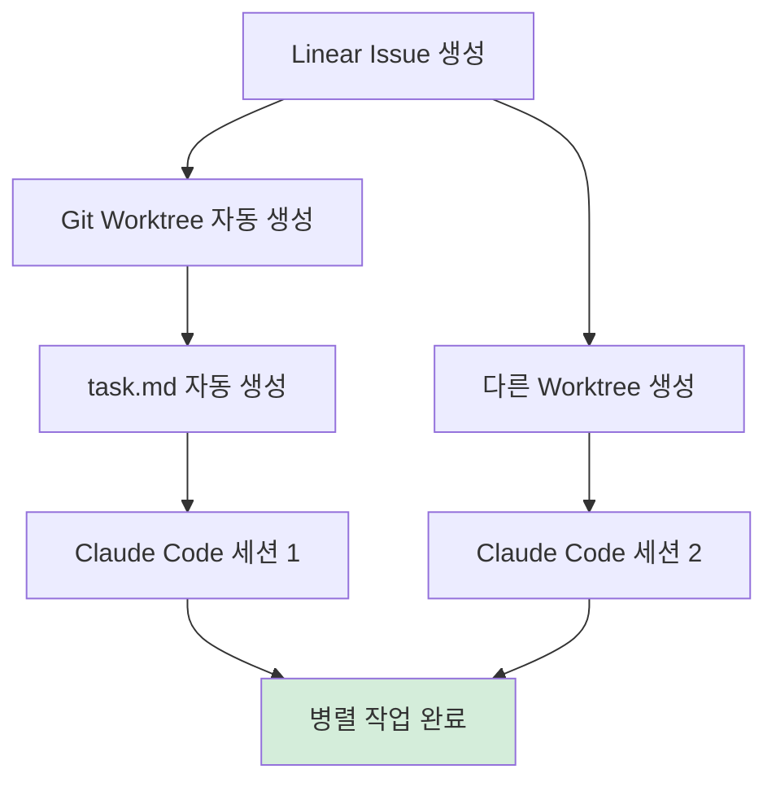
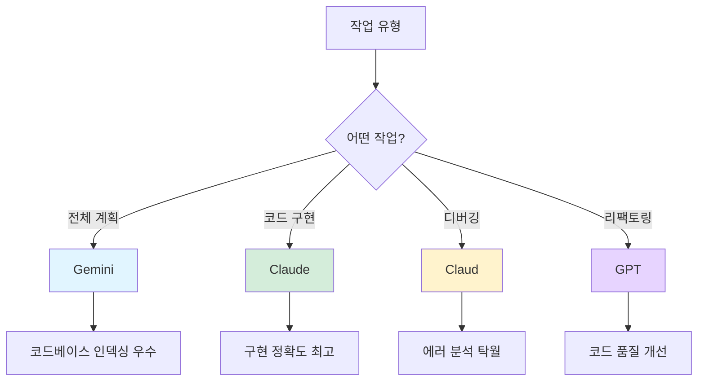

---
## 강사 정보
- 작성자: 정구봉
- LinkedIn: https://www.linkedin.com/in/gb-jeong/
- 이메일: bong@dio.so

## 강의 자료
- 강의 자료: https://goobong.gitbook.io/fastcampus
- Github: https://github.com/Koomook/fastcampus-ai-agent-vibecoding
- FastCampus 강의 주소: https://fastcampus.co.kr/biz_online_vibeagent

---

# Clip 2: 바이브코딩 팁을 자동화시키기

## 📋 학습 개요

### 🎯 학습 목표

* 바이브코딩의 효과를 극대화하는 실전 팁을 이해할 수 있다
* Y Combinator Startup School의 실전 바이브코딩 베스트 프랙티스를 습득할 수 있다

***

## 1. Y Combinator의 바이브코딩 베스트 프랙티스

<figure><figcaption></figcaption></figure>

### 1.1 프로젝트 시작 전략

#### 계획 수립부터 시작



**plan.md 예시:**

```markdown
# 프로젝트 구현 계획

## ✅ Section 1: 프로젝트 초기화
- [x] Python 가상환경 설정
- [x] 기본 디렉토리 구조 생성
- [x] requirements.txt 작성

## 🔄 Section 2: 데이터베이스 설정
- [ ] PostgreSQL 연결 설정
- [ ] 스키마 정의
- [ ] Migration 파일 작성

## 📋 Section 3: API 엔드포인트 구현
- [ ] 사용자 인증 API
- [ ] 데이터 CRUD API

## 💡 나중에 고려할 아이디어
- 캐싱 레이어 추가
- Rate limiting 구현
```

#### Git 사용 전략

**핵심 원칙:**

> Git을 종교처럼 사용하세요. 각 기능 구현 전에 깨끗한 Git 상태를 유지하고, 문제가 생기면 `git reset --hard`로 되돌리는 것을 두려워하지 마세요.

```bash
# 기능 시작 전
git status  # 깨끗한 상태 확인
git commit -am "Working state before new feature"

# 문제 발생 시
git reset --hard HEAD  # 마지막 커밋으로 돌아가기

# 해결책을 찾았다면
git reset --hard HEAD  # 다시 리셋
# 이제 깨끗한 코드베이스에 해결책 적용
```

**왜 이렇게 해야 하나?**

* LLM이 여러 번 시도하면서 "크러스트(crust)" 레이어가 쌓임
* 4-6번의 프롬프트 끝에 해결책을 찾아도, 코드는 지저분함
* 해결책만 가져와서 깨끗한 코드베이스에 재적용하는 것이 효율적

### 1.2 테스트 전략

**테스트 작성 원칙:**

```markdown
**추천:**
- ✅ 사용자 클릭 흐름 시뮬레이션
- ✅ End-to-End 기능 검증
- ✅ 실제 사용 시나리오 테스트

**지양:**
- ❌ 저수준 함수 단위 테스트 (LLM이 디폴트로 생성)
- ❌ 내부 구현 세부사항 테스트
```

### 1.3 버그 수정 전략



**실전 팁:**

**1단계: 에러 메시지 활용**

```bash
# 서버 로그에서 에러 복사
Error: Cannot read property 'id' of undefined
    at getUserData (user.js:42)

# Claude Code에 붙여넣기
User: "다음 에러가 발생했어요:
Error: Cannot read property 'id' of undefined
    at getUserData (user.js:42)"
```

**2단계: 복잡한 버그는 분석 먼저**

```bash
User: "이 버그의 원인으로 가능한 3-4가지 시나리오를 분석해줘.
코드는 작성하지 말고 분석만 해줘."

Claude Code:
1. user 객체가 null일 가능성
2. 비동기 처리 타이밍 문제
3. API 응답 구조 변경
4. 타입 변환 오류
```

***

## 2. 도구 활용 팁

### 2.1 Bash를 활용한 자동화

Claude Code는 **Bash를 기가막히게 사용**합니다.

**예시: DNS 설정 자동화**

```bash
User: "Cloudflare DNS에 다음 레코드를 추가해줘:
- A record: api.example.com → 123.45.67.89
- CNAME: www → example.com"

# Claude Code가 자동으로:
# 1. Cloudflare API 인증
# 2. DNS 레코드 조회
# 3. 레코드 추가 API 호출
# 4. 변경사항 확인
```

**예시: Heroku 배포 자동화**

```bash
User: "Heroku에 배포하고 환경 변수도 설정해줘"

# Claude Code가 자동으로:
# 1. heroku create 실행
# 2. git remote 추가
# 3. 환경 변수 설정
# 4. git push heroku main
# 5. heroku logs --tail로 확인
```

### 2.2 스크린샷 활용

**UI 버그 시연:**

```bash
# 스크린샷 붙여넣기 + 설명
User: [스크린샷]
"이 버튼이 모바일에서 화면 밖으로 나가요"
```

**디자인 참고:**

```bash
# 다른 사이트 스크린샷 + 요청
User: [스크린샷]
"이 사이트의 네비게이션 스타일을 참고해서 우리 사이트에 적용해줘"
```

***

## 3. 개발 환경 최적화

### 3.1 Git Worktree로 병렬 작업

```bash
# Linear issue로 worktree 생성 자동화
git worktree add ../myproject-TASK-123 -b task-123

# task.md 자동 생성
cat > task.md << EOF
# TASK-123: 사용자 프로필 페이지 구현

## 요구사항
- 사용자 정보 표시
- 프로필 이미지 업로드
- 정보 수정 기능

## 참고
- Linear Issue: https://linear.app/...
EOF
```

**워크플로우:**



***

## 4. 리팩토링 전략

### 4.1 테스트 기반 리팩토링

```python
# Step 1: 테스트 작성
def test_user_registration():
    response = register_user("test@example.com", "password123")
    assert response.status == "success"
    assert User.exists("test@example.com")

# Step 2: 리팩토링 요청
User: "register_user 함수를 더 깔끔하게 리팩토링해줘.
테스트는 모두 통과해야 해."

# Step 3: 테스트 실행으로 검증
pytest tests/test_auth.py::test_user_registration
```

### 4.2 AI에게 리팩토링 제안 요청

```bash
User: "이 코드베이스에서 반복적이거나 리팩토링이 필요한 부분을 찾아줘"

Claude Code:
1. user_controller.py:45-89 - 중복된 에러 처리 로직
2. api/validators.py - 비슷한 검증 함수 5개
3. models/base.py - 1000줄 넘는 파일, 분리 필요
```

***

## 5. 지속적 실험

### 5.1 모델별 강점 활용



### 5.2 매주 새로운 시도

```markdown
**실험 체크리스트:**
- [ ] 이번 주 새로운 모델 릴리스 확인
- [ ] 각 작업 유형별로 모델 성능 비교
- [ ] 커뮤니티의 새로운 팁 확인
- [ ] 나만의 워크플로우 문서화
```

***

## 6. 핵심 요약

### ✅ 바이브코딩 성공 전략

1. **새 프로젝트**에서 시작하거나, 기존 프로젝트는 **하루 투자해서 문서화**
2. **지속적으로 실험**하고 최적화
3. **Git을 종교처럼 사용**하고, 문제 시 git reset --hard
4. **고수준 통합 테스트** 작성
5. **Bash 자동화** 적극 활용
6. **음성 입력**으로 생산성 2배
7. **성숙한 프레임워크** 선택 (Rails, Django 등)

### ⚠️ 주의사항

* ❌ 여러 번 시도하며 크러스트 쌓지 말 것
* ❌ 저수준 단위 테스트에 집중하지 말 것
* ❌ 한 가지 모델에만 의존하지 말 것

***

## 7. 참고 자료

### 공식 영상

* [Y Combinator - How To Get The Most Out Of Vibe Coding](https://www.youtube.com/watch?v=BJjsfNO5JTo)


---

## 강사 정보
- 작성자: 정구봉
- LinkedIn: https://www.linkedin.com/in/gb-jeong/
- 이메일: bong@dio.so

## 강의 자료
- 강의 자료: https://goobong.gitbook.io/fastcampus
- Github: https://github.com/Koomook/fastcampus-ai-agent-vibecoding
- FastCampus 강의 주소: https://fastcampus.co.kr/biz_online_vibeagent
