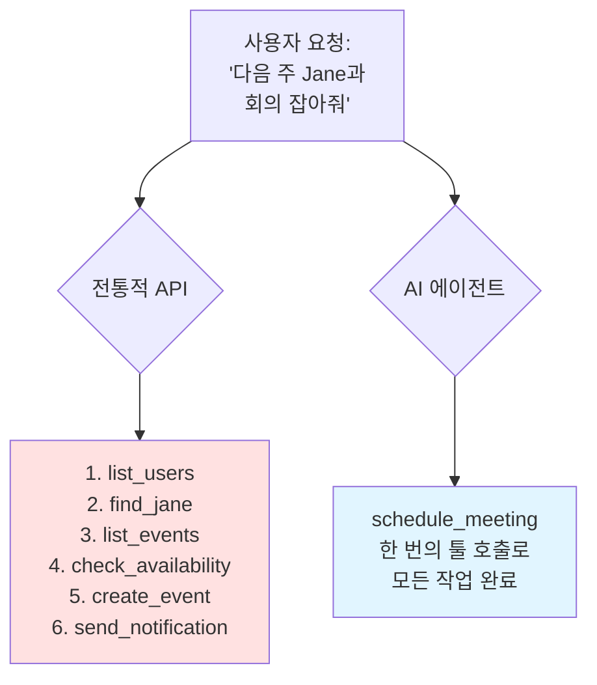

---
## 강사 정보
- 작성자: 정구봉
- LinkedIn: https://www.linkedin.com/in/gb-jeong/
- 이메일: bong@dio.so

## 강의 자료
- 강의 자료: https://goobong.gitbook.io/fastcampus
- Github: https://github.com/Koomook/fastcampus-ai-agent-vibecoding
- FastCampus 강의 주소: https://fastcampus.co.kr/biz_online_vibeagent

---

# Clip 3: AI Agent가 사용할 툴은 AI로 만들어야 하는 이유

## 📋 학습 목표

* AI 에이전트를 위한 툴 설계가 일반 API 래핑과 다른 이유를 이해할 수 있다
* 효과적인 에이전트 툴 설계의 핵심 원칙을 습득할 수 있다
* 워크플로우 중심 툴 설계 방법론을 실습할 수 있다
* 에이전트 툴의 성능 평가 방법을 파악할 수 있다

***

## 1. 에이전트 툴 설계의 패러다임 전환

### 전통적인 접근 방식의 한계

우리가 흔히 생각하는 "AI 에이전트에 툴 제공하기"는 다음과 같습니다:

```python
# ❌ 전통적인 접근: 모든 API를 툴로 래핑
tools = [
    list_users_tool,
    list_events_tool,
    create_event_tool,
    update_event_tool,
    delete_event_tool,
    send_notification_tool,
    # ... 수십 개의 툴들
]
```

**문제점:**

* 에이전트가 어떤 툴을 선택해야 할지 혼란스러워함
* 여러 툴을 조합해야 하는 단순한 작업도 복잡해짐
* 컨텍스트 윈도우가 툴 설명으로 가득 참

### Anthropic의 핵심 통찰

> "Agents are only as effective as the tools we give them."

**에이전트는 결정론적 시스템이 아닙니다:**

| 구분    | 전통적인 API    | AI 에이전트       |
| ----- | ----------- | ------------- |
| 동작 방식 | 결정론적, 예측 가능 | 비결정론적, 추론 기반  |
| 에러 처리 | 명확한 에러 코드   | 자연어로 이해하고 대응  |
| 컨텍스트  | 무제한 메모리     | 제한된 컨텍스트 윈도우  |
| 툴 선택  | 프로그래머가 명시   | LLM이 자율적으로 선택 |



***

## 2. 워크플로우 중심 툴 설계

<figure><figcaption></figcaption></figure>

### 핵심 원칙: "더 많은 툴" → "더 똑똑한 툴"

**전통적 설계 (API 래핑):**

```python
# ❌ 각 API 엔드포인트를 개별 툴로 제공
@tool
def list_customers():
    """고객 목록을 가져옵니다"""
    pass

@tool
def get_customer_transactions(customer_id: str):
    """특정 고객의 거래 내역을 가져옵니다"""
    pass

@tool
def get_customer_notes(customer_id: str):
    """고객 노트를 가져옵니다"""
    pass
```

**워크플로우 중심 설계:**

```python
# ✅ 실제 업무 흐름을 반영한 통합 툴
@tool
def get_customer_context(
    customer_id: str,
    include_transactions: bool = True,
    include_notes: bool = True,
    response_format: ResponseFormat = ResponseFormat.CONCISE
):
    """
    고객 컨텍스트를 조회합니다.

    고객 지원 담당자가 필요한 모든 정보를 한 번에 제공합니다:
    - 기본 고객 정보
    - 최근 거래 내역
    - CS 노트 및 이슈 히스토리

    Args:
        customer_id: 고객 ID
        include_transactions: 거래 내역 포함 여부
        include_notes: 노트 포함 여부
        response_format: CONCISE(간략) 또는 DETAILED(상세)
    """
    pass
```

### 실제 사례: Slack 메시지 조회

**Before (3개 툴):**

```
🔧 list_channels()         # 채널 목록 조회
🔧 get_channel_id()        # 채널 이름 → ID 변환
🔧 read_messages()         # 메시지 읽기
```

**After (1개 통합 툴):**

```python
🔧 search_slack_messages(
    channel_name: str,
    query: str = None,
    limit: int = 10,
    response_format: ResponseFormat = ResponseFormat.CONCISE
)
```

**성능 차이:**

* 토큰 사용량: 206 → 72 (65% 감소)
* 툴 호출 횟수: 3회 → 1회
* 에러 가능성 감소 (중간 단계 제거)

***

## 3. 효과적인 툴 설계 패턴

### Pattern 1: Response Format 제어

```python
from enum import Enum

class ResponseFormat(Enum):
    DETAILED = "detailed"  # 모든 필드 포함, 후속 작업용
    CONCISE = "concise"    # 핵심 정보만, 토큰 절약

@tool
def search_logs(
    query: str,
    response_format: ResponseFormat = ResponseFormat.CONCISE
):
    """
    로그를 검색합니다.

    - CONCISE: 로그 메시지, 타임스탬프만 반환
    - DETAILED: trace_id, span_id 등 모든 메타데이터 포함
    """
    pass
```

**언제 사용할까?**

* ✅ **CONCISE**: 정보 조회 후 사용자에게 보고할 때
* ✅ **DETAILED**: 조회한 데이터를 다른 툴에 전달할 때

### Pattern 2: 네임스페이스 일관성

```python
# ✅ 명확한 네임스페이스로 툴 구분
@tool
def asana_search_tasks(): pass

@tool
def asana_create_task(): pass

@tool
def github_search_issues(): pass

@tool
def github_create_issue(): pass
```

**왜 중요한가?**

* 에이전트가 `search_tasks`와 `search_issues`를 혼동하지 않음
* 멀티 툴 환경에서 정확도 향상

### Pattern 3: 스마트 기본값 제공

```python
@tool
def schedule_event(
    title: str,
    participants: list[str],
    duration_minutes: int = 30,  # 일반적인 회의 시간
    auto_find_room: bool = True,  # 자동으로 회의실 찾기
    auto_send_invite: bool = True  # 초대장 자동 발송
):
    """
    이벤트를 스케줄링합니다.

    자동화된 기능:
    - 참여자 가용 시간 확인
    - 적절한 회의실 예약
    - 캘린더 초대장 발송
    """
    pass
```

***

## 4. 에이전트 툴 평가 방법론

### 평가 작업 설계

**강력한 평가 작업 예시:**

```
다음 주 Jane과 회의를 잡아줘. 주제는 Acme Corp 최신 프로젝트야.
지난 프로젝트 기획 회의 노트를 첨부하고, 회의실도 예약해줘.
```

**검증 가능한 결과:**

* ✅ Jane의 캘린더에 이벤트 생성됨
* ✅ 회의 제목에 "Acme Corp" 포함
* ✅ 관련 노트 첨부됨
* ✅ 회의실 예약 완료

### 프로그래밍 방식 평가

```python
def evaluate_agent_tools(test_cases):
    metrics = {
        'accuracy': [],
        'tool_calls': [],
        'tokens_used': [],
        'errors': []
    }

    for task in test_cases:
        result = run_agent(task.prompt, tools)

        # 정확도 평가
        metrics['accuracy'].append(
            verify_outcome(result, task.expected_outcome)
        )

        # 효율성 평가
        metrics['tool_calls'].append(len(result.tool_calls))
        metrics['tokens_used'].append(result.token_count)

        # 에러 추적
        if result.error:
            metrics['errors'].append({
                'task': task.id,
                'error': result.error
            })

    return metrics
```

**측정 지표:**

* 📊 정확도: 예상 결과와 실제 결과 일치 비율
* 📊 런타임: 작업 완료까지 소요 시간
* 📊 토큰 소비량: 비용 효율성
* 📊 에러율: 실패한 툴 호출 비율

***

## 5. 핵심 체크리스트

### ✅ 좋은 에이전트 툴 설계

* [ ] **워크플로우 중심**: 실제 업무 흐름을 반영했는가?
* [ ] **적절한 추상화**: 너무 세분화하지도, 너무 거대하지도 않은가?
* [ ] **응답 형식 제어**: CONCISE/DETAILED 옵션 제공하는가?
* [ ] **명확한 네임스페이스**: 툴 이름이 용도를 명확히 전달하는가?
* [ ] **스마트 기본값**: 일반적인 케이스에 최적화된 기본값인가?
* [ ] **LLM 친화적 문서**: docstring이 에이전트가 이해하기 쉬운가?
* [ ] **평가 가능**: 성공/실패를 프로그래밍 방식으로 검증 가능한가?

### ❌ 피해야 할 안티패턴

* [ ] 모든 API 엔드포인트를 개별 툴로 래핑
* [ ] 툴 이름이 모호하거나 중복됨 (`search` vs `find` vs `query`)
* [ ] 항상 모든 데이터를 반환 (토큰 낭비)
* [ ] 에러 메시지가 LLM이 이해하기 어려움
* [ ] 평가 없이 "잘 되겠지" 하고 배포

***

## 핵심 요약

1. **패러다임 전환**: AI 에이전트 툴은 API 래핑이 아니라 워크플로우 설계입니다
2. **더 적은 툴, 더 높은 품질**: 3개 툴 → 1개 통합 툴로 성능 65% 향상 가능
3. **Response Format 제어**: CONCISE/DETAILED로 토큰 효율성 극대화
4. **Claude Code로 프로토타이핑**: AI를 사용해 AI 툴을 설계하고 테스트
5. **평가 자동화**: 프로그래밍 방식으로 정확도, 효율성, 에러율 측정

***

## 참고 자료

### 공식 문서

* [Anthropic - Writing Tools for Agents](https://www.anthropic.com/engineering/writing-tools-for-agents)
* [Claude Code Documentation](https://docs.claude.com/ko/docs/claude-code/overview)

### 관련 기술

* [Tool Use API Guide](https://docs.claude.com/en/docs/build-with-claude/tool-use)

### 추가 학습

* [Contextual Retrieval](https://www.anthropic.com/news/contextual-retrieval)


---

## 강사 정보
- 작성자: 정구봉
- LinkedIn: https://www.linkedin.com/in/gb-jeong/
- 이메일: bong@dio.so

## 강의 자료
- 강의 자료: https://goobong.gitbook.io/fastcampus
- Github: https://github.com/Koomook/fastcampus-ai-agent-vibecoding
- FastCampus 강의 주소: https://fastcampus.co.kr/biz_online_vibeagent
