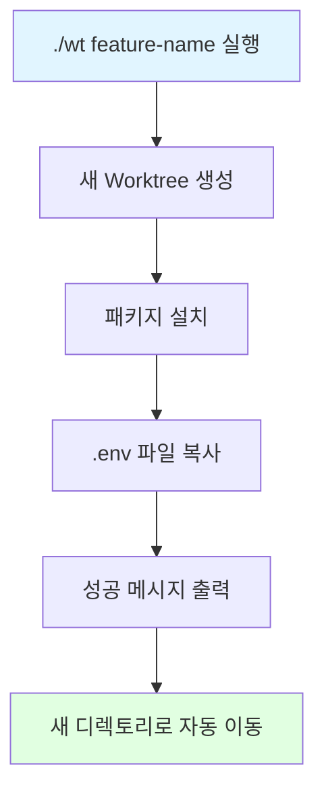

---
## 강사 정보
- 작성자: 정구봉
- LinkedIn: https://www.linkedin.com/in/gb-jeong/
- 이메일: bong@dio.so

## 강의 자료
- 강의 자료: https://goobong.gitbook.io/fastcampus
- Github: https://github.com/Koomook/fastcampus-ai-agent-vibecoding
- FastCampus 강의 주소: https://fastcampus.co.kr/biz_online_vibeagent

---

# Clip 2: Worktree 자동화 스크립트 만들기

📋 학습 개요

## 🎯 학습 목표
- Git worktree 생성 과정을 자동화하는 스크립트를 작성합니다
- 패키지 자동 설치 및 환경 설정을 자동화합니다
- Claude Code와 함께 바이브코딩으로 개발 생산성을 극대화합니다

## 💡 실무 활용 사례
- 새 브랜치 작업 시작 시간을 몇 분에서 몇 초로 단축
- 팀원들이 일관된 환경에서 작업할 수 있도록 표준화
- 반복적인 설정 작업을 자동화하여 개발에 집중
- 신규 개발자 온보딩 시간 단축

## 🏗️ 자동화 플로우



## 🗂️ STEP 1: 자동화가 필요한 이유

### 수동 작업의 문제점

**현재 워크플로우 (수동):**
```bash
# 1. Worktree 생성
git worktree add ../project-feature-a -b feature-a

# 2. 디렉토리 이동
cd ../project-feature-a

# 3. Node.js 패키지 설치
npm install
# 또는 Python 가상환경 설정
python -m venv .venv
source .venv/bin/activate
pip install -r requirements.txt

# 4. 환경 변수 복사
cp ../project/.env .env

# 5. 개발 시작
claude
```

**문제점:**
- ⏰ 매번 4-5개의 명령어를 수동으로 입력
- 🤔 명령어를 잊어버리거나 순서를 틀릴 수 있음
- 📦 패키지 설치에 시간 소요 (npm install 2-3분)
- 🔁 팀원마다 다른 설정 방식 사용 가능

### 자동화 후 워크플로우

**개선된 워크플로우:**
```bash
# 단 하나의 명령어로 모든 작업 완료!
./wt feature-a

# 자동으로 수행되는 작업:
# ✅ Worktree 생성
# ✅ 패키지 자동 설치
# ✅ .env 파일 자동 복사
# ✅ 디렉토리 자동 이동
# ✅ 바로 개발 시작 가능!
```

**장점:**
- ⚡ 시간 절약: 5분 → 10초
- 🎯 실수 방지: 자동화된 일관된 프로세스
- 🤝 팀 표준화: 모두가 같은 방식으로 환경 구성
- 🚀 생산성 향상: 설정이 아닌 개발에 집중


## 🎨 STEP 2: 바이브코딩으로 스크립트 작성하기

### 바이브코딩 전략

**목표:** Claude Code에게 요구사항을 명확히 전달하여 한 번에 완성도 높은 스크립트 만들기

**전달할 핵심 요구사항:**

1. **기본 기능**
   - `./wt <브랜치명>` 형식으로 실행
   - Git worktree 자동 생성
   - 패키지 자동 설치 (npm 또는 pip)

2. **환경 설정**
   - .env 파일 자동 복사 (있는 경우)
   - 성공/실패 메시지 출력

3. **사용성**
   - 명확한 진행 상황 표시
   - 에러 처리 및 안내 메시지


### Claude Code와 대화 시작하기

**프롬프트 예시:**

```
Git worktree 자동화 스크립트를 만들어줘.

요구사항:
1. 스크립트 이름: wt
2. 사용법: ./wt <브랜치명>
3. 동작:
   - 새 worktree 생성 (../프로젝트명-브랜치명 경로에)
   - 패키지 자동 설치 (npm install 또는 pip install)
   - .env 파일이 있으면 새 worktree로 복사
   - 완료 후 성공 메시지 출력

추가 요구사항:
- 명령어 실행 중 진행 상황을 표시
- 에러 발생 시 명확한 메시지 출력
- Bash 스크립트로 작성
- 실행 권한 추가 방법도 알려줘
```


---

## 강사 정보
- 작성자: 정구봉
- LinkedIn: https://www.linkedin.com/in/gb-jeong/
- 이메일: bong@dio.so

## 강의 자료
- 강의 자료: https://goobong.gitbook.io/fastcampus
- Github: https://github.com/Koomook/fastcampus-ai-agent-vibecoding
- FastCampus 강의 주소: https://fastcampus.co.kr/biz_online_vibeagent
