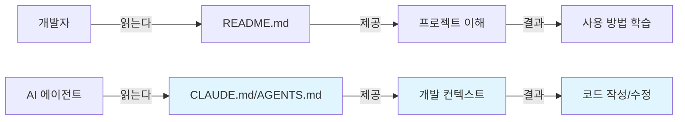
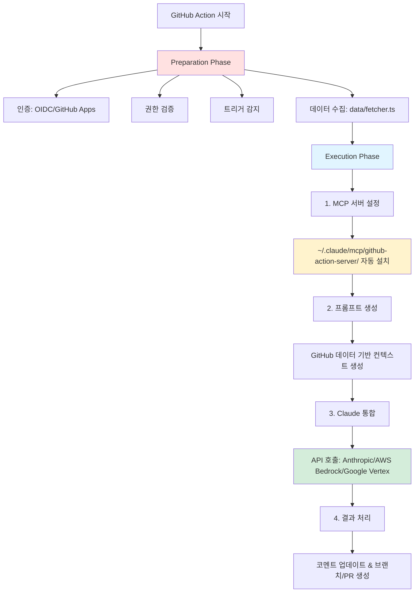
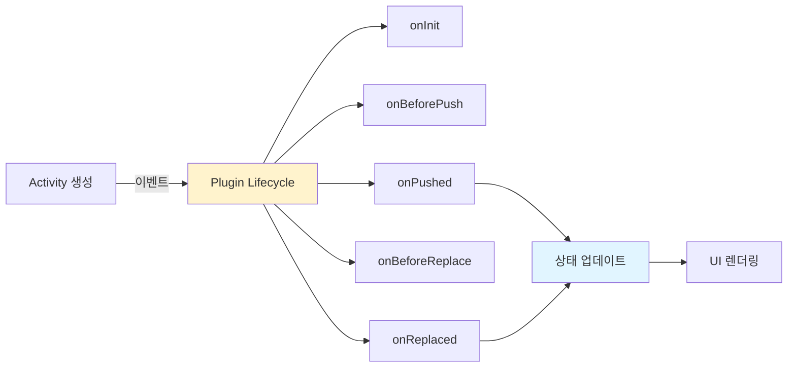
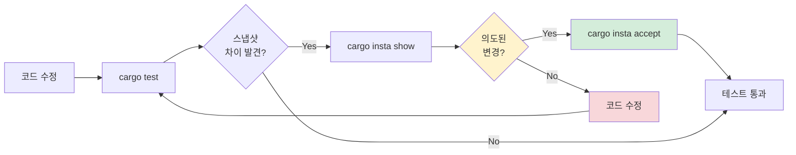
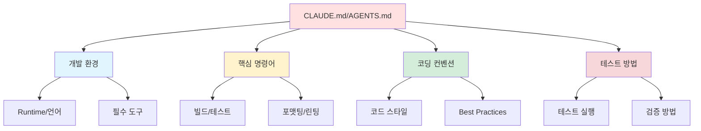

# Clip 1: CLAUDE.md와 AGENTS.md Best Practice 찾아서 이해하기

## 📋 학습 목표

- CLAUDE.md와 AGENTS.md 파일의 목적과 역할을 이해할 수 있다
- 주요 오픈소스 프로젝트의 AI 에이전트 가이드 패턴을 분석할 수 있다
- 효과적인 프로젝트 메모리 문서 작성 원칙을 파악할 수 있다
- 실제 프로젝트에 적용 가능한 Best Practice를 도출할 수 있다

---

## 1. CLAUDE.md와 AGENTS.md란?

### 1.1 정의와 목적

**CLAUDE.md**와 **AGENTS.md**는 AI 에이전트가 프로젝트를 효과적으로 이해하고 작업할 수 있도록 돕는 **프로젝트 메모리(Project Memory)** 파일입니다.

> **핵심 개념:**
> AI 에이전트에게 프로젝트의 구조, 개발 환경, 코딩 컨벤션, 테스트 방법 등을 명시적으로 알려주어 일관된 코드 품질을 유지하도록 합니다.

### 1.2 README.md와의 차이점

| 구분 | README.md | CLAUDE.md / AGENTS.md |
|------|-----------|----------------------|
| **대상** | 인간 개발자 | AI 에이전트 |
| **목적** | 프로젝트 소개 및 사용법 | 개발 가이드라인 및 명령어 |
| **내용** | 개요, 설치, 예제 | 환경 설정, 테스트, 코딩 규칙 |
| **스타일** | 설명적, 마케팅적 | 명령적, 구체적 |



---

## 2. 주요 오픈소스 프로젝트 분석

### 2.1 Anthropic - claude-code-action

**저장소:** https://github.com/anthropics/claude-code-action

#### 📁 파일: CLAUDE.md

**핵심 내용:**

```markdown
## Development Environment
- Runtime: Bun 1.2.11
- Language: TypeScript (strict mode)

## Essential Commands
- Testing: `bun test`
- Formatting: `bun run format`
- Format check: `bun run format:check`
- Type checking: `bun run typecheck`
```

**아키텍처 구조:**



**핵심 컴포넌트:**

1. **Data Fetching** (`data/fetcher.ts`)
   - GraphQL/REST API로 PR/Issue 데이터 조회
   - GitHub 컨텍스트 파싱 및 포맷팅

2. **MCP Server Integration**
   - 자동 설치 경로: `~/.claude/mcp/github-{type}-server/`
   - 워크플로우 접근, 코멘트 작업, 파일 작업 제공

3. **Execution Steps** (순서대로):
   - **Step 1**: MCP 서버 설정 및 GitHub 도구 접근 구성
   - **Step 2**: GitHub 데이터 기반 컨텍스트 풍부한 프롬프트 생성
   - **Step 3**: Claude 통합 (Anthropic API, AWS Bedrock, Google Vertex AI 지원)
   - **Step 4**: 결과 처리 (코멘트 업데이트, 브랜치/PR 생성)

---

### 2.2 당근마켓 - Stackflow

**저장소:** https://github.com/daangn/stackflow

#### 📁 파일: AGENTS.md

**프로젝트 특성:**
- JavaScript 스택 기반 모바일 네비게이션 라이브러리
- 프레임워크 독립적 (React 지원)

**핵심 내용:**

```markdown
## Development Workflow
Commands:
- `yarn install` - Install dependencies
- `yarn dev` - Watch mode (watch and build all packages)
- `yarn build` - Compilation
- `yarn test` - Testing
- `yarn typecheck` - Type checking
- `yarn lint` - Linting
- `yarn format` - Formatting
- `yarn release` - Publishing
- `yarn release:canary` - Canary release

Tools:
- Package Manager: Yarn Berry v4
- Linting/Formatting: Biome
- Version Management: Changesets
- Monorepo Task Orchestration: Ultra Runner
- Compilation: esbuild (CommonJS and ESM outputs)
```

**Key Concepts (주요 용어):**

| 용어 | 설명 |
|------|------|
| **Activity** | 네비게이션 스택의 화면/페이지 |
| **Stack** | 전환 상태를 가진 Activity 컬렉션 |
| **Event** | 상태 변경을 유도하는 도메인 이벤트 (Pushed, Popped, Replaced 등) |
| **Plugin** | 라이프사이클 이벤트에 훅을 걸 수 있는 확장 기능 |
| **Effect** | 상태 변경으로 인해 생성되는 부수 효과 |
| **Step** | Activity 내부의 하위 네비게이션 |

**Common Tasks (일반 작업):**

```typescript
// ✅ 새 Activity 추가하기
import { ActivityComponentType } from "@stackflow/react";

const MyActivity: ActivityComponentType = () => {
  return <div>My Screen</div>;
};

// ✅ Stack 설정
import { stackflow } from "@stackflow/react";

const { Stack, useFlow } = stackflow({
  activities: {
    MainActivity: MyActivity,
    DetailActivity: DetailScreen,
  },
});

// ✅ 네비게이션 사용
const flow = useFlow();
flow.push("DetailActivity", { id: "123" });
flow.pop();
flow.replace("MainActivity", {});
```

**Important Notes:**
- ⚠️ **항상 `yarn` 명령어 사용**: npm이 아닌 Yarn Berry v4를 사용해야 합니다
- ⚠️ Changesets로 버전 관리: 임의로 버전 수정하지 마세요
- ⚠️ Biome가 ESLint/Prettier를 대체: 전통적인 린팅 도구 대신 Biome 사용
- ⚠️ 테스트 파일 네이밍: `*.spec.ts` 규칙 준수

**플러그인 아키텍처:**



---

### 2.3 OpenAI - Codex (Rust)

**저장소:** https://github.com/openai/codex

#### 📁 파일: AGENTS.md

**프로젝트 특성:**
- Rust 기반 코드 생성 도구
- Crate 시스템: `codex-` 접두사 사용 (예: `codex-core`, `codex-tui`)

**핵심 내용:**

```markdown
## Code Style Requirements

### Formatting & Linting
- Auto-format: `just fmt` (코드 변경 후 자동 실행, 승인 불필요)
- Fix issues: `just fix -p <project>` (프로젝트별 수정)
- Fix shared crates: `just fix` (공유 크레이트 변경 시에만 `-p` 없이 사용)
- Use `-p` flag to scope to specific projects

### Rust Conventions
- Inline variables in `format!`: `format!("{variable}")`
- Collapse nested if statements
- Prefer method references over closures
- Compare entire objects in tests

### Environment Variables (중요)
- ⚠️ `CODEX_SANDBOX_NETWORK_DISABLED_ENV_VAR` 코드 수정 금지
- ⚠️ `CODEX_SANDBOX_ENV_VAR` 코드 수정 금지
- Sandbox는 shell 작업 중 `CODEX_SANDBOX_NETWORK_DISABLED=1` 설정
- Seatbelt 프로세스는 `CODEX_SANDBOX=seatbelt` 수신
```

**TUI Code Conventions (ratatui):**

이 프로젝트는 TUI(Terminal User Interface) 렌더링에 엄격한 코딩 컨벤션을 적용합니다.

```rust
// ❌ 잘못된 방법: 수동으로 Style 생성
let style = Style::default()
    .fg(Color::Cyan)
    .add_modifier(Modifier::BOLD);
let span = Span::styled("text", style);

// ✅ 올바른 방법: Stylize trait 헬퍼 사용
use ratatui::style::Stylize;
let span = "text".cyan().bold();

// ❌ 잘못된 방법: 하드코딩된 white 색상
let text = "Error".white();

// ✅ 올바른 방법: 기본 foreground 사용
let text = "Error".into();  // 또는 "Error".red() 등

// ❌ 잘못된 방법: 복잡한 스타일 체인
let style = Style::default().fg(Color::Red).bg(Color::Black).bold();

// ✅ 올바른 방법: 헬퍼 체이닝
let text = "Warning".red().on_black().bold();
```

**텍스트 래핑 (Text Wrapping):**

```rust
// ✅ 일반 문자열: textwrap 사용
use textwrap::wrap;
let wrapped = wrap("Long text...", 80);

// ✅ ratatui Lines: tui/src/wrapping.rs 헬퍼 사용
use crate::wrapping::wrap_lines;
let wrapped_lines = wrap_lines(lines, 80);
```

**테스트 프로토콜:**

```markdown
1. Project-specific tests: `cargo test -p codex-<project>` (예: `cargo test -p codex-tui`)
2. Core/common/protocol changes: `cargo test --all-features` (사용자에게 먼저 확인)
3. Test assertions: `pretty_assertions::assert_eq`
4. Snapshot tests (insta): UI/텍스트 출력 검증용
```

**Snapshot Tests (insta):**

이 프로젝트는 특히 `codex-rs/tui`에서 렌더링된 출력을 검증하기 위해 snapshot 테스트를 사용합니다.

```bash
# 1. 테스트 실행 (변경사항 감지)
cargo test -p codex-tui

# 2. 변경된 스냅샷 검토
cargo insta show

# 3. 의도된 변경이라면 스냅샷 업데이트
cargo insta accept

# 4. 특정 테스트만 검토/수락
cargo insta show --test test_name
cargo insta accept --test test_name
```

**Snapshot 테스트 워크플로우:**



---

### 2.4 Apache - Airflow

**저장소:** https://github.com/apache/airflow

#### 📁 파일: AGENTS.md

**프로젝트 특성:**
- Python 기반 워크플로우 오케스트레이션
- 대규모 엔터프라이즈 프로젝트

**핵심 내용:**

```markdown
## Local Development Environment

### Option 1: Local virtualenv with uv
Commands:
- `uv venv` - Create virtual environment
- `uv sync` - Install dependencies
- `uv run --group docs build-docs` - Build docs

### Option 2: Breeze Docker Environment
- Replicates CI environment
- Includes services: databases, queues
- Command: `breeze --backend postgres --python 3.10 testing tests`
```

**Pre-commit Hooks:**

```bash
# 설치
uv tool install prek
prek install

# 수동 실행
prek --all-files
```

**테스팅 예시:**

```bash
# Breeze 환경에서 테스트
breeze --backend postgres --python 3.10 testing tests --test-type All

# 로컬에서 특정 파일 테스트
pytest tests/test_example.py

# 또는 Breeze에서 특정 테스트
breeze testing tests/test_example.py
```

**케이스별 참고 문서 (contributing-docs/):**

Airflow는 작업 유형에 따라 읽어야 할 문서를 명확히 안내합니다.

| 케이스 | 읽을 문서 | 설명 |
|--------|----------|------|
| **로컬 환경 설정** | `07_local_virtualenv.rst` | `uv venv`, `uv sync` 등 로컬 Python 환경 준비 |
| **환경 비교** | `06_development_environments.rst` | 로컬 vs Breeze Docker 환경 차이점 비교 |
| **빠른 시작 (숙련자)** | `03b_contributors_quick_start_seasoned_developers.rst` | `prek` 설치, Breeze 테스트 실행 |
| **정적 코드 검사** | `08_static_code_checks.rst` | 사용 가능한 훅, 전제 조건, `prek install` 설정 |
| **테스팅** | `03b_contributors_quick_start_seasoned_developers.rst` | `pytest` 개별 파일, `breeze testing` 전체 스위트 |
| **문서 빌드** | `11_documentation_building.rst` | `uv run --group docs build-docs`, `breeze build-docs` |
| **PR 워크플로우** | `05_pull_requests.rst` | 테스트 포함, rebase 우선, 커밋 메시지 표준 |
| **Provider 패키징** | `12_provider_distributions.rst` | Provider 배포 및 패키징 (고급) |
| **API 버저닝** | `19_execution_api_versioning.rst` | API 버전 관리 고려사항 (고급) |

**문서 링크 패턴:**

```markdown
## 예시: 로컬 환경 설정이 필요한 경우
"로컬 Python 환경을 준비하려면 `contributing-docs/07_local_virtualenv.rst`를 참조하세요."

## 예시: 테스트 실행이 필요한 경우
"테스트 실행 방법은 `contributing-docs/03b_contributors_quick_start_seasoned_developers.rst`를 참조하세요."
```
---

## 3. 공통 패턴 분석

### 3.1 필수 섹션 구조

모든 프로젝트에서 공통적으로 포함하는 섹션:



### 3.2 명령어 작성 원칙

**✅ 좋은 예시:**
```markdown
## Testing
- Run all tests: `cargo test --all-features`
- Run specific project: `cargo test -p codex-tui`
- Run with coverage: `cargo tarpaulin`
```

**❌ 나쁜 예시:**
```markdown
## Testing
테스트를 실행하려면 cargo 명령어를 사용하세요.
필요에 따라 옵션을 추가할 수 있습니다.
```

**원칙:**
1. 복사해서 바로 실행 가능한 명령어
2. 각 명령어의 목적 명시
3. 옵션 설명 간결하게
4. 실제 예시 제공


## 4. Best Practice 체크리스트

### 4.1 문서 구조

```markdown
- [ ] 프로젝트 개요 (1-2문장)
- [ ] 개발 환경 명시 (런타임, 언어, 버전)
- [ ] 필수 도구 설치 방법
- [ ] 핵심 명령어 목록
- [ ] 코딩 컨벤션
- [ ] 테스트 프로토콜
- [ ] 특수 고려사항 (선택)
```

### 4.2 명령어 작성

```markdown
- [ ] 복사-붙여넣기 가능
- [ ] 각 명령어 목적 설명
- [ ] 예상 결과 표시
- [ ] 에러 처리 방법 (선택)
```

### 4.3 코드 예시

```markdown
- [ ] 실행 가능한 완전한 코드
- [ ] 주석으로 설명 추가
- [ ] 프로젝트 컨벤션 준수
```

## 효과적인 작성 원칙
 - 명령어는 실행 가능하게
 - 코드 예시는 완전하게
 - 컨벤션은 구체적으로
 - 테스트는 단계별로

---

## 참고 자료

### 분석한 프로젝트

- [Anthropic claude-code-action - CLAUDE.md](https://github.com/anthropics/claude-code-action/blob/main/CLAUDE.md)
- [당근마켓 Stackflow - AGENTS.md](https://github.com/daangn/stackflow/blob/main/AGENTS.md)
- [OpenAI Codex - AGENTS.md](https://github.com/openai/codex/blob/main/AGENTS.md)
- [Apache Airflow - AGENTS.md](https://github.com/apache/airflow/blob/main/AGENTS.md)

