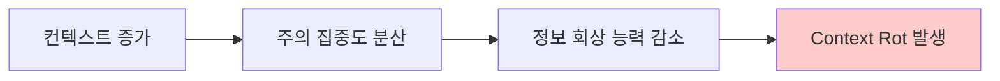
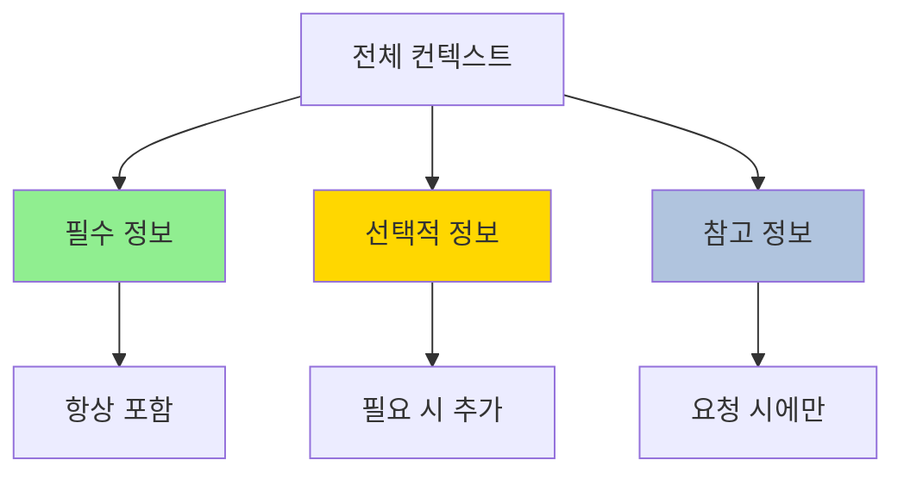
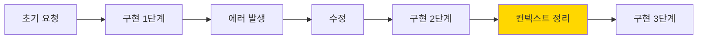

# Clip 1: Context Prompt Engineering 이해하기

## 요약

* Context Engineering의 개념과 Prompt Engineering과의 차이점
* Context Rot 현상과 LLM의 한계
* 효과적인 프롬프트 구조 설계 원칙
* 바이브코딩에서 컨텍스트를 최적화하는 전략

***

## 1. Context Engineering이란?

### 1.1 정의

**Context Engineering**은 "LLM 추론 중 최적의 토큰 집합을 큐레이션하고 유지하는 전략"입니다.

Prompt Engineering의 자연스러운 진화로, 단순히 효과적인 프롬프트를 작성하는 것을 넘어 **전체 컨텍스트 상태**를 관리합니다:

* ✅ 시스템 지시사항 (System Instructions)
* ✅ 도구 정의 (Tool Definitions)
* ✅ 외부 데이터 (External Data/Documents)
* ✅ 메시지 히스토리 (Conversation History)

### 1.2 왜 필요한가?

**핵심 문제: Context Rot**

> LLM은 인간처럼 특정 지점에서 집중력을 잃거나 혼란을 경험합니다.



**아키텍처적 제약:**

* 트랜스포머 기반 LLM: 모든 토큰이 다른 모든 토큰에 주의(Attention)
* n개 토큰 → n² 쌍 관계 생성
* 컨텍스트 길이 ↑ → 주의 집중도 ↓

***

## 2. Prompt Engineering vs Context Engineering

<figure><figcaption></figcaption></figure>

### 2.1 비교

| 구분        | Prompt Engineering | Context Engineering             |
| --------- | ------------------ | ------------------------------- |
| **범위**    | 단일 프롬프트 작성         | 전체 컨텍스트 상태 관리                   |
| **초점**    | 질문을 잘 만들기          | 정보를 잘 유지하기                      |
| **시간 범위** | Single-turn        | Multi-turn 대화                   |
| **관리 대상** | User Message       | System + Tools + History + Data |
| **목표**    | 좋은 답변 얻기           | 지속적으로 좋은 답변 얻기                  |

### 2.2 바이브코딩 관점

바이브코딩에서는 두 가지 모두 중요합니다:

**Prompt Engineering:**

```
사용자: "슬랙봇 만들어줘"
→ 너무 추상적, LLM이 방향을 잡기 어려움

사용자: "Python FastAPI로 슬랙봇을 만들어줘.
        슬랙 이벤트를 받아서 OpenAI API로 답변하고,
        답변을 슬랙 채널에 다시 보내줘"
→ 구체적, LLM이 바로 실행 가능
```

**Context Engineering:**

* 긴 대화 중 이전 결정사항 유지
* 프로젝트 구조, 의존성 정보 관리
* 에러 발생 시 컨텍스트 정리

***

## 3. 효과적인 프롬프트 구조 설계

<figure><figcaption></figcaption></figure>

### 3.1 시스템 프롬프트의 "올바른 높이"

**❌ 너무 구체적 (Brittle):**

```
당신은 Python FastAPI 전문가입니다.
항상 Pydantic v2를 사용하고,
비동기 함수로 작성하며,
타입 힌트를 명시하세요.
```

→ 다른 프레임워크, 동기 함수 필요 시 제약

**❌ 너무 추상적 (Vague):**

```
당신은 유용한 코딩 어시스턴트입니다.
```

→ 지침이 없어 일관성 없는 답변

**✅ 적절한 추상화:**

```
당신은 소프트웨어 개발 어시스턴트입니다.
사용자의 요구사항에 맞는 기술 스택을 선택하고,
모범 사례(best practices)를 따르는 코드를 작성하세요.
실행 가능한 예제와 함께 설명을 제공하세요.
```

### 3.2 구조화된 프롬프트 패턴

**효과적인 프롬프트 구조:**

```markdown
# 역할 정의
당신은 [역할]입니다.

# 목표
[구체적인 목표]를 달성해야 합니다.

# 제약사항
- 제약 1
- 제약 2

# 컨텍스트
[관련 정보, 프로젝트 구조, 기술 스택]

# 작업
[구체적인 작업 지시]

# 예상 결과
[어떤 형태의 결과물을 원하는지]
```

***

## 4. Context Rot 방지 전략

### 4.1 컨텍스트 정리 (Context Pruning)

**전략 1: 메시지 압축**

```python
# 오래된 메시지를 요약으로 대체
old_messages = conversation_history[:10]
summary = f"이전 대화 요약: {summarize(old_messages)}"
new_context = [summary] + conversation_history[10:]
```

**전략 2: 핵심만 유지**

* ✅ 현재 작업과 직접 관련된 정보
* ✅ 프로젝트 전반적 구조/설정
* ✅ 사용자의 명시적 요구사항
* ❌ 오래된 에러 메시지
* ❌ 실패한 시도들의 상세 로그

### 4.2 정보 계층화



**필수 정보 (Always Include):**

* 프로젝트 목표
* 기술 스택
* 현재 작업 단계

**선택적 정보 (Include When Relevant):**

* 이전 구현 내역
* 에러 해결 기록

**참고 정보 (Include On Demand):**

* 외부 문서/API 레퍼런스
* 전체 코드베이스

***

## 5. 바이브코딩 실전 적용

### 5.1 좋은 프롬프트 vs 나쁜 프롬프트

**❌ 나쁜 예:**

```
슬랙봇 만들어줘
```

**문제점:**

* 기술 스택 불명확
* 기능 범위 모호
* 실행 환경 정보 없음

**✅ 좋은 예:**

```
다음 스펙으로 슬랙봇을 만들어줘:

기술 스택:
- Python 3.11, uv 패키지 매니저
- FastAPI (슬랙 이벤트 수신)
- OpenAI API (gpt-4o-mini)

핵심 기능:
- 슬랙 Event API로 멘션 이벤트 수신
- 사용자 메시지를 OpenAI로 전달하여 답변 생성
- 생성된 답변을 슬랙 채널에 포스팅

배포:
- GCP Cloud Run 배포 준비
- 환경변수: SLACK_BOT_TOKEN, OPENAI_API_KEY

프로젝트 구조:
- main.py: FastAPI 앱
- bot.py: 슬랙 클라이언트 로직
- llm.py: OpenAI 호출 로직
```

### 5.2 대화 중 컨텍스트 관리

**시나리오: 긴 구현 과정**



**컨텍스트 정리 타이밍:**

1. 단계 완료 후
2. 에러 해결 후
3. 방향 전환 시

**정리 프롬프트 예시:**

```
✅ 슬랙 이벤트 수신 구현 완료
✅ OpenAI 연동 완료

다음 단계: GCP Cloud Run 배포 설정
이전 단계의 에러 로그는 제외하고 진행해줘.
```

***

## 6. 핵심 요약

**Context Engineering의 핵심:**

1. **컨텍스트 = 단순 프롬프트 이상**: 시스템 지시사항, 도구, 히스토리 전체 관리
2. **Context Rot 인식**: 컨텍스트가 길어질수록 LLM 성능 저하
3. **적절한 추상화**: 너무 구체적/추상적 모두 지양
4. **정기적 정리**: 완료된 단계, 해결된 에러는 요약 또는 제거

***

## 참고 자료

### 공식 문서

* [Anthropic - Effective Context Engineering for AI Agents](https://www.anthropic.com/engineering/effective-context-engineering-for-ai-agents)
* [Claude Prompt Engineering Guide](https://docs.claude.com/en/docs/build-with-claude/prompt-engineering/overview)
