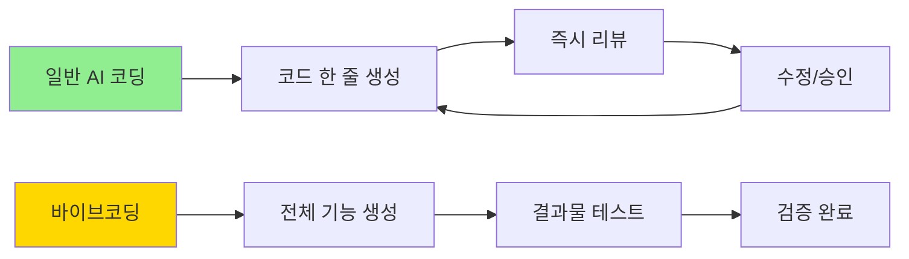
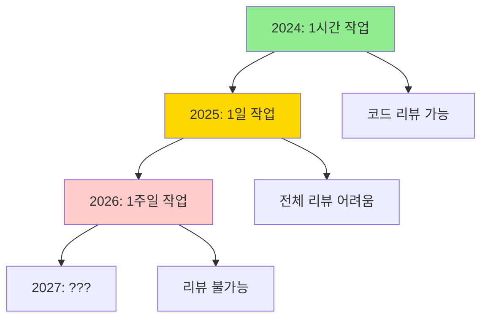

# Clip 2: AI의 PM이 되기

## 1. 바이브코딩의 진짜 의미

### 1.1 정의: Andrej Karpathy의 관점

> "바이브코딩은 완전히 분위기에 몸을 맡기고, 기하급수적 성장을 받아들이며, 코드가 존재한다는 것조차 잊는 것입니다."

**핵심:** "코드가 존재한다는 것조차 잊는다"

### 1.2 일반 AI 코딩 vs 바이브코딩

| 구분         | AI 코딩 (Cursor/Copilot) | 바이브코딩       |
| ---------- | ---------------------- | ----------- |
| **피드백 루프** | 타이트한 실시간 피드백           | 느슨한 비동기 피드백 |
| **코드 리뷰**  | 모든 줄 검토                | 결과물 위주 검토   |
| **개발자 역할** | 코드 작성자                 | 프로덕트 매니저    |
| **대상 사용자** | 엔지니어                   | 비개발자도 포함    |
| **작업 규모**  | 몇 분 \~ 1시간             | 몇 시간 \~ 며칠  |



### 1.3 왜 바이브코딩이 중요한가?

<figure><figcaption></figcaption></figure>

**기하급수적 성장 (The Exponential):**

> AI가 수행할 수 있는 작업 길이가 **7개월마다 2배씩** 증가하고 있습니다.



**현실:**

* 현재: AI가 1시간 분량 작업 → 모든 코드 리뷰 가능
* 1년 후: AI가 1일 분량 작업 → 전체 리뷰 힘듦
* 2년 후: AI가 1주일 분량 작업 → **리뷰가 병목**

**결론:** 코드를 일일이 리뷰하는 방식으로는 AI의 성장 속도를 따라갈 수 없습니다.

***

## 2. "AI의 PM"이 되기

<figure><figcaption></figcaption></figure>

### 2.1 핵심 원칙

**Ask not what Claude can do for you, but what you can do for Claude.**

> 클로드가 당신을 위해 무엇을 할 수 있는지 묻지 말고, 당신이 클로드를 위해 무엇을 할 수 있는지 물어보세요.

### 2.2 PM의 역할

**신입 직원을 맞이하듯이:**

```markdown
# 신입 엔지니어에게 필요한 것
- ✅ 코드베이스 투어
- ✅ 요구사항 명세 (Requirements)
- ✅ 제약사항 (Constraints)
- ✅ 프로젝트 컨텍스트
- ✅ 참고할 유사 기능
- ❌ "이 버그 고쳐줘" (정보 없이)
```

**클로드에게도 동일하게 적용:**

```python
# ❌ 나쁜 예 (정보 부족)
"슬랙봇 만들어줘"

# ✅ 좋은 예 (PM처럼 지시)
"""
슬랙봇 구현 가이드:

## 기술 스택
- Python 3.11, FastAPI
- Slack Bolt SDK
- OpenAI API (gpt-4o-mini)

## 프로젝트 구조
/app
  /slack_bot.py  # 슬랙 이벤트 핸들러
  /llm.py        # OpenAI 클라이언트
  /main.py       # FastAPI 엔트리포인트

## 참고 코드
유사 기능: /examples/discord_bot.py
패턴 따르기: /core/event_handler_base.py

## 요구사항
1. 멘션 이벤트 수신
2. OpenAI로 답변 생성
3. 슬랙 채널에 답변 포스팅
4. 에러 핸들링 (rate limit, timeout)

## 제약사항
- 응답 시간 3초 이내
- 환경변수로 API 키 관리
- 로깅 필수 (info, error)
"""
```

### 2.3 실전: 15\~20분 프롬프트 준비 프로세스

**단계 1: 탐색 대화 (Exploration Chat)**

```
User: "현재 코드베이스에서 인증은 어떻게 처리되고 있어?"
Claude: "auth/ 폴더에 JWT 기반 인증이 구현되어 있습니다..."

User: "유사한 API 엔드포인트 구조를 보여줘"
Claude: "/api/users.py에서 RESTful 패턴을 확인할 수 있습니다..."
```

**단계 2: 계획 문서화**

```markdown
# 구현 계획

## 변경할 파일
- /api/posts.py (신규)
- /models/post.py (신규)
- /auth/middleware.py (수정)

## 따를 패턴
- RESTful API: /api/users.py 참고
- 인증: JWT 미들웨어 적용
- 데이터베이스: SQLAlchemy ORM 사용
```

**단계 3: 실행**

```
User: "위 계획대로 구현해줘.
      테스트 코드도 포함하고,
      /api/users.py의 패턴을 따라줘."
```

## 참고 자료

### 공식 영상

* [Vibe coding in prod | Code w/ Claude](https://www.youtube.com/watch?v=fHWFF_pnqDk) - Erik Schulntz, Anthropic

### 관련 개념

* [Andre Karpathy's Tweet on Vibe Coding](https://twitter.com/karpathy)
