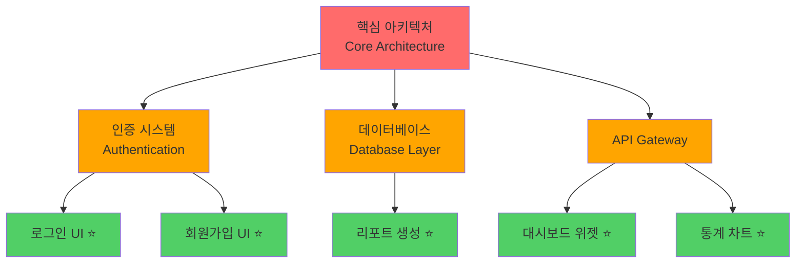
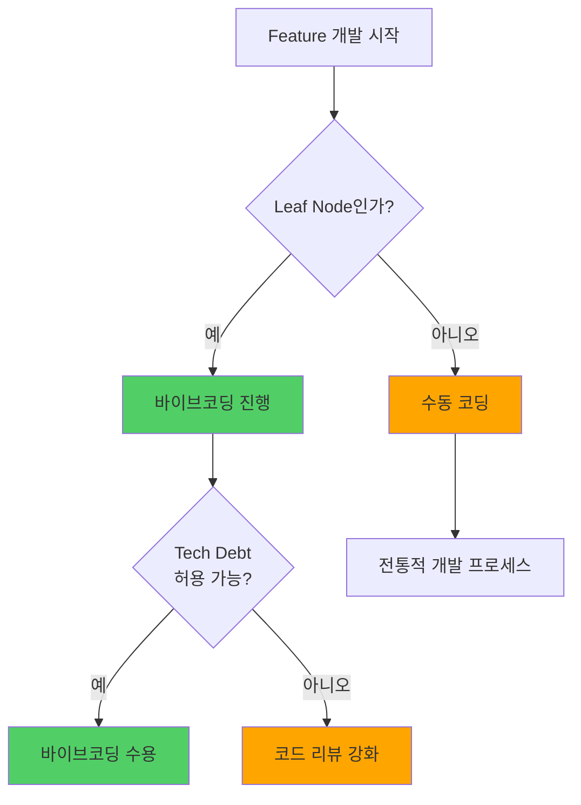
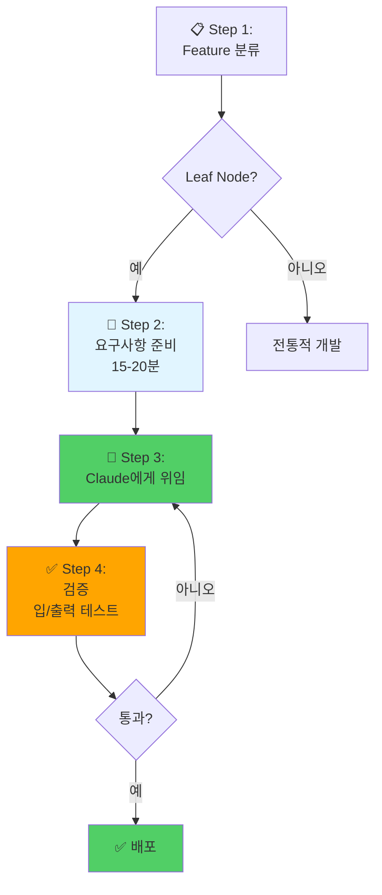
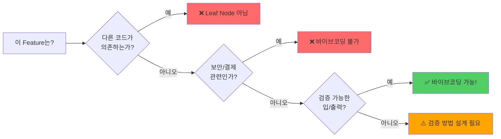

---
## 강사 정보
- 작성자: 정구봉
- LinkedIn: https://www.linkedin.com/in/gb-jeong/
- 이메일: bong@dio.so

## 강의 자료
- 강의 자료: https://goobong.gitbook.io/fastcampus
- Github: https://github.com/Koomook/fastcampus-ai-agent-vibecoding
- FastCampus 강의 주소: https://fastcampus.co.kr/biz_online_vibeagent

---

# Clip 1: 바이브코딩의 리스크를 낮추기 위한 feature 선정 방법

## 📋 학습 목표

* **Leaf Nodes** 개념을 이해하고 코드베이스에서 식별할 수 있다
* 바이브코딩을 안전하게 적용할 수 있는 영역과 위험한 영역을 구분할 수 있다
* Tech Debt 관리 관점에서 Feature 선정 기준을 수립할 수 있다
* Anthropic의 22,000줄 PR 사례를 통해 실전 적용 방법을 배울 수 있다

***

## 1. Leaf Nodes 전략

<figure><figcaption></figcaption></figure>

### 1.1 Leaf Nodes란?

**Leaf Nodes**는 코드베이스에서 **다른 코드가 의존하지 않는 말단 기능**입니다.



**색상 범례:**

* 🔴 **빨간색 (Core)**: 절대 바이브코딩 금지 영역 - 모든 것이 의존하는 핵심
* 🟠 **주황색 (Branches)**: 신중한 검토 필요 - 여러 기능이 의존
* 🟢 **초록색 (Leaf Nodes)**: 바이브코딩 가능 영역 - 독립적인 말단 기능

### 1.2 왜 Leaf Nodes에 집중해야 하는가?

**Tech Debt의 영향 범위:**

| 코드 영역                 | Tech Debt 발생 시 영향 | 바이브코딩 적합성    |
| --------------------- | ----------------- | ------------ |
| **Core Architecture** | 🚨 전체 시스템 마비 가능   | ❌ 절대 불가      |
| **Shared Libraries**  | ⚠️ 여러 기능에 버그 전파   | ⚠️ 신중한 검토 필요 |
| **Leaf Nodes**        | ✅ 해당 기능만 영향       | ✅ 바이브코딩 가능   |

**Leaf Nodes의 특징:**

1. **고립성 (Isolation)**: 다른 코드가 이 코드에 의존하지 않음
2. **변경 빈도 낮음**: 한 번 작성하면 자주 수정하지 않음
3. **제한된 Tech Debt**: 기술 부채가 다른 곳으로 전파되지 않음
4. **쉬운 교체**: 문제 발생 시 전체를 새로 작성해도 영향 적음

***

## 2. Anthropic의 실제 사례: 22,000줄 PR

### 2.1 사례 개요

**프로젝트:**

* 강화학습(Reinforcement Learning) 코드베이스에 22,000줄 변경
* Claude가 대부분의 코드 작성
* 프로덕션 환경에 성공적으로 배포


### 2.2 성공 요인: Leaf Nodes 전략

#### ✅ Leaf Nodes에 집중

**변경 영역:**

* 대부분의 코드: Leaf Nodes (말단 기능)
* 일부 코드: 핵심 아키텍처 (인간이 집중 검토)

**전략:**

```markdown
✅ Leaf Nodes → 바이브코딩 OK
⚠️  Core Parts → 인간이 직접 검토
```

### 2.3 결과

**시간 절약:**

* 예상 소요 시간: 2주
* 실제 소요 시간: 1일
* **14배 생산성 향상**

**심리적 효과:**

> "Knowing that we could do this, it made us think differently about what we could do. When something costs one day instead of two weeks, you realize you can build much bigger features."
>
> — Erik Schultz

***

## 3. 바이브코딩 리스크 관리 체크리스트

### 3.1 Feature 선정 기준

```markdown
## ✅ 바이브코딩 적합한 Feature

- [ ] Leaf Node인가? (다른 코드가 의존하지 않는가?)
- [ ] 변경 빈도가 낮은가?
- [ ] Tech Debt가 발생해도 격리 가능한가?
- [ ] 입력/출력이 명확하게 정의되는가?
- [ ] 테스트로 정확성을 검증할 수 있는가?

## ❌ 바이브코딩 부적합한 Feature

- [ ] 핵심 아키텍처인가?
- [ ] 여러 기능이 이 코드에 의존하는가?
- [ ] 보안/인증 시스템인가?
- [ ] 결제/금융 로직인가?
- [ ] 자주 수정될 것으로 예상되는가?
```

### 3.2 Tech Debt 관리

**현재의 한계:**

> "Tech debt is one of those rare things where there really isn't a good way to validate it other than being an expert in the implementation itself."
>
> — Erik Schultz

**대응 전략:**



**원칙:**

* Leaf Nodes는 Tech Debt가 있어도 다른 코드로 전파되지 않음
* Core Architecture는 Tech Debt를 절대 허용하지 않음

***

## 4. 실전 가이드

### 4.1 Leaf Nodes 식별하기

**코드베이스 탐색 프롬프트:**

```
Claude Code에게 다음과 같이 요청하세요:

"우리 코드베이스에서 다음 조건을 만족하는 파일들을 찾아줘:
1. 다른 파일에서 import되지 않는 파일
2. 주로 UI/프레젠테이션 레이어
3. 독립적인 기능 (예: 대시보드 위젯, 리포트 생성)

이런 파일들의 목록과 각 파일이 왜 Leaf Node인지 설명해줘."
```

**분석 예시:**

```markdown
✅ Leaf Nodes:
- src/components/widgets/SalesChart.tsx
  → 이유: 대시보드에서만 사용, 다른 곳에서 import 없음

- src/reports/monthly-report.ts
  → 이유: 독립적인 리포트 생성, 다른 로직이 의존하지 않음

❌ Core Architecture:
- src/auth/AuthProvider.tsx
  → 이유: 전체 앱이 이 컴포넌트에 의존

- src/utils/api-client.ts
  → 이유: 모든 API 호출이 이 모듈 사용
```

### 4.2 바이브코딩 워크플로우

**단계별 프로세스:**



### 4.3 실습: Leaf Nodes 전략 적용하기

**시나리오:**

당신의 팀에서 다음 3개 Feature를 개발해야 합니다:

1. **Feature A**: 사용자 대시보드에 새로운 통계 차트 추가
2. **Feature B**: 인증 시스템에 OAuth 2.0 추가
3. **Feature C**: 월간 리포트 PDF 생성 기능

**분석 연습:**

| Feature    | Leaf Node? | 바이브코딩 가능? | 이유          |
| ---------- | ---------- | --------- | ----------- |
| A: 통계 차트   | ✅ 예        | ✅ 가능      | 독립적 UI 컴포넌트 |
| B: OAuth   | ❌ 아니오      | ❌ 불가      | 핵심 보안 시스템   |
| C: PDF 리포트 | ✅ 예        | ✅ 가능      | 독립적 기능      |

**Feature A 바이브코딩 프롬프트 예시:**

```markdown
스펙:
- 프로젝트: React + TypeScript
- 라이브러리: Recharts 사용
- 위치: src/components/dashboard/

요구사항:
- 최근 30일간 매출 데이터를 Line Chart로 표시
- 툴팁에 날짜별 상세 정보 표시
- 반응형 디자인 (모바일 대응)

데이터 소스:
- API: GET /api/sales/monthly
- 응답 형식: { date: string, amount: number }[]

참고 파일:
- src/components/dashboard/UserStats.tsx (비슷한 패턴)

제약사항:
- 기존 디자인 시스템 (Tailwind CSS) 사용
- 로딩/에러 상태 처리 필수
```

***

## 5. 핵심 요약

### Leaf Nodes 전략의 핵심 원칙

```markdown
1. 🌿 Focus on Leaf Nodes
   → Tech Debt가 격리되는 영역에만 바이브코딩 적용

2. 🔴 Core Architecture는 직접 작성
   → 핵심 아키텍처는 반드시 인간이 검토

3. ✅ 검증 가능한 설계
   → 입력/출력이 명확한 기능 선택

4. 📊 영향 범위 분석
   → 다른 코드가 의존하는지 반드시 확인
```

### Leaf Nodes 선정 기준



***

## 참고 자료

### 영상 자료

* [Vibe coding in prod | Code w/ Claude](https://www.youtube.com/watch?v=fHWFF_pnqDk) - Erik Schultz, Anthropic


---

## 강사 정보
- 작성자: 정구봉
- LinkedIn: https://www.linkedin.com/in/gb-jeong/
- 이메일: bong@dio.so

## 강의 자료
- 강의 자료: https://goobong.gitbook.io/fastcampus
- Github: https://github.com/Koomook/fastcampus-ai-agent-vibecoding
- FastCampus 강의 주소: https://fastcampus.co.kr/biz_online_vibeagent
