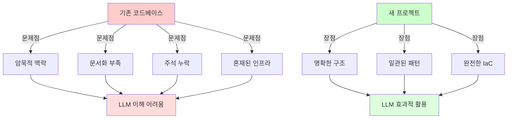
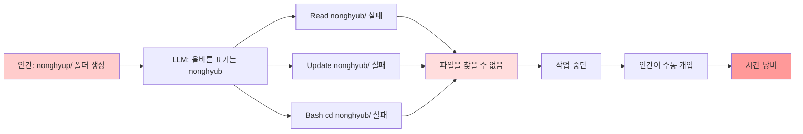
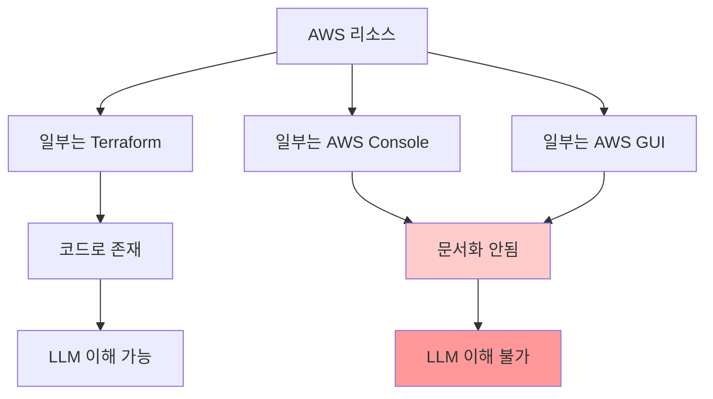
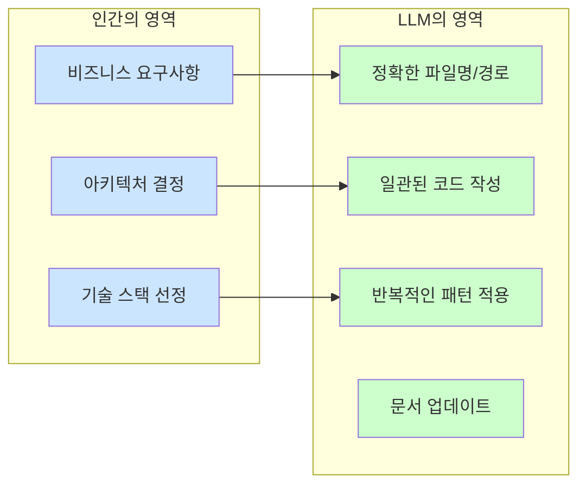

---
## 강사 정보
- 작성자: 정구봉
- LinkedIn: https://www.linkedin.com/in/gb-jeong/
- 이메일: bong@dio.so

## 강의 자료
- 강의 자료: https://goobong.gitbook.io/fastcampus
- Github: https://github.com/Koomook/fastcampus-ai-agent-vibecoding
- FastCampus 강의 주소: https://fastcampus.co.kr/biz_online_vibeagent

---

# Clip 2: 바이브코딩으로 프로젝트를 시작하면 유리한 점

## 학습 목표

* 새 프로젝트에서 바이브코딩이 유리한 이유 이해하기
* 기존 코드베이스 vs 새 프로젝트의 바이브코딩 효율성 차이 파악
* 인간의 타이핑 오류가 LLM 작업에 미치는 영향 이해
* 세부 구현을 LLM에게 위임하는 전략 학습

***

## 1. 바이브코딩이 효과적인 환경

### 1.1 새 프로젝트 vs 기존 코드베이스

바이브코딩은 **"새로운" 프로젝트**에서 훨씬 효과적입니다.

**왜 새 프로젝트가 유리한가?**



### 1.2 기존 코드베이스에서 바이브코딩하기

기존 프로젝트에 바이브코딩을 적용할 때는 특별한 전략이 필요합니다.

#### ✅ 준비 단계: 토큰을 문서화에 투자

```markdown
**추천 전략:**
1. 토큰 예산을 전부 문서화와 주석 작성에 사용
2. 코드에 담기지 않은 비즈니스 로직도 모두 문서화
3. 인간이 알고 있는 암묵적 지식을 명시적으로 기록
```

**문서화 예시:**

```python
# ❌ 나쁜 예: 암묵적 로직
def process_payment(amount):
    return amount * 1.1

# ✅ 좋은 예: 명시적 문서화
def process_payment(amount):
    """
    결제 금액을 처리합니다.

    비즈니스 규칙:
    - 모든 결제에 10% VAT가 자동 추가됨
    - 2024년 1월 1일부터 적용된 세법에 따름
    - 해외 결제는 이 함수를 사용하지 않음 (별도 로직 필요)

    Args:
        amount (float): 결제 금액 (VAT 제외)

    Returns:
        float: VAT 포함 최종 금액
    """
    VAT_RATE = 1.1  # 10% VAT
    return amount * VAT_RATE
```

***

## 2. 인간의 실수 vs LLM의 정확성

### 2.1 실제 사례: 인간이 만든 잘못된 구조

**발생한 문제:**

```
인간이 프로젝트 초기에 만든 폴더: nonghyup/
올바른 표기 (농협의 실제 표기):  nonghyub/
```

**무슨 일이 벌어졌나?**

<figure><figcaption></figcaption></figure>



**핵심 문제:**

* 인간이 프로젝트 시작 시 `nonghyup`이라고 폴더명을 잘못 지음
* LLM은 올바른 표기인 `nonghyub`을 알고 있음
* LLM이 계속 `nonghyub`만 찾으려고 시도 → 모든 파일 작업 실패

### 2.2 LLM이 파일명을 다룰 때의 장점

**파일명 기반 도구들:**

* `Read`: 파일 읽기
* `Edit`: 파일 수정
* `Write`: 파일 쓰기
* `Bash`: 셸 명령 실행 (파일 경로 포함)
* `Glob`: 파일 패턴 검색

이 모든 도구가 **정확한 파일명/경로**에 의존합니다.

**인간이 직접 폴더/파일을 만들 때의 문제:**

```bash
# 프로젝트 시작 시 인간이 직접 만들면...
$ mkdir nonghyup              # ❌ 잘못된 표기로 폴더 생성
$ touch nonghyup_api.py       # ❌ 잘못된 이름으로 파일 생성

# 이후 LLM에게 작업 요청
👤 "농협 API 설정 파일 읽어줘"
🤖 Read nonghyub_config.json  # ❌ 올바른 표기로 시도 → 실패!
```

**LLM에게 처음부터 맡길 때:**

```bash
# 인간: 폴더/파일명을 직접 언급하지 않음
👤 "농협 API 프로젝트 구조 만들어줘"

# LLM: 올바른 표기로 일관되게 생성
🤖 mkdir nonghyub/            # ✅ 올바른 표기
🤖 touch nonghyub/api.py      # ✅ 일관성 유지
🤖 touch nonghyub/config.json # ✅ 이후 모든 참조 정확
```

***

## 3. 새 프로젝트 시작 시 바이브코딩의 이점

### 3.1 명명(Naming)의 일관성

**기존 프로젝트의 문제:**

```
// 여러 개발자가 각자의 스타일로...
user_service.js
UserController.java
user-repository.ts
UserMgr.py          // ❌ 일관성 없음
```

**새 프로젝트에서 LLM 활용:**

```
// LLM이 일관된 네이밍 컨벤션 유지
user_service.py
user_controller.py
user_repository.py
user_manager.py      // ✅ 패턴 일관
```

### 3.2 구조 설계의 명확성

새 프로젝트를 LLM과 함께 시작하면:

```
프로젝트 생성 단계
    ↓
LLM이 제안 → 인간이 검토 → 구조 확정
    ↓
모든 파일/폴더가 명확한 의도로 생성됨
    ↓
이후 확장 시 LLM이 기존 패턴을 따름
```

**예시:**

```
myproject/
├── src/
│   ├── domain/        # 비즈니스 로직
│   ├── application/   # 유즈케이스
│   ├── infrastructure/# 외부 연동
│   └── presentation/  # API 레이어
├── tests/
│   └── (src와 동일 구조)
└── docs/
    ├── architecture.md
    └── decisions/     # ADR (Architecture Decision Records)
```

LLM은 이 구조를 이해하고 새 파일을 **올바른 위치**에 생성합니다.

### 3.3 Infrastructure as Code (IaC)의 효과

**혼합 방식의 문제:**



**완전한 IaC 방식:**

```hcl
# terraform/main.tf - 모든 인프라가 코드로 정의됨
resource "aws_lambda_function" "api" {
  function_name = "my-api"
  runtime       = "python3.11"
  handler       = "main.handler"

  # 모든 설정이 명시적
  environment {
    variables = {
      DB_HOST = aws_db_instance.main.endpoint
      CACHE_URL = aws_elasticache_cluster.main.cache_nodes[0].address
    }
  }
}

resource "aws_db_instance" "main" {
  # DB 설정도 모두 코드로...
}
```

**실제 경험:**

> "전부 IaC로 전환하는 고민 시간 < 구현 시간"
>
> * GUI 클릭 → 코드 변환: 10분 고민
> * LLM이 IaC 작성: 3분 완료

***

## 4. 세부 구현은 LLM에게 맡기기

### 4.1 인간과 LLM의 역할 분담




---

## 강사 정보
- 작성자: 정구봉
- LinkedIn: https://www.linkedin.com/in/gb-jeong/
- 이메일: bong@dio.so

## 강의 자료
- 강의 자료: https://goobong.gitbook.io/fastcampus
- Github: https://github.com/Koomook/fastcampus-ai-agent-vibecoding
- FastCampus 강의 주소: https://fastcampus.co.kr/biz_online_vibeagent
