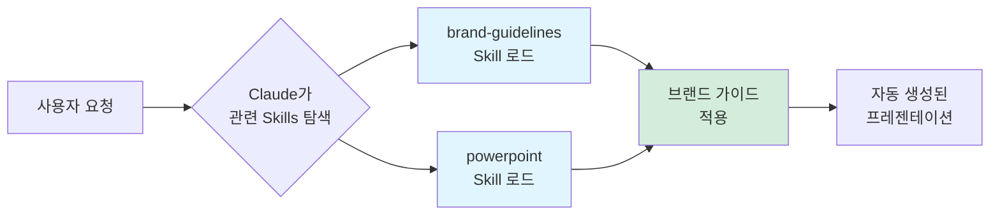
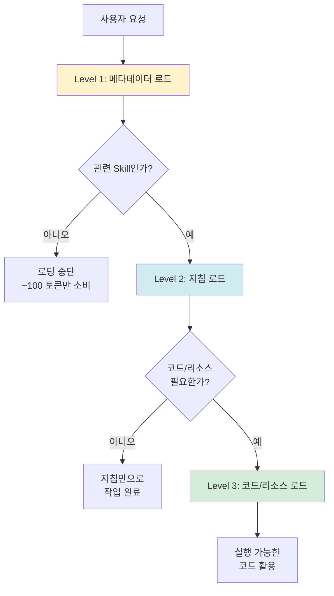
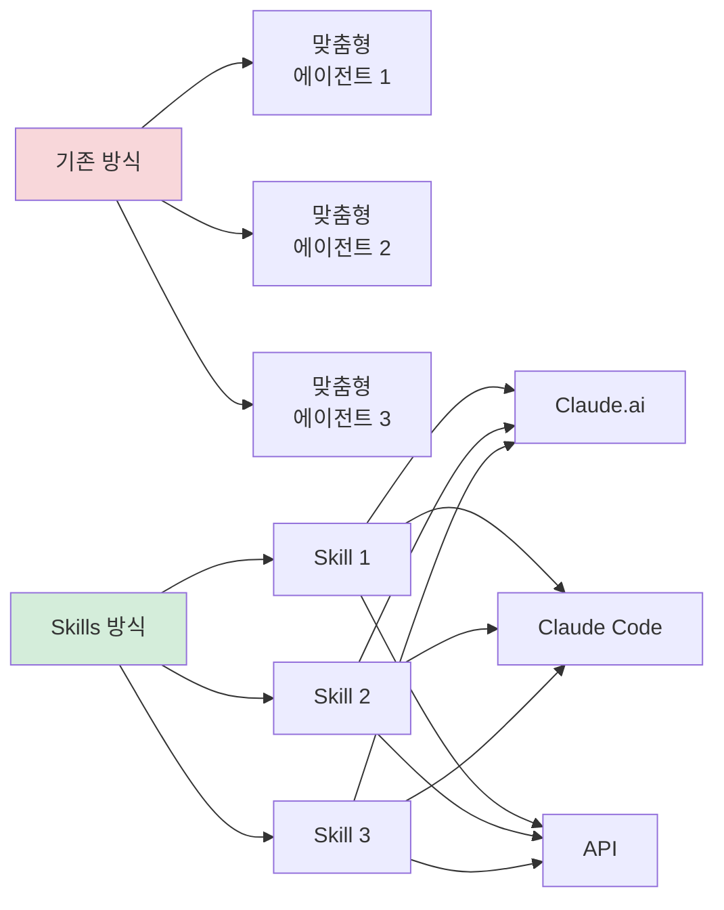

# Clip 1: Claude Skills의 프롬프트와 코드를 동시에 사용하는 자동화 살펴보기

## 📋 학습 목표

* Claude Skills의 개념과 필요성을 이해할 수 있다
* 프롬프트와 코드가 결합된 Skills의 작동 원리를 파악할 수 있다
* 점진적 공개(Progressive Disclosure) 설계를 이해할 수 있다
* 실제 Skills 활용 사례를 살펴보고 업무 자동화 가능성을 탐색할 수 있다

***

## 1. Claude Skills란 무엇인가?

<figure><figcaption></figcaption></figure>

### 1.1 기본 개념

**Claude Skills**는 Claude가 특정 작업을 더 효과적으로 수행할 수 있도록 지식과 도구를 제공하는 **모듈식 기능 패키지**입니다.

더 구체적으로 표현하면:

> Skills는 지침(프롬프트), 실행 가능한 코드, 참고 자료를 포함한 폴더로, Claude가 필요할 때만 동적으로 로드하여 전문화된 작업에 활용합니다.

### 1.2 왜 Skills가 필요한가?

기존에는 복잡한 작업을 수행하려면 매번 긴 프롬프트를 작성해야 했습니다. 예를 들어:

**기존 방식 (❌ 비효율적):**

```
사용자: "우리 회사 브랜드 가이드에 맞춰서 PowerPoint를 만들어줘.
       브랜드 컬러는 #1E3A8A와 #F59E0B를 사용하고,
       폰트는 Pretendard를 쓰고,
       슬라이드 레이아웃은 제목-내용-이미지 순서로..."
```

**Skills 방식 (✅ 효율적):**

```
사용자: "Q4 실적 보고서 프레젠테이션 만들어줘"
Claude: [자동으로 brand-guidelines Skill과 powerpoint Skill을 로드하여 작업]
```



***

## 2. Skills의 4가지 핵심 특징

### 2.1 조합 가능 (Composable)

여러 Skills가 함께 작동하며 Claude가 자동으로 조정합니다.

**실제 예시:**

* `powerpoint` Skill + `brand-guidelines` Skill
* `canvas-design` Skill + `theme-factory` Skill
* `internal-comms` Skill + `brand-guidelines` Skill

### 2.2 이식 가능 (Portable)

동일한 Skill을 다양한 환경에서 재사용할 수 있습니다.

| 플랫폼             | 사용 가능한 Skills | 특징                                          |
| --------------- | ------------- | ------------------------------------------- |
| **Claude.ai**   | 사전 구축 + 커스텀   | Pro, Max, Team, Enterprise 플랜 (코드 실행 기능 필요) |
| **Claude Code** | 커스텀만          | 로컬 파일 시스템에 설치 (~/.claude/skills)          |
| **Claude API**  | 사전 구축 + 커스텀   | Messages API에 통합 (/v1/skills 엔드포인트)       |

### 2.3 효율적 (Efficient)

**"필요할 때만 최소 정보 로드"** 철학으로 토큰을 절약합니다.

### 2.4 강력함 (Powerful)

실행 가능한 코드를 포함하여 신뢰성과 정확성을 향상시킵니다.

***

## 3. 프롬프트와 코드를 동시에 사용하는 원리

<figure><figcaption></figcaption></figure>

### 3.1 점진적 공개 (Progressive Disclosure) 설계

Claude Skills의 핵심은 **3단계 로딩 구조**입니다.

<figure><figcaption></figcaption></figure>



#### Level 1: 메타데이터 (항상 로드)

```yaml
---
name: powerpoint
description: PowerPoint 프레젠테이션을 생성하고 편집하는 Skill.
             슬라이드 추가, 텍스트/이미지 삽입, 레이아웃 조정 시 사용.
---
```

* **소비 토큰**: \~100 토큰
* **포함 내용**: 이름, 설명
* **역할**: Claude가 "이 Skill이 필요한가?"를 판단

#### Level 2: 지침 (트리거 시 로드)

```markdown
# PowerPoint Skill

## 사용 시기
- 프레젠테이션 생성 요청 시
- 슬라이드 편집이 필요한 경우

## 지침
1. 제목 슬라이드는 중앙 정렬
2. 본문 슬라이드는 제목-내용-이미지 순서
3. 브랜드 컬러 우선 사용
```

* **소비 토큰**: \~5,000 토큰 미만
* **포함 내용**: 절차적 지식, 사용 방법, 예제
* **역할**: Claude에게 "어떻게 작업할 것인가"를 안내

#### Level 3: 리소스/코드 (필요 시 로드)

```python
# ppt_generator.py
from pptx import Presentation
from pptx.util import Inches, Pt

def create_slide(prs, title, content):
    """슬라이드 생성 함수"""
    slide_layout = prs.slide_layouts[1]
    slide = prs.slides.add_slide(slide_layout)

    # 제목 설정
    title_shape = slide.shapes.title
    title_shape.text = title

    # 내용 설정
    content_shape = slide.placeholders[1]
    content_shape.text = content

    return slide
```

* **소비 토큰**: 필요할 때만
* **포함 내용**: 실행 스크립트, 템플릿, 참고 파일
* **역할**: 결정론적 작업 수행, 신뢰성 향상

***

## 4. 실제 Skills 활용 사례

Anthropic의 공식 GitHub 저장소([anthropics/skills](https://github.com/anthropics/skills))에는 13개의 예제 스킬이 제공됩니다.

### 4.1 창의성 & 디자인 분야

#### algorithmic-art

**용도**: p5.js를 활용한 생성 미술 및 파티클 시스템 제작

```markdown
사용자: "흐름장(flow field)을 사용한 추상 미술 작품을 만들어줘"

Claude의 동작:
1. [Level 1] algorithmic-art Skill 메타데이터 확인
2. [Level 2] 흐름장 알고리즘 지침 로드
3. [Level 3] p5.js 코드 템플릿 로드 및 실행
```

#### canvas-design

**용도**: PNG/PDF 형식의 포스터, 디자인 제작

```markdown
사용자: "신제품 출시 포스터 디자인해줘"

활용된 Skills:
- canvas-design (디자인 레이아웃)
- brand-guidelines (브랜드 컬러/폰트)
```

#### slack-gif-creator

**용도**: Slack에 최적화된 애니메이션 GIF 생성

**특징:**
* 크기 제약 검증기
* 조합 가능한 애니메이션 프리미티브
* Slack 업로드 사양에 맞춘 최적화

### 4.2 개발 & 기술 분야

#### mcp-builder

**용도**: Model Context Protocol 서버 생성 가이드

**프롬프트 예시:**

```
외부 API(예: 날씨 API)를 Claude에 연결하는 MCP 서버를 만들어줘
```

**Skill이 제공하는 것:**

* MCP 서버 구조 지침
* FastMCP(Python) 또는 MCP SDK(Node.js) 템플릿
* 에러 핸들링 패턴

#### webapp-testing

**용도**: Playwright를 활용한 로컬 웹앱 UI 테스트

```python
# Skill이 제공하는 코드 예제
from playwright.sync_api import sync_playwright

def test_login(page):
    """로그인 기능 테스트"""
    page.goto("http://localhost:3000/login")
    page.fill("#email", "test@example.com")
    page.fill("#password", "password123")
    page.click("button[type='submit']")
    assert page.locator(".dashboard").is_visible()
```

#### artifacts-builder

**용도**: React, Tailwind CSS, shadcn/ui를 사용한 복잡한 HTML 아티팩트 생성

**특징:**
* 상태 관리, 라우팅 지원
* shadcn/ui 컴포넌트 통합
* 멀티 컴포넌트 구조 지원

### 4.3 엔터프라이즈 & 커뮤니케이션

#### internal-comms

**용도**: 회사 내부 커뮤니케이션 문서 작성

**지원 포맷:**

* 상태 보고서 (Status Reports)
* 리더십 업데이트 (Leadership Updates)
* 3P 업데이트 (Third-Party Updates)
* 회사 뉴스레터
* FAQ
* 사고 보고서 (Incident Reports)

**프롬프트 예시:**

```
지난주 프로젝트 진행 상황을 상태 보고서 형식으로 정리해줘
```

#### brand-guidelines

**용도**: 조직의 브랜드 가이드라인 적용

**Skill 구조:**

```yaml
---
name: brand-guidelines
description: Anthropic 공식 브랜드 색상 및 타이포그래피를
             모든 아티팩트에 적용하는 Skill
---

# Brand Colors
- Primary: #1E3A8A
- Secondary: #F59E0B
- Accent: #10B981

# Typography
- Heading: Pretendard Bold
- Body: Pretendard Regular
```

### 4.4 문서 생성 분야 (Document Skills)

GitHub 저장소의 `document-skills/` 폴더에는 프로덕션 급 문서 조작 스킬이 제공됩니다:

#### powerpoint (pptx)

**용도**: PowerPoint 프레젠테이션 생성 및 편집

#### excel (xlsx)

**용도**: Excel 스프레드시트 데이터 처리

#### word (docx)

**용도**: Word 문서 생성 및 편집

#### pdf

**용도**: PDF 문서 생성 및 변환

**참고:** Document Skills는 소스 공개(source-available)이지만 오픈소스는 아니며, 참고 구현 목적으로 제공됩니다.

### 4.5 메타 Skills

#### skill-creator

**용도**: 효과적인 새 Skills 제작 가이드

#### template-skill

**용도**: 새 Skill 제작을 위한 시작 템플릿

### 4.6 기타 유틸리티

#### theme-factory

**용도**: 아티팩트(슬라이드, 문서, HTML 페이지)의 테마 스타일링

**특징:**
* 10개의 사전 설정 테마
* 온디맨드 테마 생성
* 색상/폰트 자동 적용

***

## 5. Skills가 기존 방식과 다른 점

### 5.1 기존: 맞춤형 에이전트 구축

**단점:**

* ❌ 각 사용 사례마다 새로운 에이전트 개발 필요
* ❌ 코드베이스 중복
* ❌ 유지보수 어려움

### 5.2 Skills: 재사용 가능한 모듈

**장점:**

* ✅ 한 번 만들면 여러 곳에서 재사용
* ✅ 조직 전체에서 공유 가능
* ✅ Claude.ai, Claude Code, API에서 동일하게 작동



***

## 6. 바이브코딩에서 Skills 활용하기

### 6.1 사용 가능한 곳

**Claude.ai (웹):**

* 설정에서 Skills 활성화
* 자동으로 관련 Skills 호출
* 수동 선택 불필요

**Claude Code (CLI):**

```bash
# Skills 마켓플레이스에서 플러그인 등록 및 설치
/plugin marketplace add anthropics/skills

# 또는 수동 설치: ~/.claude/skills 디렉토리에 직접 저장
```

**Claude API:**

```python
import anthropic

client = anthropic.Anthropic()

response = client.messages.create(
    model="claude-sonnet-4-5-20250929",
    messages=[{"role": "user", "content": "프레젠테이션 만들어줘"}],
    skills=["powerpoint", "brand-guidelines"],  # Skills 지정
    betas=["code-execution"]  # Code Execution Tool 베타 기능 필요
)
```

### 6.2 바이브코딩 시나리오

**시나리오: 회사 브랜드에 맞는 분기 보고서 자동 생성**

```
💬 사용자: "Q4 실적 보고서 프레젠테이션을 만들어줘.
           데이터는 sales_data.csv 파일을 참고해."

🤖 Claude의 동작:
[Step 1] 관련 Skills 탐색
  → powerpoint, brand-guidelines, internal-comms 발견

[Step 2] Level 1 메타데이터 로드 (300 토큰)
  → 세 Skill 모두 관련성 있음 판단

[Step 3] Level 2 지침 로드 (12,000 토큰)
  → PowerPoint 레이아웃 가이드
  → 브랜드 컬러/폰트 규칙
  → 실적 보고서 표준 포맷

[Step 4] CSV 데이터 분석
  → 매출 증가율: +15%
  → 핵심 지표 추출

[Step 5] Level 3 코드 실행
  → ppt_generator.py 실행
  → 차트 생성 스크립트 실행

✅ 결과: "Q4_Performance_Report.pptx" 자동 생성
```

***

## 참고 자료

### 공식 문서

* [Claude Skills 공식 발표](https://www.anthropic.com/news/skills)
* [Agent Skills 엔지니어링 블로그](https://www.anthropic.com/engineering/equipping-agents-for-the-real-world-with-agent-skills)
* [Claude Skills 개요 문서](https://docs.claude.com/en/docs/agents-and-tools/agent-skills/overview)

### 코드 저장소

* [Anthropic Skills GitHub](https://github.com/anthropics/skills)

### 영상 자료

* [Claude Skills 소개 영상 (1분)](https://www.youtube.com/watch?v=IoqpBKrNaZI)
